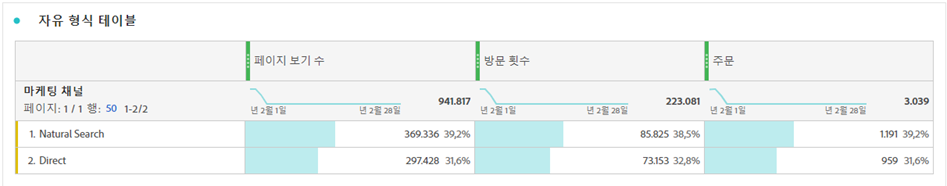
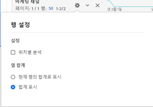

# 작업 공간 합계

자유 형식 테이블에서, 합계 행은 각 분류 수준에 나타나고 두 개의 합계를 표시할 수 있습니다.

* **[!UICONTROL 총계]**(회색의 &#39;흐린&#39; 숫자) - 이 합계는 수집된 모든 히트를 나타내며 경우에 따라 &#39;보고서 세트 합계&#39;라고도 합니다. 세그먼트가 패널 수준에서 또는 자유 형식 테이블 내에서 적용되면 이 합계는 세그먼트 기준과 일치하는 모든 히트를 반영하도록 조정됩니다.
* **[!UICONTROL 테이블 합계]**(검정 숫자) - 이 합계는 일반적으로 [!UICONTROL 총계]와 같거나 그 하위 세트입니다. [!UICONTROL 포함 내용 없음] 선택 사항을 포함하여 자유 형식 테이블 내에 적용된 테이블 필터를 반영합니다.

## 합계 표시 설정 {#display-total}

**[!UICONTROL 열 설정]** 아래에는 **[!UICONTROL 합계 표시]** 및 **[!UICONTROL 총계 표시]** 선택 사항이 있습니다. 이러한 설정을 선택 취소하면 표에서 합계가 제거됩니다. 예를 들어 특정 [계산된 지표 시나리오](https://docs.adobe.com/content/help/ko-KR/analytics/components/calculated-metrics/calcmetrics-reference/cm-totals.html)에서 합계가 적절하지 않은 경우 이 선택 사항이 필요할 수 있습니다.

## 정적 행 합계 설정  {#static-row-total}

[정적 행](https://docs.adobe.com/content/help/ko-KR/analytics/analyze/analysis-workspace/visualizations/freeform-table/column-row-settings/manual-vs-dynamic-rows.html) 합계는 별도로 동작하며 **[!UICONTROL 행 설정]**&#x200B;에서 제어합니다.

* **[!UICONTROL 현재 행의 합계를 합계로 표시]** - 테이블에서 행의 클라이언트측 합계를 보여 주므로 이것은 합계가 방문 또는 방문자와 같은 지표에 대한 중복 제거를 수행하지 **않음**&#x200B;을 의미합니다.
* **[!UICONTROL 총계 표시]** - 서버측 합계를 보여 줍니다. 이것은 합계가 방문 또는 방문자와 같은 지표에 대한 중복 제거를 수행함을 의미합니다.

## FAQ

| 질문 | 답변 |
|---|---|
| 회색 열 비율은 어느 &#39;합계&#39;를 기반으로 합니까? | 이것은 **[!UICONTROL 행 설정]**&#x200B;의 **[!UICONTROL 백분율]** 설정 선택 사항에 따라 달라집니다.<ul><li>열별 백분율 계산 - 기본 설정입니다. 백분율이 테이블 합계를 기반으로 합니다.</li><li>행별 백분율 계산 - 백분율이 총계를 기반으로 합니다.</li></ul> |
| **[!UICONTROL 지정되지 않음(없음) 포함]** 설정은 합계에 어떤 영향을 줍니까? | **[!UICONTROL 지정되지 않음(없음) 포함]** 설정이 선택 취소되면 없음/지정되지 않음 행이 테이블, 테이블 합계에서 제거되고, [&#39;합계&#39; 지표 유형](https://docs.adobe.com/content/help/ko-KR/analytics/components/calculated-metrics/calcmetric-workflow/m-metric-type-alloc.html)을 사용하는 임의의 계산된 지표로 전달됩니다. |
| 사용자 지정 테이블 필터가 자유 형식 테이블에 적용되는 경우 모든 계산된 지표 및 조건부 서식이 필터를 처리합니까? | 현재 처리하지 않습니다. **[!UICONTROL 지정되지 않음(없음) 포함]**&#x200B;은 처리되지만 사용자 지정 테이블 필터는 다음 항목에 영향을 주지 않습니다.<ul><li>조건부 서식에서 사용하는 열 최대/최소 범위는 모든 데이터에 적용됩니다.</li><li>**[!UICONTROL 총계]** 지표 유형을 활용하는 계산된 지표.</li><li>자유 형식 테이블의 행들 간에 계산되는 열 합계, 열 최댓값, 열 최솟값, 카운트, 평균, 중간값, 백분위수, 사분위, 행 수, 표준 편차, 분산, 누적, 누적 평균, 회귀 변형, T 스코어, T 테스트, Z 스코어, Z 테스트와 같은 함수를 사용하는 계산된 지표.</li></ul> |
| 계산된 지표에서 **[!UICONTROL 총계]** 지표 유형은 무엇을 반영합니까? | **[!UICONTROL 총계]**&#x200B;는 **[!UICONTROL 총계]**&#x200B;를 계속 지칭하며 테이블이나 **[!UICONTROL 테이블 총계]**&#x200B;에 적용된 필터를 반영하지 않습니다. |
| 데이터를 자유 형식 테이블에서 복사하여 붙여넣거나 CSV를 통해 다운로드할 때에는 어떤 합계가 표시됩니까? | 합계 행은 **[!UICONTROL 테이블 총계]**&#x200B;만 반영하며 **[!UICONTROL 합계 표시]** 열 설정을 준수합니다. |

