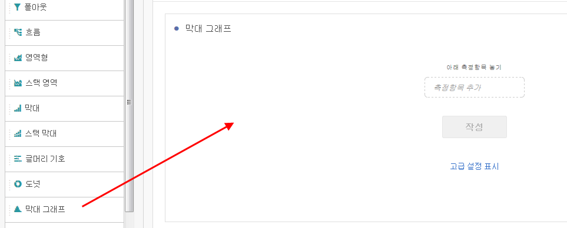
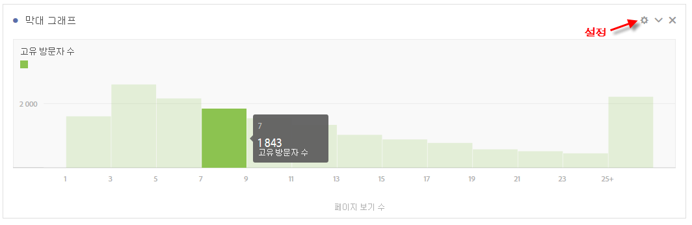
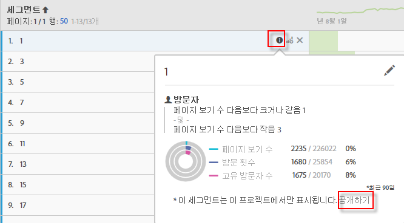

# 히스토그램

막대 그래프는 막대 차트와 비슷하지만, 숫자를 범위(버킷)로 그룹화합니다. Analytics는 숫자의 &quot;버킷&quot;을 범위로 자동화하지만 고급 설정에서 설정을 변경할 수 [있습니다](#section_09D774C584864D4CA6B5672DC2927477).

## 히스토그램 작성 {#section_74647707CC984A1CB6D3097F43A30B45}

히스토그램을 만드는 방법:

1. Click **[!UICONTROL Visualizations]** in the left rail.
1. Drag **[!UICONTROL Histogram]** to the panel.
1. Choose a Metric to drag to the Histogram visualization and click **[!UICONTROL Build]**.

>[!NOTE] 히스토그램은 계산된 지표는 지원하지 않고 표준 지표만 지원합니다. 

여기서는 고유 방문자당 페이지 보기 지표를 사용했습니다. 첫 번째(왼쪽) 버킷은 고유 방문자당 1페이지 보기, 두 번째 버킷에서 두 페이지 보기 등에 해당합니다.

## 고급 설정 {#section_09D774C584864D4CA6B5672DC2927477}

막대 그래프 설정을 조정하려면 오른쪽 위 모서리에 있는 설정(&quot;톱니바퀴&quot;) 아이콘을 클릭합니다. 다음은 수정할 수 있는 설정입니다.

| 막대 그래프 설정 | 기능 |
|---|---|
| 버킷 시작 | 히스토그램이 시작하는 버킷을 결정합니다. &quot;1&quot;은 기본값입니다. 시작 숫자를 0에서 무한대로 설정할 수 있습니다(음수는 없음). |
| 지표 버킷 | 데이터 범위(버킷)의 수를 늘리거나 줄일 수 있습니다. 버킷의 최대 수는 50개입니다. |
| 지표 버킷 크기 | 각 버킷의 크기를 설정할 수 있습니다. 예를 들어 버킷 크기를 페이지 보기 1개에서 페이지 보기 2개로 변경할 수 있습니다. |
| 계산 방법 | 방문자, 방문 [또는 히트 중에서](https://marketing.adobe.com/resources/help/ko_KR/reference/visitors.html)선택할 [수](https://marketing.adobe.com/resources/help/ko_KR/reference/metrics_visit.html)있도록해줍니다. 예를 들어 방문당 페이지 보기 횟수 또는 방문자당 페이지 보기 횟수 또는 히트당 페이지 보기 횟수 등이 있습니다. 히트의 경우 &quot;발생 횟수&quot;는 자유형 테이블에서 y축 지표로 사용됩니다. |

**예**:

* 시작 버킷:1.지표 버킷:5.지표 버킷 크기:2 히스토그램은 다음과 같이 표시됩니다.1-2, 3-4, 5-6, 7-8, 9-10.
* 시작 버킷:0;지표 버킷:3.지표 버킷 크기:5는 다음 히스토그램을 생성합니다.0-4, 5-9, 10-14

## 히스토그램 데이터 보기 및 편집 {#section_B2CD7CDF0F6B432F928103AE7AAA3617}

To view or change the data source for the histogram chart, click the dot next to the Histogram header to go to **[!UICONTROL Data Source Settings]** > **[!UICONTROL Show Data Source]**.

표에 표시되는 사전에 작성된 세그먼트는 내부 세그먼트이며, 세그먼트 선택기에 나타나지 않습니다. Click the &quot;i&quot; icon next to the segment name, then click **[!UICONTROL Make public]** to make the segment public.

데이터 분류 수행과 같이, 자유 형식 데이터 테이블 및 기타 시각화를 관리하는 방법을 더 탐색하려면, [여기](https://marketing.adobe.com/resources/help/ko_KR/analytics/analysis-workspace/freeform-analysis-visualizations.html)로 이동하십시오. 
