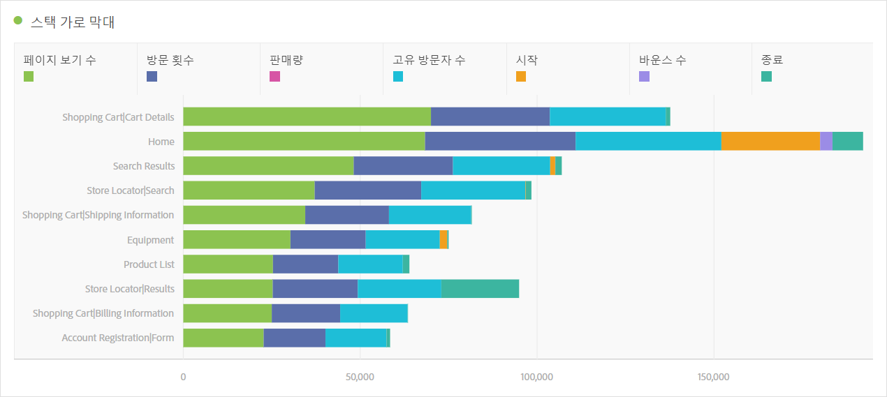
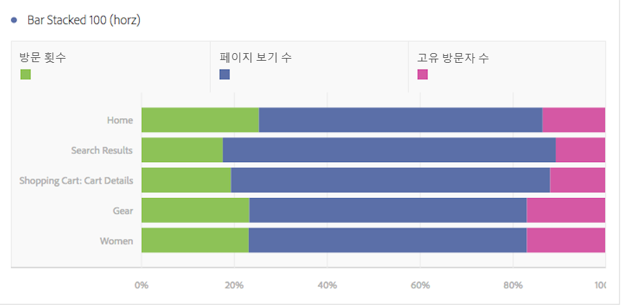

# 가로 막대 및 스택 가로 막대

## 가로 막대형 {#section_73A4D6F6C8864045A97B0B32B5FFFEDB}

이 시각화는 하나 이상의 지표에서 다양한 값을 나타내는 가로 막대를 보여줍니다.

## 스택 가로 막대 {#section_50C08E9E20A94024A6553BC352ADB597}

This visualization is like the [!UICONTROL Horizontal Bar Chart], but the series bars appear stacked.

The [!UICONTROL Horizontal Bar Stacked] visualization setting on bar stacked visualizations turns the chart into a "100% stacked" visualization:

