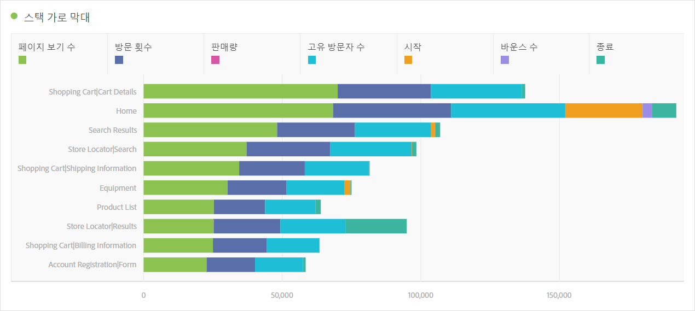

# 가로 막대(스택)

>[!BEGINSHADEBOX]

_이 문서에서는 가로 막대 및 가로 막대 누적 시각화에 대해 설명합니다._  _&#x200B;**Adobe Analytics**._ _이 문서의_&#x200B;에 대한 [가로 막대 및 가로 막대 누적](https://experienceleague.adobe.com/ko/docs/analytics-platform/using/cja-workspace/visualizations/horizontal-bar)을 참조하십시오.  _&#x200B;**Customer Journey Analytics** 버전._

>[!ENDSHADEBOX]

가로 막대 시각화에는 표준 옵션과 스택 옵션이 있습니다.

## 가로 막대 {#horizontal-bar}

<!-- markdownlint-disable MD034 -->

>[!CONTEXTUALHELP]
>id="workspace_horizontalbar_button"
>title="가로 막대"
>abstract="하나 이상의 지표에서 다양한 값을 나타내는 가로 막대 시각화를 만듭니다."

<!-- markdownlint-enable MD034 -->

이  **[!UICONTROL 가로 막대]** 시각화는 하나 이상의 지표에서 다양한 값을 나타내는 가로 막대를 보여 줍니다.

## 스택 가로 막대 {#horizontal-bar-stacked}

<!-- markdownlint-disable MD034 -->

>[!CONTEXTUALHELP]
>id="workspace_horizontalbarstacked_button"
>title="스택 가로 막대"
>abstract="하나 이상의 스택 지표에서 다양한 값을 나타내는 가로 막대 시각화를 만듭니다."

<!-- markdownlint-enable MD034 -->

 **[!UICONTROL 스택 가로 막대]** 시각화는 [!UICONTROL 가로 막대]와 유사하지만 일련의 막대가 스택되어 표시됩니다.

 **[!UICONTROL 설정]**&#x200B;에서 **[!UICONTROL 100% 스택]** 옵션을 사용하여 차트를 100% 스택 시각화로 변환합니다.

>[!MORELIKETHIS]
>
>[패널에 시각화 추가](/help/analyze/analysis-workspace/visualizations/freeform-analysis-visualizations.md#add-visualizations-to-a-panel)
>[시각화 설정](/help/analyze/analysis-workspace/visualizations/freeform-analysis-visualizations.md#settings)
>[시각화 컨텍스트 메뉴](/help/analyze/analysis-workspace/visualizations/freeform-analysis-visualizations.md#context-menu)
>

