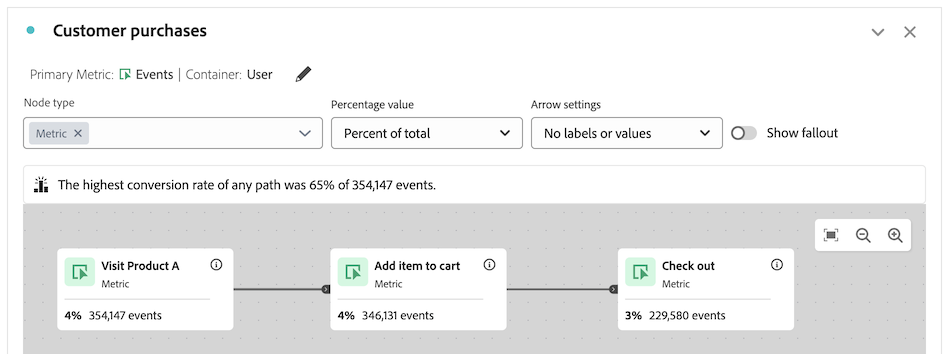

# 여정 캔버스 개요 {#journey-canvas-overview}

<!-- markdownlint-disable MD034 -->

>[!CONTEXTUALHELP]
>id="cja_journeycanvas_button"
>title="여정 캔버스"
>abstract="사람들이 일련의 터치포인트를 어떻게 진행하거나 이탈하는지 보여 줍니다. 여러 진입 지점과 경로가 있는 여정에 사용하십시오."

<!-- markdownlint-enable MD034 -->

<!-- markdownlint-disable MD034 -->

>[!CONTEXTUALHELP]
>id="cja_journeycanvas_panel"
>title="여정 캔버스"
>abstract="사람들이 정의된 여정을 어떻게 진행하거나 이탈하는지 분석합니다. 이벤트, 차원 항목, 세그먼트의 조합을 나타내는 유연한 노드 및 화살표 그래프를 만들어 사용자 여성 분석을 빌드합니다. 캔버스에서 노드를 드래그하여 여정의 이벤트와 조건을 재배열합니다. 데이터가 이에 따라 업데이트됩니다."

<!-- markdownlint-enable MD034 -->

<!-- markdownlint-disable MD034 -->

>[!CONTEXTUALHELP]
>id="journeycanvas_button2"
>title="여정 캔버스"
>abstract="사람들이 일련의 터치포인트를 어떻게 진행하거나 이탈하는지 보여 줍니다. 여러 진입 지점과 경로가 있는 여정에 사용하십시오."

<!-- markdownlint-enable MD034 -->

<!-- markdownlint-disable MD034 -->

>[!CONTEXTUALHELP]
>id="journeycanvas_panel2"
>title="여정 캔버스"
>abstract="사람들이 정의된 여정을 어떻게 진행하거나 이탈하는지 분석합니다. 이벤트, 차원 항목, 세그먼트의 조합을 나타내는 유연한 노드 및 화살표 그래프를 만들어 사용자 여성 분석을 빌드합니다. 캔버스에서 노드를 드래그하여 여정의 이벤트와 조건을 재배열합니다. 데이터가 이에 따라 업데이트됩니다."

<!-- markdownlint-enable MD034 -->

>[!BEGINSHADEBOX]

_이 문서는 이 문서의_  _&#x200B;**Adobe Analytics**&#x200B;에 여정 캔버스 시각화를 설명합니다.  _&#x200B;자세한 내용은 [여정 캔버스 개요](https://experienceleague.adobe.com/ko/docs/analytics-platform/using/cja-workspace/visualizations/journey-canvas/journey-canvas)를 참조하십시오&#x200B;__&#x200B;**Customer Journey Analytics**&#x200B;버전._

>[!ENDSHADEBOX]

{{release-limited-testing}}

여정 캔버스 시각화는 사용자와 고객에게 제공하는 여정을 분석하고 깊이 있는 인사이트를 얻을 수 있습니다. 이를 통해 여정을 정의한 다음 사람들이 여정을 떠나고(폴아웃) 계속 따라가는(폴스루) 방법을 확인할 수 있습니다.

이벤트, 차원 항목, 세그먼트 및 날짜 범위를 조합하여 여정 노드를 생성함으로써 [사용자 여정에 대한 분석을 구축](/help/analyze/analysis-workspace/visualizations/journey-canvas/configure-journey-canvas.md)할 수 있습니다. 노드를 연결하여 여정의 흐름을 만들고, 여러 경로와 결정 지점을 포함합니다. 캔버스에서 노드를 드래그하여 여정의 이벤트와 조건을 재배열합니다. 데이터를 변경하면 실시간으로 업데이트합니다.

[노드는 &quot;최종 경로&quot;로 연결](/help/analyze/analysis-workspace/visualizations/journey-canvas/configure-journey-canvas.md#logic-when-connecting-nodes)됩니다. 즉, 방문자는 두 노드 사이에서 발생하는 모든 이벤트에 관계없이 한 노드에서 다른 노드로 이동하는 한 계산됩니다. 사용자가 경로를 따라 이동할 수 있는 시간은 컨테이너 설정에 따라 결정됩니다.

## 주요 기능

여정 캔버스 시각화의 주요 기능은 다음과 같습니다.

* 가장 복잡한 사용자 여정에 맞춰 폴아웃과 폴스루에 대한 심층 분석.

* 사용자 여정의 다양한 진입점, 노드 및 경로를 매핑하고 시각화하는 캔버스.

* 캔버스에 구성 요소를 추가하고 기존 노드를 재배치하기 위한 드래그 앤 드롭 상호 작용.

## 잠재적 인사이트

여정 캔버스는 가장 복잡한 여정에 대한 실행 가능한 인사이트를 제공합니다.

### 전환율이 가장 높은 경로 {#conversion-rate-caption}

여정 캔버스에서 가장 눈에 띄는 인사이트는 캔버스 상단에 캡션으로 표시되어 있습니다.

이 캡션은 여정의 모든 경로 중 전환율이 가장 높았던 경로를 요약한 것입니다.

여정에 여러 시작 노드가 포함된 경우 캡션은 다음과 같이 표시됩니다.

여정에 단일 시작 노드가 포함된 경우 캡션은 다음과 같이 표시됩니다.

이 캡션을 해석할 때 다음 사항을 고려해야 합니다.

* _경로_&#x200B;는 화살표로 연결된 시작 노드로 정의되며, 그 사이에는 여러 개의 노드가 연결되어 있습니다.

* 전환율 계산은 여정의 유형(여정에 포함된 시작 노드와 끝 노드의 수, 그리고 경로가 교차하는지 여부)에 따라 달라집니다.

  다음 테이블은 여정 유형에 따라 전환율을 계산하는 방법을 설명합니다.

  | 여정 유형 | 전환율 계산 | 예 |
  |---------|----------|---------|
  | **단일 시작 노드와 단일 종료 노드** | 전환율은 종료 노드의 수를 시작 노드의 수로 나누어 계산됩니다. |  |
  | **단일 시작 노드와 여러 종료 노드** | 전환율은 가장 높은 수를 가진 종료 노드를 찾아서 그 수를 시작 노드의 수로 나누어 계산됩니다. |  |
  | **각 경로에는 단일 시작 노드와 단일 종료 노드가 포함된 여러 개의 독립 실행형 경로** | 전환율은 종료 노드의 수를 시작 노드의 수로 나누어 계산됩니다. 전환율이 가장 높은 경로는 캡션에 설명되어 있습니다. |  |
  | **여정의 어느 지점에서든 공통 노드로 수렴하는 여러 시작 노드** | 전환율은 가장 높은 수를 가진 끝 노드를 찾아서 그 수를 가장 낮은 수를 가진 시작 노드의 수로 나누어 계산됩니다. |  |

### 폴스루, 폴아웃 등

다음은 여정 캔버스가 제공할 수 있는 기타 인사이트의 몇 가지 예입니다. 이러한 인사이트가 보고서 세트의 모든 사용자, 여정을 시작한 모든 사용자 또는 여정의 이전 노드에서 모든 사용자를 기반으로 하는지 여부를 선택할 수 있습니다.

#### 폴스루

* 여정을 완료한 사람(종료 노드에 방문한 사람)의 수와 백분율

* 여정의 특정 노드에 방문한 사람들의 수와 비율

* 여정의 특정 노드 이후 또는 이전에 이루어진 가장 일반적인 단계

#### 폴아웃

* 사람들이 여정에서 가장 흔히 이탈하는 노드(직후 노드에 방문하지 못하는 노드)

#### 각 노드에 대한 추가 데이터

* 여정의 모든 노드에 분류 차원을 추가하여 해당 노드에 대한 추가 데이터 확인

## 여정 캔버스, 폴아웃 또는 플로우 시각화 중에서 선택

여정 캔버스 시각화는 [폴아웃 시각화](/help/analyze/analysis-workspace/visualizations/fallout/fallout-flow.md) 및 [플로우 시각화](/help/analyze/analysis-workspace/visualizations/c-flow/flow.md)와 유사하지만 중요한 차이점이 있습니다.

### 차이점 이해

<!-- Information in this snippet is shared between Journey canvas, Fallout, and Flow visualization docs -->

{{journey-visualization-comparisons}}

### 여정 캔버스 사용 시기

여정 캔버스는 다음의 경우에 필수적입니다.

* 여러 진입점과 경로가 있는 여정을 포함한 폴아웃 분석.

* 사전 정의된 페이지 시퀀스를 갖춘 여러 진입점과 경로가 있는 비선형 여정.

* 사전 정의된 여정을 기반으로 한 탐색적 애드혹 분석.

* 세션, 개인 또는 발생 횟수 외의 기본 지표가 필요한 분석.

[위의 테이블](#understand-the-differences)을 사용하여 여정 캔버스, 폴아웃, 플로우 시각화의 차이점을 이해하십시오.

## 여정 캔버스에서 분석 구축

Analysis Workspace에서 사용할 수 있는 모든 차원이나 지표를 기반으로 한 분석을 여정 캔버스에 구축할 수 있습니다. 자세한 내용은 [여정 캔버스 시각화 구성](/help/analyze/analysis-workspace/visualizations/journey-canvas/configure-journey-canvas.md)을 참조하십시오.

>[!MORELIKETHIS]
>
> * [Adobe Customer Journey Analytics의 여정 캔버스 시각화 안내서](https://experienceleaguecommunities.adobe.com/t5/adobe-analytics-blogs/a-guide-to-journey-canvas-visualization-in-adobe-customer/ba-p/737857?profile.language=ko)

