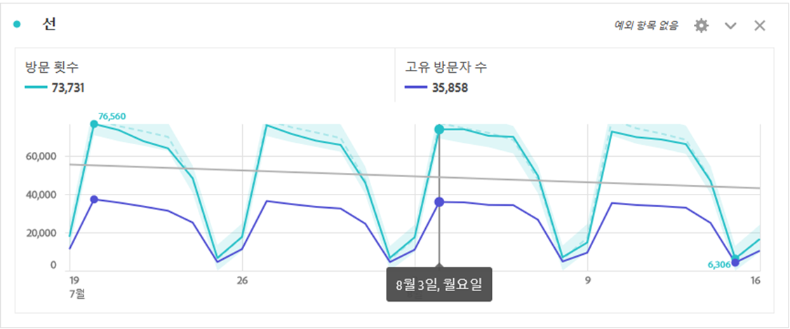
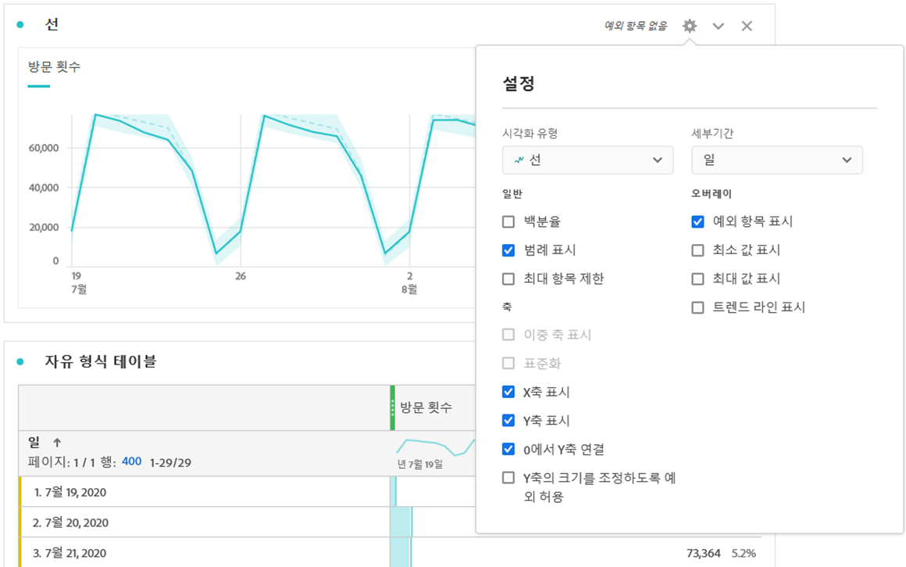
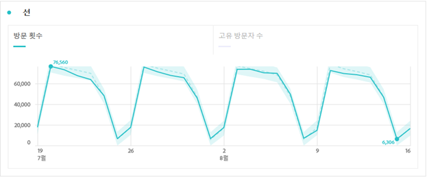
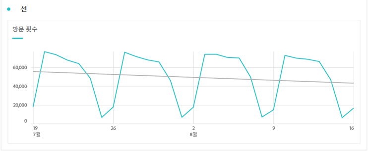

# 라인

라인 시각화는 일정 기간 동안 값이 변경되는 방법을 보여주기 위해 행을 사용하여 지표를 나타냅니다. 라인 차트는 시간을 차원으로 사용하는 경우에만 사용할 수 있습니다.

>[!IMPORTANT]
>
>트렌드 표시 [!UICONTROL 와]같은 일부 라인 시각화 설정이 현재 제한된 테스트에 있습니다. [추가 정보](/help/landing/an-releases.md)

라인 시각화의 오른쪽 상단에 있는 톱니바퀴 아이콘을 클릭하여 [**시각화 설정에**](freeform-analysis-visualizations.md) 액세스합니다. 설정은 다음과 같이 분류됩니다.

* **일반**:시각화 유형 간에 공통적인 설정
* **축**:라인 시각화의 x축 또는 y축에 영향을 주는 설정
* **오버레이**:라인 시각화에 표시된 시리즈에 추가 컨텍스트를 추가하기 위한 옵션.

## 세부기간 변경

[시각화 설정](freeform-analysis-visualizations.md)의 세부기간 드롭다운을 사용하면 트렌드 시각화(예: 선, 막대)를 일별에서 주별, 월별 등으로 변경할 수 있습니다. 세부기간은 데이터 소스 테이블에서도 업데이트됩니다.

## 최소 또는 최대 표시

시각화 **[!UICONTROL 설정]** > **[!UICONTROL 오버레이]** > **[!UICONTROL 최소/최대]**&#x200B;표시아래에서 최소값과 최대값 레이블을 오버레이하여 지표의 최고점 및 최저점을 빠르게 강조 표시할 수 있습니다. 참고:최소/최대 값은 차원 내의 전체 값 집합이 아니라 시각화에서 보이는 데이터 포인트에서 파생됩니다.

## 트렌드 오버레이 표시

시각화 **[!UICONTROL 설정]** > **[!UICONTROL 오버레이]** > **[!UICONTROL 트렌드]**&#x200B;표시아래에서 회귀 트렌드를 라인 시리즈에 추가할 수 있습니다. 트렌드라인은 데이터의 명확한 패턴을 표현하는 데 도움이 됩니다.

모든 모델은 보통 최소 제곱을 사용하여 적합합니다.

| 모델 | 설명 |
| --- | --- |
| 선형 | 단순한 선형 데이터 세트에 가장 잘 맞는 직선을 만들며, 데이터가 일정한 속도로 증가 또는 감소하는 경우 유용합니다. 수식: `y = a + b * x` |
| 로그 | 최적 곡선 선을 만들며 데이터의 변경 비율이 빠르게 증가 또는 감소하여 레벨을 빼는 경우 유용합니다. 로그 트렌드라인은 음수와 양수 값을 사용할 수 있습니다. 수식: `y = a + b * log(x)` |
| 지수 | 곡선을 만들 수 있으며 데이터가 증가하거나 지속적으로 증가하는 속도로 떨어질 때 유용합니다. 데이터에 0 또는 음수 값이 있는 경우에는 이 옵션을 사용하지 마십시오. 수식: `y = a + e^(b * x)` |
| 기능 | 곡선을 만들고 특정 비율로 증가되는 측정을 비교하는 데이터 세트에 유용합니다. 데이터에 0 또는 음수 값이 있는 경우에는 이 옵션을 사용하지 마십시오. 수식: `y = a * x^b` |
| 이차 | 포물선(오목한 위 또는 아래)과 같은 데이터 세트에 가장 적합한 글꼴을 찾습니다. 수식: `y = a + b * x + c * x^2` |
