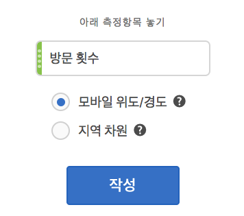
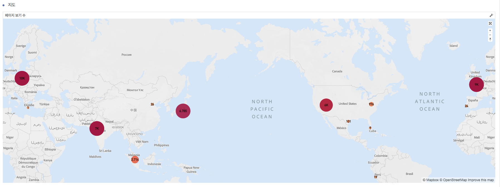
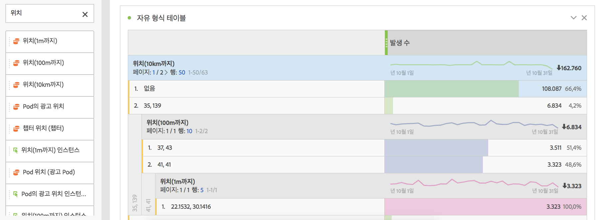
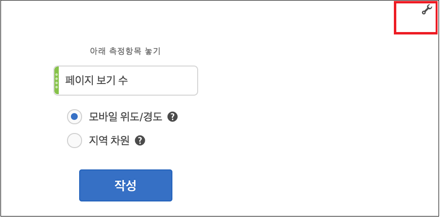

# 맵

## 개요 {#section_19F740FAF08D47B1AF1EF239A74FC75C}

Analysis Workspace의 맵 시각화

* 지표의 시각적 맵을 만들 수 있습니다 (계산된 지표 포함).
* 지리적으로 다른 지역들의 지표 데이터를 식별하고 비교하는 데 유용합니다.
* 모바일 사용에 따른 위도/경도 또는 웹 사용을 위한 지리적 차원, 이렇게 2가지 데이터 소스를 지원할 수 있습니다.
* PDF 내보내기 지원
* 그래픽 디스플레이를 위해 WebGL을 활용합니다. 그래픽 드라이버가 WebGL 렌더링을 지원하지 않으면 드라이버를 업데이트해야 할 수 있습니다.

## Build a map visualization {#section_61BBFA3A7BFD48DA8D305A69D9416299}

1. 시각화 목록에서 **[!UICONTROL 맵]을 자유 형식 패널로 드래그합니다.**

   

1. 지표(계산된 지표 포함) 목록에서 지표를 드래그해옵니다.
1. 그리는 데 사용할 데이터 소스를 지정합니다. (이 대화 상자는 모바일 앱 데이터용으로 위치 추적이 활성화된 경우에만 표시됩니다.)

<table id="table_CD54B433464B4282A7524FB187016C47"> 
 <tbody> 
  <tr> 
   <td colname="col1"> 
<b>모바일 위도/경도</b> 
 </td> 
   <td colname="col2"> 
이 옵션은 모바일 앱 데이터를 나타냅니다. 
 
Analytics &gt; 관리 &gt; 보고서 세트 &gt; &lt;보고서 세트 선택&gt; &gt; 설정 편집 &gt; 모바일 관리 &gt; 위치 추적 활성화에서 보고서 세트에 대해 이 옵션을 활성화한 경우에만 이 옵션이 표시됩니다  . 
 
기본 설정입니다(위치 추적이 활성화된 경우). 
 </td> 
  </tr> 
  <tr> 
   <td colname="col1"> 
<b>지역 차원</b> 
 </td> 
   <td colname="col2"> 
이 옵션은 방문자의 IP 주소를 기반으로 방문자 위치에 대한 지리 특성 데이터를 나타냅니다. 이 데이터는 국가, 지역 및 도시로 변환됩니다. DMA나 우편 번호 수준으로는 이동하지 않습니다. 
 
거의 모든 보고서 세트에 이 차원이 활성화되어 있습니다. 활성화되어 있지 않은 경우 Adobe 고객 지원부에 문의하여 지역 보고서를 활성화하십시오. 
 </td> 
  </tr> 
 </tbody> 
</table>

1. **[!UICONTROL 작성을 클릭합니다]**.

   당신이 보게 될 첫 번째 보기는 다음과 유사한 버블 맵을 사용하는 세계 보기입니다.

   

1. 이제

   * **확대/축소** - 맵을 두 번 클릭하거나 스크롤 휠을 사용하여 특정 영역을 확대하도록 이 맵을 확대할 수 있습니다. 맵은 커서를 놓은 위치에 따라 확대됩니다. 확대/축소 상호 작용을 통해 확대/축소 수준에 따라 필요한 차원(국가 &gt; 시/도 &gt; 구/군/시)이 자동으로 업데이트됩니다.
   * **비교** - 동일한 프로젝트에서 두 개 이상의 맵 시각화를 나란히 배치하여 비교할 수 있습니다.
   * **기간별(예: 연도별) 비교 표시**:

      * 음수를 표시합니다. 예를 들어, 연도별 지표를 맵에 그리는 경우 뉴욕에 대해 -33%를 맵에 표시할 수 있습니다.
      * "퍼센트" 유형의 지표를 사용하면 클러스터링에서 백분율의 평균을 함께 계산합니다.
      * 녹색/빨간색 색상 구성표: 양수/음수
   * **회전** - [!UICONTROL Ctrl] 키를 누른 상태에서 맵을 움직여 2D 또는 3D로 맵을 회전할 수 있습니다.

   * **전환** - 아래 설명된 [설정](../../../analyze/analysis-workspace/visualizations/map-visualization.md#section_5F89C620A6AA42BC8E0955478B3A427E)을 사용하여 히트맵(열 지도)과 같은 다른 보기로 전환할 수 있습니다. 버블 보기가 기본 설정입니다.

1. 프로젝트를 **저장**&#x200B;하여 모든 맵 설정(좌표, 확대/축소, 회전)을 저장합니다.
1. 시각화 아래의 자유 형식 테이블은 왼쪽 레일에서 위치 차원과 지표를 드래그하여 채울 수 있습니다.

   

## Map visualization settings {#section_5F89C620A6AA42BC8E0955478B3A427E}

Map of settings exists exists for map:

오른쪽 상단의 **스패너 아이콘**&#x200B;은 지표와 데이터 소스를 변경할 수 있는 초기 대화 상자를 표시합니다.

**톱니바퀴 아이콘**&#x200B;을 클릭하면 다음 시각화 설정이 표시됩니다.

| 설정 | 설명 |
|--- |--- |
| 버블 | 버블을 사용하여 이벤트를 그립니다. 버블 차트는 산포도와 비례 영역 차트의 중간에 있는 다중 변수 그래프입니다. 이 보기가 기본 보기입니다. |
| 히트맵 | 히트맵을 사용하여 이벤트를 그립니다. 히트맵은 표에 포함된 개별 값이 색상으로 표현되는 데이터 그래픽 표현입니다. |
| 스타일: 색상 테마 | 히트맵 및 버블의 색상 구성표를 보여줍니다. 코랄, 빨강, 녹색, 파랑 중에서 선택할 수 있습니다. 기본값은 코랄입니다. |
| 스타일: 맵 스타일 | 기본, 도로, 더 밝게, 밝게, 어둡게, 위성 중에서 선택할 수 있습니다. |
| 클러스터 반경 | 지정된 픽셀 수 내에 있는 데이터 포인트를 그룹화합니다. 기본값은 50입니다. |
| 사용자 지정 최대 값 | 맵에 대한 최대 값 임계값을 변경할 수 있습니다. 이 값을 조정하면 사용자 지정 최대 값 세트에 상대적인 버블/히트 맵 값 (색상 및 크기) 의 척도가 조정됩니다. |