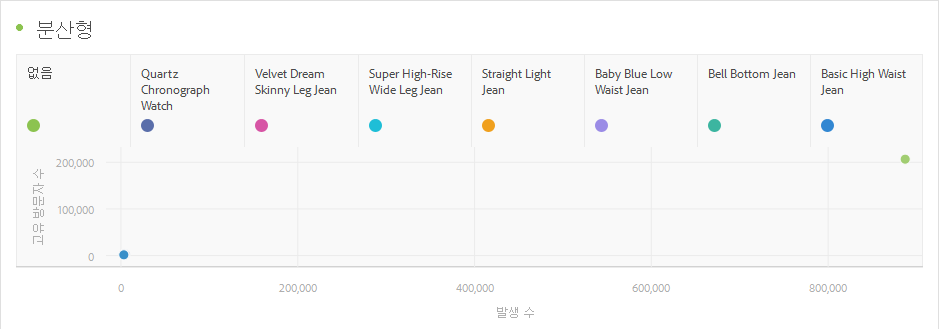

# 산포도

제공된 노출 횟수와 해당 노출 횟수에서 확인된 고유한 사용자 수를 표시합니다.

각 데이터 포인트의 크기는 조회자가 광고에 노출된 평균 횟수에 대한 시각적인 단서를 제공합니다. 크기 및 데이터는 차원, 날짜 범위, 선택한 필터에 따라 달라집니다.

>[!NOTE]
>
>산포도 차트와 연관된 표에는 두 개 이상의 열이 필요합니다. 첫 번째 열은 X축을 정의하고 두 번째 열은 Y축을 정의합니다. 사용 가능한 세 번째 열이 있으면 산포도 차트는 이 열을 사용하여 점의 반경을 결정합니다. 즉, 열 *1*, *2* 및 *3*&#x200B;은 *X*, *Y* 및 *점 반경*&#x200B;에 해당됩니다.

