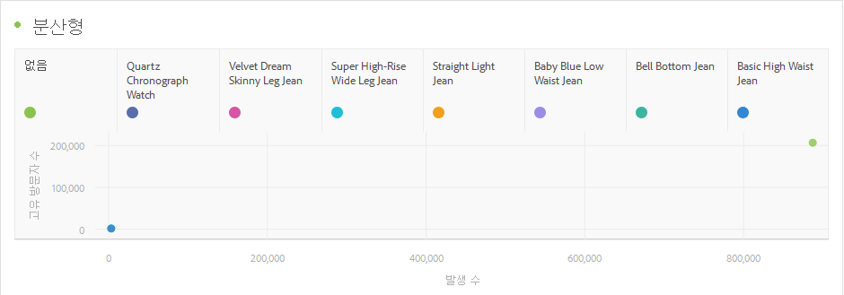

# 분산 {#scatter}

<!-- markdownlint-disable MD034 -->

>[!CONTEXTUALHELP]
>id="workspace_scatter_button"
>title="분산"
>abstract="차원 항목과 최대 3개 지표 간의 관계를 보여 주는 분산 시각화를 만듭니다."

<!-- markdownlint-enable MD034 -->

>[!BEGINSHADEBOX]

_이 문서에서는_&#x200B;의 분산 시각화에 대해 설명합니다 _&#x200B;**Adobe Analytics**._ _이 문서의_&#x200B;에 대한 [분산](https://experienceleague.adobe.com/ko/docs/analytics-platform/using/cja-workspace/visualizations/scatterplot) 참조 _&#x200B;**Customer Journey Analytics** 버전._

>[!ENDSHADEBOX]

 **[!UICONTROL Scatter]** 시각화를 사용하면 데이터의 서로 다른 지표 간의 상관 관계와 패턴을 식별할 수 있습니다. 시각화는 차원 항목과 최대 3개의 지표 간의 관계를 보여 줍니다. 시각화는 3개의 구성 요소가 필요하며 최대 4개의 구성 요소 시각화를 지원합니다.

* 행 구성 요소(일반적으로 차원)는 그래프의 각 점을 나타냅니다. 서로 다른 행은 서로 다른 색상 점으로 표시됩니다.
* 가장 왼쪽 열(일반적으로 지표)은 Y축(세로)에서 점의 위치를 나타냅니다.
* 두 번째 열은 X축(가로)에서 점의 위치를 표시합니다.
* 세 번째 열은 점의 반경을 결정합니다.
* 자유 형식 테이블의 모든 후속 열은 산포도 시각화에 의해 무시됩니다.

>[!BEGINSHADEBOX]

데모 비디오를 보려면  [산포도 시각화](https://experienceleague.adobe.com/en/docs/analytics-learn/tutorials/analysis-workspace/visualizations/scatterplot-visualization){target="_blank"}를 확인하십시오.

>[!ENDSHADEBOX]

>[!NOTE]
>
>[범례가 산포에 표시되도록 구성](/help/analyze/analysis-workspace/visualizations/freeform-analysis-visualizations.md#settings)할 때 범례는 데이터 원본에 (선택된) 차원 항목의 수가 제한된 경우에만 표시됩니다.

>[!MORELIKETHIS]
>
>[패널에 시각화 추가](/help/analyze/analysis-workspace/visualizations/freeform-analysis-visualizations.md#add-visualizations-to-a-panel)
>[시각화 설정](/help/analyze/analysis-workspace/visualizations/freeform-analysis-visualizations.md#settings)
>[시각화 컨텍스트 메뉴](/help/analyze/analysis-workspace/visualizations/freeform-analysis-visualizations.md#context-menu)
>
