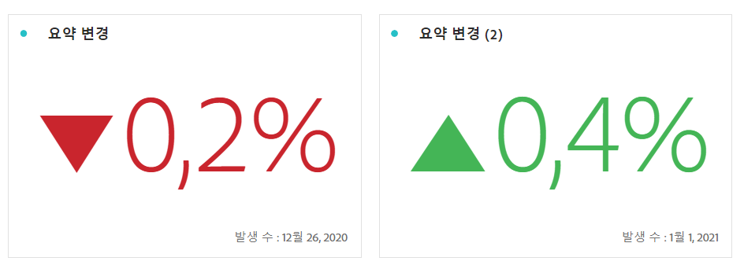

# 요약 번호 및 요약 변경 사항

## 요약 번호 시각화 {#summary-number}

프로젝트에서 중요한 큰 숫자를 강조 표시하려면 요약 번호 시각화를 사용하십시오. 이 시각화는 다음과 같은 방식으로 동작합니다.

* 셀을 선택하지 않은 경우 열의 합계를 선택합니다.
* 단일 셀을 선택하면 해당 셀의 요약이 표시됩니다.
* 두 개 이상의 셀을 선택하면 선택한 첫 번째 셀이 표시됩니다.
* 열을 선택하면 열의 첫 번째 셀 값이 선택됩니다.

오른쪽 위에 있는 **시각화 설정** 톱니바퀴를 클릭하여 요약 번호 설정을 구성합니다.

| 설정 | 정의 |
|--- |--- |
| 백분율 | 숫자 대신 백분율을 표시합니다. |
| 범례 표시 | 표시된 지표에 대한 정보를 표시합니다. |
| 값 생략 | 값들을 축약하고 소수점 이하 최대 3자리를 표시하도록 선택합니다. |
| 다음을 기준으로 값 요약 | 선택한 데이터의 최대, 최소, 평균, 중간값 또는 합계를 표시하도록 선택합니다. |

오른쪽 위에 있는 **시각화 설정** 톱니바퀴를 클릭하여 요약 번호 설정을 구성합니다.

| 설정 | 정의 |
|--- |--- |
| 백분율 | 숫자 대신 백분율을 표시합니다. |
| 범례 표시 | 표시된 지표에 대한 정보를 표시합니다. |
| 값 생략 | 값들을 축약하고 소수점 이하 최대 3자리를 표시하도록 선택합니다. |
| 다음을 기준으로 값 요약 | 선택한 데이터의 최대, 최소, 평균, 중간값 또는 합계를 표시하도록 선택합니다. |

## 요약 변경 시각화 {#summary-change}

요약 변경 시각화를 사용하여 두 숫자 간의 델타(변화량)를 표시합니다. 요약 변경의 녹색 및 빨간색 색상은 [사용자 지정 이벤트 극성](https://docs.adobe.com/content/help/ko-KR/analytics/admin/admin-tools/success-events/success-event.html) 또는 계산된 지표의 [증가 트렌드를 다른 방식으로 표시](https://docs.adobe.com/content/help/ko-KR/analytics/components/calculated-metrics/calcmetric-workflow/cm-build-metrics.html) 옵션을 통해 제어할 수 있습니다.

이 시각화는 다음과 같은 방식으로 동작합니다.

* 셀을 선택하지 않으면 열의 처음 두 셀 값을 비교합니다.
* 하나의 셀을 선택하면 셀 값을 자신과 비교하기 때문에 0을 표시합니다.
* 두 개의 셀을 선택하면 처음 선택한 셀을 분자로, 두 번째 셀을 분모로 취합니다.
* 세 개 이상의 셀을 선택하면 처음 두 개만 비교합니다.
* 셀 범위를 선택하면 범위에서 선택한 첫 번째 셀과 마지막 셀을 비교합니다.
* 열을 선택하면 첫 번째 값과 자신을 비교하여 0이 표시됩니다.

오른쪽 위에 있는 **시각화 설정** 톱니바퀴를 클릭하여 요약 변경 설정을 구성합니다.

| 설정 | 정의 |
|--- |--- |
| 백분율 | 숫자 대신 백분율을 표시합니다. |
| 범례 표시 | 표시된 지표에 대한 정보를 표시합니다. |
| 백분율 변경 표시 | 두 숫자 사이의 퍼센트 변화량을 표시합니다. |
| 원시 차이 표시 | 두 숫자 사이의 원시 차이를 표시합니다. 이 옵션을 사용하여 값들을 축약하고 소수점 이하 최대 3자리를 표시할 수도 있습니다. |
