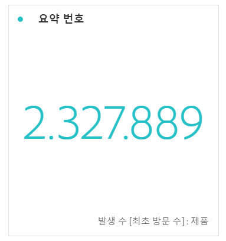

# 요약 번호 및 요약 변경 사항

## 요약 번호 시각화

* 셀을 선택하지 않은 경우 열의 합계를 선택합니다.
* 단일 셀을 선택하면 해당 셀의 요약이 표시됩니다.
* 두 개 이상의 셀을 선택하면 선택한 첫 번째 셀이 표시됩니다.
* 열을 선택하면 열의 첫 번째 셀 값이 선택됩니다.

## 요약 변경 사항 시각화

* 셀을 선택하지 않으면 열의 처음 두 셀 값을 비교합니다.
* 하나의 셀을 선택하면 셀 값을 자신과 비교하기 때문에 0을 표시합니다.
* 두 개의 셀을 선택하면 처음 선택한 셀을 분자로, 두 번째 셀을 분모로 취합니다.
* 세 개 이상의 셀을 선택하면 처음 두 개만 비교합니다.
* 셀 범위를 선택하면 범위에서 선택한 첫 번째 셀과 마지막 셀을 비교합니다.
* 열을 선택하면 첫 번째 값과 자신을 비교하여 0이 표시됩니다.
* 요약 변경의 녹색 및 빨간색 색상은 다음을 통해 제어할 수 있습니다.

   * [사용자 지정 이벤트 극성](https://marketing.adobe.com/resources/help/en_US/reference/success_event.html)
   * 계산된 지표의 [증가 트렌드를 다른 방식으로 표시](https://marketing.adobe.com/resources/help/en_US/analytics/calcmetrics/cm_build_metrics.html) 옵션.

## Summary Change settings {#section_2581AC0107634FB4990AB8347E5897AA}

시각화 옆에 있는 톱니바퀴 아이콘을 클릭하여 요약 설정을 구성합니다.

| 설정 | 정의 |
|--- |--- |
| 백분율 | 숫자 대신 백분율을 사용합니다. |
| 범례 표시 | 사용된 지표를 표시합니다. |
| 요약 번호 옵션: 값 간략하게 하기 | 축약값에 대해 소수점 이하 0~3자리를 선택할 수 있습니다. |
| 요약 변경 옵션: 백분율 변경 표시 | 두 숫자 사이의 변경을 백분율로 표시합니다. |
| 요약 변경 옵션: 원시 차이 표시 | 두 숫자 사이의 원시 차이를 표시합니다. |