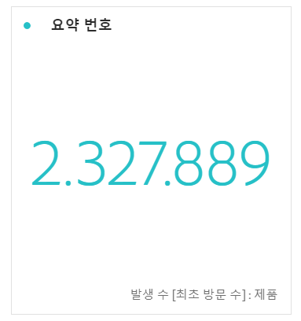
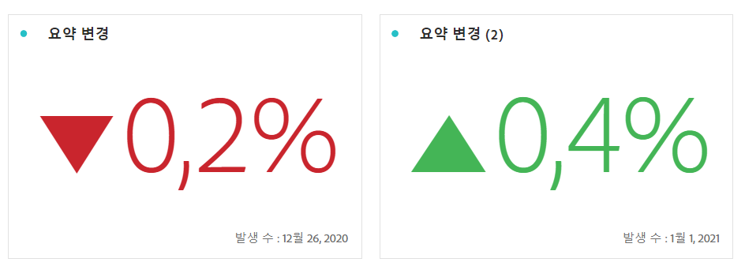

# 요약 숫자 및 변경 사항

>[!BEGINSHADEBOX]

_이 문서는 이 문서의_  _&#x200B;**Adobe Analytics**&#x200B;에 있는 요약 번호 및 요약 변경 시각화를 문서화합니다._ _자세한 내용은 [요약 번호 및 요약 변경](https://experienceleague.adobe.com/ko/docs/analytics-platform/using/cja-workspace/visualizations/summary-number-change)을 참조하십시오_  _&#x200B;**Customer Journey Analytics** 버전._

>[!ENDSHADEBOX]

>[!BEGINSHADEBOX]

데모 비디오를 보려면  [요약 숫자 및 요약 변경 시각화](https://experienceleague.adobe.com/en/docs/analytics-learn/tutorials/analysis-workspace/visualizations/summary-number-and-summary-change-visualizations-2021){target="_blank"}를 확인하십시오.

>[!ENDSHADEBOX]

## 요약 숫자 {#summary-number}

<!-- markdownlint-disable MD034 -->

>[!CONTEXTUALHELP]
>id="workspace_summarynumber_button"
>title="요약 숫자"
>abstract="총계와 소계를 보여 주는 시각화를 만듭니다."

<!-- markdownlint-enable MD034 -->

프로젝트에서 중요한 큰 숫자를 강조 표시하려면  **[!UICONTROL 요약 숫자]** 시각화를 사용하십시오. 이 시각화는 연관된 데이터 소스를 사용하여 다음과 같은 방식으로 작동합니다.

* 선택된 셀이 없는 경우 열의 합계를 선택합니다.
* 단일 셀을 선택하면 해당 셀에 대한 요약이 표시됩니다.
* 셀을 두 개 이상 선택하면 선택한 첫 번째 셀이 표시됩니다.
* 열을 선택하면 열의 첫 번째 셀 값이 선택됩니다.

시각화 설정의 일부로 특정 요약 숫자 옵션을 이용할 수 있습니다.

| 옵션 | 정의 |
|--- |--- |
| **[!UICONTROL 값 생략]** | 숫자 값을 지능적으로 축약하도록 **[!UICONTROL 값 생략]**&#x200B;을 선택합니다. 선택하면 숫자를 입력하여 축약 수를 정의합니다. 예: <table><tr><td>**원래 값**</td><td>**축약 값**</td><td>**결과**</td></tr><tr><td>$12,011,141.25</td><td>선택되지 않음</td><td  align="right">$12,011,141.25</td></tr><tr><td>$12,011,141.25</td><td>선택된 경우, `0`으로 설정</td><td align="right">$12M</td></tr><tr><td>$12,011,141.25</td><td> 선택된 경우, `1`으로 설정</td><td  align="right">$12.0M</td></tr><tr><td>$12,011,141.25</td><td>선택된 경우, `2`으로 설정</td><td align="right">$12.01M</td></tr><tr><td>$12,011,141.25</td><td>선택된 경우, `3`으로 설정</td><td align="right">$12.011M</td></tr></table> |
| **[!UICONTROL 다음을 기준으로 값 요약]** | 선택한 데이터의 최대, 최소, 평균, 중간값 또는 합계를 표시하도록 선택합니다. |

## 요약 변경 {#summary-change}

<!-- markdownlint-disable MD034 -->

>[!CONTEXTUALHELP]
>id="workspace_summarychange_button"
>title="요약 변경"
>abstract="두 숫자 사이의 델타(변경)를 보여 주는 시각화를 만듭니다."

<!-- markdownlint-enable MD034 -->

 **[!UICONTROL 요약 변경]** 시각화를 사용하여 두 숫자 간의 델타(변화량)를 표시합니다. <!-- This is applicable for AA, not CJA: The green and red color of the Summary Change can be controlled through [custom event polarity](/help/admin/tools/success-events/success-event.md) or a calculated metric's [Show Upward Trend As](/help/components/calculated-metrics/workflow/cm-build-metrics.md) option.-->

<!--
The green and red color of the Summary Change can be controlled through [custom event polarity](/help/admin/tools/manage-rs/edit-settings/conversion-var-admin/c-success-events/success-event.md.md) or a calculated metric's [Show Upward Trend As](/help/components/calculated-metrics/calcmetric-workflow/cm-build-metrics.md) option.
-->

이 시각화는 다음과 같은 방식으로 동작합니다.

* 셀을 선택하지 않으면 열의 처음 두 셀 값을 비교합니다.
* 한 셀을 선택하면 셀 값을 자신과 비교하므로 0이 표시됩니다.
* 두 개의 셀을 선택하면 첫 번째 선택한 셀이 분모로 사용되고 두 번째 셀이 분모로 사용됩니다.
* 둘 이상의 셀을 선택한 경우 비교를 위해 처음 두 개만 고려합니다.
* 셀 범위를 선택하면 범위에서 선택한 첫 번째 셀과 마지막 셀을 비교합니다.
* 열을 선택하면 첫 번째 값을 자신과 비교하여 0의 변화를 표시합니다.

시각화 설정의 일부로 특정 **[!UICONTROL 요약 변경 옵션]**&#x200B;을 이용할 수 있습니다.

| 옵션 | 정의 |
|--- |--- |
| **[!UICONTROL 백분율 변경 표시]** | 두 숫자 사이의 퍼센트 변화량을 표시합니다. |
| **[!UICONTROL 원시 차이 표시]** | 두 숫자 사이의 원시 차이를 표시합니다. 이 옵션을 사용하여 값들을 축약하고 소수점 이하 최대 3자리를 표시할 수도 있습니다. |
| **[!UICONTROL 값 생략]** | 변경된 값을 지능적으로 축약하도록 **[!UICONTROL 값 생략]**&#x200B;을 선택합니다. 선택하면 숫자를 입력하여 축약 수를 정의합니다. 예: <table><tr><td>**원래 값**</td><td>**축약 값**</td><td>**결과**</td></tr><tr><td>$12,011,141.25</td><td>선택되지 않음</td><td  align="right">$12,011,141.25</td></tr><tr><td>$12,011,141.25</td><td>선택된 경우, `0`으로 설정</td><td align="right">$12M</td></tr><tr><td>$12,011,141.25</td><td> 선택된 경우, `1`으로 설정</td><td  align="right">$12.0M</td></tr><tr><td>$12,011,141.25</td><td>선택된 경우, `2`으로 설정</td><td align="right">$12.01M</td></tr><tr><td>$12,011,141.25</td><td>선택된 경우, `3`으로 설정</td><td align="right">$12.011M</td></tr></table> |

>[!MORELIKETHIS]
>
>[패널에 시각화 추가](/help/analyze/analysis-workspace/visualizations/freeform-analysis-visualizations.md#add-visualizations-to-a-panel)
>[시각화 설정](/help/analyze/analysis-workspace/visualizations/freeform-analysis-visualizations.md#settings)
>[시각화 컨텍스트 메뉴](/help/analyze/analysis-workspace/visualizations/freeform-analysis-visualizations.md#context-menu)
>
