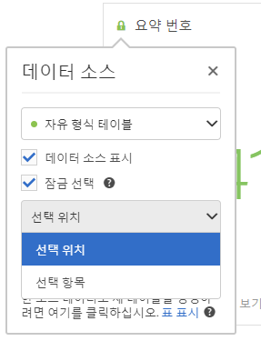
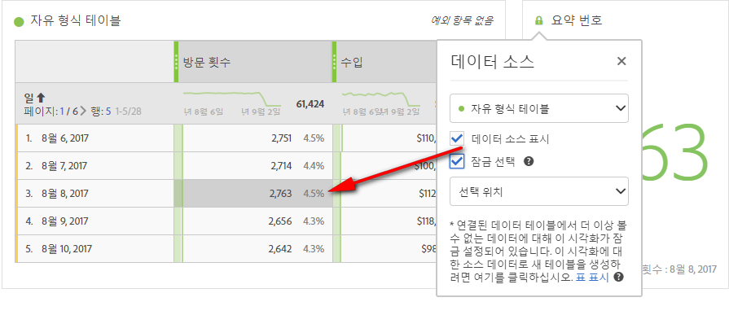
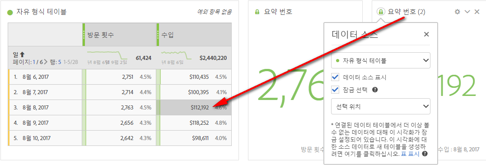
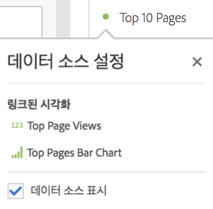

# 데이터 소스 관리

시각화를 동기화하면 시각화에 해당하는 데이터 테이블 또는 데이터 소스를 제어할 수 있습니다.

**팁:** 제목 옆의 점 색상을 통해 연관된 시각화를 구분할 수 있습니다. 색상이 일치하면 시각화가 동일한 데이터 소스를 기준으로 한다는 것을 의미합니다.

데이터 소스를 관리하면 데이터 소스를 표시하거나 선택을 잠글 수 있습니다. 이러한 설정은 새 데이터가 유입될 때 시각화가 변경되는(또는 변경되지 않는) 방식을 결정합니다.

1. [데이터 테이블과 시각화를](../../../analyze/analysis-workspace/build-workspace-project/t-freeform-project.md#task_C2C698ACC7954062A28E4784911E6CF2) 사용하여 프로젝트를 [만듭니다](../../../analyze/analysis-workspace/visualizations/freeform-analysis-visualizations.md#concept_09242627629147A88A68F1506954C276).
1. 데이터 테이블에서 시각화와 연결할 셀(데이터 소스)을 선택합니다.
1. In the visualization, click the dot next to the title to bring up the **[!UICONTROL Data Source]** dialog. Select **[!UICONTROL Show Data Source]** or **[!UICONTROL Lock Selection]**.

   

   시각화를 테이블 셀에 동기화하면, 새로운(숨겨진) 테이블이 만들어지고 해당 테이블과 동기화된 시각화가 컬러 코딩됩니다.

| 요소 | 설명 |
|--- |--- |
| 연결된 시각화 | 자유 형식 또는 집단 테이블에 연결된 시각화가 있는 경우 왼쪽 상단 점이 열려 연결된 시각화가 나열되고 이 점에 해당 테이블을 표시하거나 숨길 수 있는 "표시" 확인란 옵션이 표시됩니다.  마우스를 가져가면 연결된 시각화가 강조 표시되고 클릭하면 해당 시각화로 이동합니다. |
| 데이터 소스 표시 | 시각화에 해당하는 데이터 테이블을 확인란을 사용 설정하여 표시하거나 사용 해제하여 숨길 수 있습니다. |
| 선택 사항 잠금 | 이 설정을 사용하면 해당 데이터 테이블에서 현재 선택된 데이터로 시각화를 잠급니다. 사용 설정되면 다음 중에서 선택하십시오.  <ul><li>**선택된 위치**: 해당 데이터 테이블에서 선택되어 있는 위치에 대해 시각화를 잠금 상태로 유지하려면 이 옵션을 선택합니다. 이 위치에서 특정 항목이 바뀌는 경우에도 이 위치의 시각화는 계속 유지됩니다. 예를 들어 상위 5위까지 표시되는 캠페인 이름에 관계없이 이 시각화에서 상위 5개의 캠페인 이름을 항상 표시하려면 이 옵션을 선택합니다.</li> <li>**선택된 항목**: 해당 데이터 테이블에서 현재 선택되어 있는 특정 항목에 대해 시각화를 잠금 상태로 유지하려면 이 옵션을 선택합니다. 이러한 항목은 테이블의 항목 간에 순위가 바뀌는 경우에도 계속 시각화됩니다. 예를 들어 해당 캠페인 이름의 순위에 관계없이 이 시각화에서 동일한 특정 상위 5개의 캠페인 이름을 항상 표시하려면 이 옵션을 선택합니다.</li></ul> |

이 아키텍처는 더 이상 분석 작업 공간의 이전 아키텍처와 다르므로 잠긴 선택 영역을 저장하는 숨겨진 숨겨진 테이블을 더 이상 만들지 않습니다. 이제 데이터 소스는 시각화를 작성한 기반이 된 테이블을 가리킵니다.

**사용 사례의 예:**

* 요약 시각화를 작성하고 이를 작성한 기반이 된 테이블의 셀에 잠글 수 있습니다. "데이터 소스 표시"를 활성화하면 이 정보가 테이블의 어디에서 오는지 정확하게 보여줍니다. 소스 데이터가 회색으로 표시됩니다.

   &gt;
* 여기에 표시된 것처럼 많은 시각화를 추가하고 동일한 테이블의 다른 셀에서 소스를 가져올 수 있습니다. 테이블은 위 예의 경우와 동일하지만 소스 셀(및 지표)은 다릅니다.

   &gt;
* 왼쪽 상단의 점(데이터 소스 설정)을 클릭하여 자유 형식 또는 집단 테이블에 연결된 시각화가 있는지 여부를 확인할 수 있습니다. 마우스를 이동하면 연결된 시각화가 강조 표시되고, 클릭하면 해당 시각화로 이동합니다.

   &gt;
