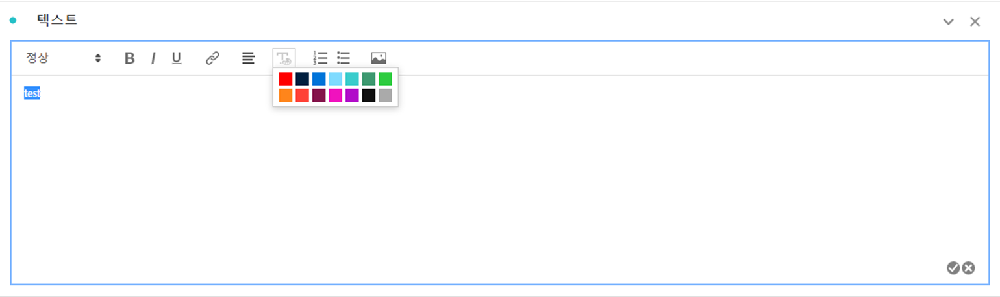
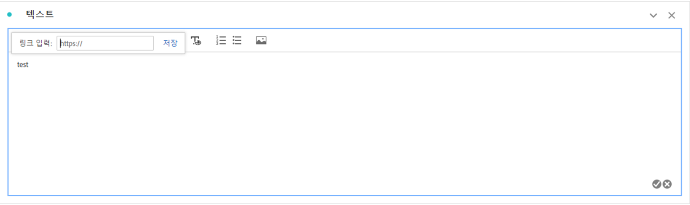
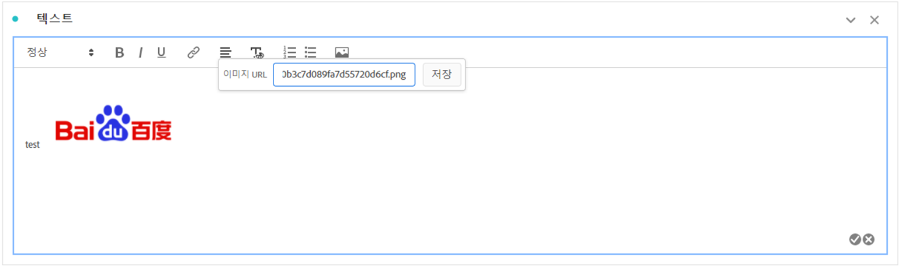

# 텍스트

텍스트 시각화 또는 패널/시각화 설명을 사용하여 사용자 정의 텍스트를 작업 영역 프로젝트에 추가할 수 있습니다(마우스 오른쪽 단추 클릭 헤더 > **[!UICONTROL 설명 편집]**). 텍스트의 서식을 변경하고 하이퍼링크를 추가하고 이미지를 추가할 수도 있습니다.

## {#format} 서식 조정

텍스트 상자 또는 설명을 편집할 때 선택한 텍스트의 글꼴 크기(제목 수준), 색상, 스타일(굵게, 기울임체, 밑줄) 및 정렬을 조정할 수 있습니다. 글머리 기호 및 번호 매기기 목록을 추가할 수도 있습니다.

## 하이퍼링크 추가 {#hyperlinks}

하이퍼링크를 추가하려면 텍스트를 강조 표시하고 메뉴에서 하이퍼링크 아이콘을 클릭합니다. 하이퍼링크는 외부 웹 사이트, 문서 페이지, [Workspace 프로젝트/패널/시각화](https://experienceleague.adobe.com/docs/analytics/analyze/analysis-workspace/curate-share/shareable-links.html) 등으로 링크되어 프로젝트 수신자를 보다 지원할 수 있습니다.

## 이미지 {#images} 추가

프로젝트에 이미지를 추가하려면 메뉴에서 이미지 아이콘을 클릭하고 공개 이미지 URL을 삽입합니다. 이미지 URL은 공개적으로 액세스할 수 있어야 하며 `https`으로 시작해야 하며 `.png`, `.jpeg`, `.jpg` 또는 `.gif` 형식이어야 합니다. 정적 이미지 및 애니메이션 이미지가 지원됩니다.

