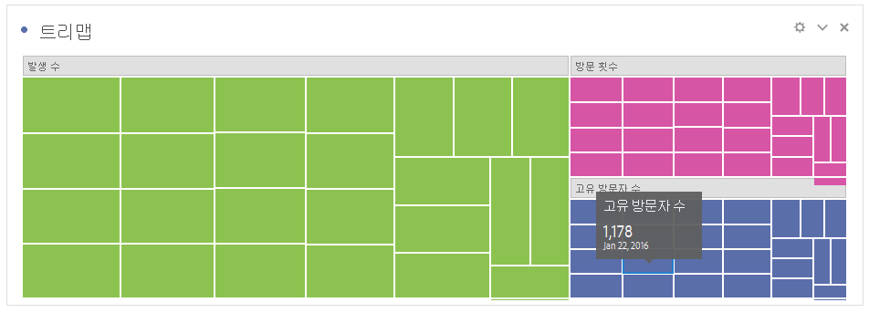

# 트리맵

계층형(트리 구조) 데이터를 중첩된 직사각형 세트로 표시합니다.

각 트리 분기에 직사각형이 제공된 다음 하위 분기를 나타내는 좀 더 작은 직사각형으로 바둑판식으로 정렬됩니다.

색상 및 크기 차원이 트리 구조와 어떤 방식으로 상호 연관되어 있는 경우 특정 색상이 특별히 관련이 있는 경우처럼 다른 방식으로는 구분하기 어려울 수 있는 패턴을 쉽게 볼 수도 있습니다. 트리맵의 또 다른 이점은 구조적으로 공간을 효율적으로 사용할 수 있다는 것입니다.
