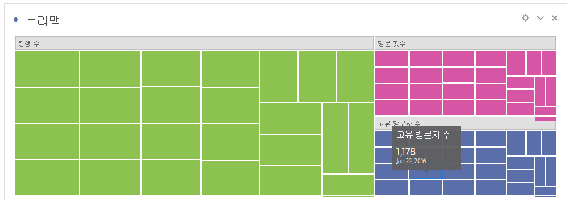

# [!UICONTROL 트리맵] {#treemap}

<!-- markdownlint-disable MD034 -->

>[!CONTEXTUALHELP]
>id="workspace_treemap_button"
>title="트리맵"
>abstract="중첩된 직사각형으로 계층(트리 구조) 데이터를 보여 주는 트리맵 시각화를 만듭니다."

<!-- markdownlint-enable MD034 -->

>[!BEGINSHADEBOX]

_이 문서에서는 트리맵 시각화에 대해 설명합니다._  _&#x200B;**Adobe Analytics**._ _이 문서의_&#x200B;에 대해 [트리맵](https://experienceleague.adobe.com/ko/docs/analytics-platform/using/cja-workspace/visualizations/treemap)을(를) 참조하십시오 _&#x200B;**Customer Journey Analytics** 버전._

>[!ENDSHADEBOX]

 **[!UICONTROL 트리맵]** 시각화를 사용하면 계층형(트리 구조) 데이터를 중첩된 직사각형 집합으로 표시할 수 있습니다.

각 트리 분기에 직사각형이 제공된 다음 하위 분기를 나타내는 좀 더 작은 직사각형으로 바둑판식으로 정렬됩니다.

트리맵을 사용하면 다른 방식으로는 찾기 어려운 패턴을 볼 수 있습니다. 차원의 색상과 크기를 사용하여 차원이 어떻게 상관되는지, 그리고 어떤 특정 차원이 특히 중요한지를 확인할 수 있습니다. 트리맵의 또 다른 이점은 구조적으로 공간을 효율적으로 사용할 수 있다는 것입니다.

>[!BEGINSHADEBOX]

데모 비디오를 보려면  [트리맵 시각화](https://experienceleague.adobe.com/ko/docs/analytics-learn/tutorials/analysis-workspace/visualizations/treemap-visualization){target="_blank"}를 확인하십시오.

>[!ENDSHADEBOX]

>[!MORELIKETHIS]
>
>[패널에 시각화 추가](/help/analyze/analysis-workspace/visualizations/freeform-analysis-visualizations.md#add-visualizations-to-a-panel)
>[시각화 설정](/help/analyze/analysis-workspace/visualizations/freeform-analysis-visualizations.md#settings)
>[시각화 컨텍스트 메뉴](/help/analyze/analysis-workspace/visualizations/freeform-analysis-visualizations.md#context-menu)
>
