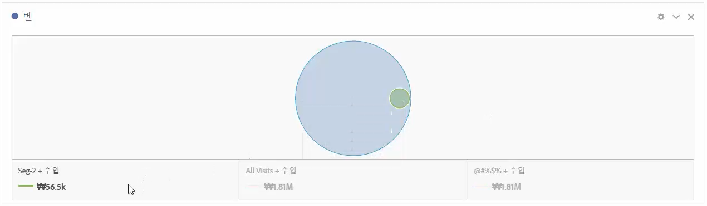
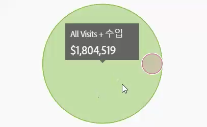
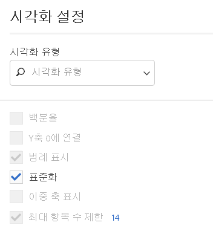

# 벤

벤 시각화를 사용하여 최대 3개의 세그먼트(구성 요소)와 1개의 지표를 드래그하여 벤 다이어그램을 작성할 수 있습니다.

그런 후 세그먼트 위로 마우스를 가져가 백분율 등을 보다 자세히 확인할 수 있습니다.

To turn the Venn diagram into a Freeform table, click the colored dot next to the **[!UICONTROL Venn]** header and select **[!UICONTROL Manage Data Sources]** &gt; **[!UICONTROL Available Data Sources]** &gt; **[!UICONTROL Freeform Table]**.

벤 다이어그램을 정규화하려면(크기 조정), 해당 [시각화 설정] 아이콘으로 이동한 후 **[!UICONTROL 정규화를 선택합니다]**.

