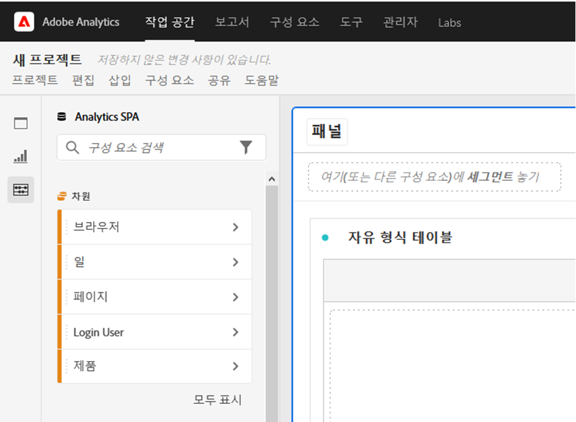
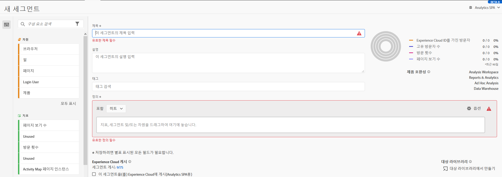

# 분석 작업 공간의 액세스 가능성

Adobe Analytics의 고급 분석 툴인 [!UICONTROL 분석 작업 공간에서]액세스 가능성 지원에 대해 알아봅니다.

액세서빌러티(Accessibility) 는 제품이 시각, 청각, 모터 및 기타 장애가 있는 사람들에게 유용하게 사용되는 것을 말합니다. 소프트웨어 제품의 액세서빌러티 기능에는 화면 판독기 지원, 그래픽에 상응하는 텍스트, 키보드 단축키, 디스플레이 색상을 대비로 변경 등이 포함됩니다.

[!UICONTROL 분석 작업 공간은] 액세스 가능하게 해주는 일부 도구와 액세스 가능한 컨텐츠를 만드는 데 도움이 되는 도구를 제공합니다.

## 키보드를 [!UICONTROL 사용하여 작업] 영역 탐색

분석 작업 공간 [!UICONTROL 의] 탐색은 위쪽 > 아래쪽, 왼쪽 > 오른쪽으로 작동합니다. 다음 탐색 요소는 접근성을 용이하게 합니다.

* 중요한 단축키를 사용하는 `F6` 키
* 개별 요소 간에 `Tab` 키가 이동합니다.
* 보이는 키보드 사용자가 현재 포커스가 있는 UI 요소를 명확하게 나타낼 수 있도록 초점 표시기를 적용합니다. 표시기는 선택한 요소 주위에 파란색 테두리입니다.

   

### 드래그 앤 드롭 상호 작용을 위한 키보드 탐색

[!UICONTROL 분석 작업 공간] 은 드래그 앤 드롭 사용자 인터페이스입니다. 그러나 사용자는 키보드를 사용하여 구성 요소를 추가할 수 있습니다.

1. 왼쪽 레일에 있는 구성 요소에 탭으로 이동합니다.
1. 을 눌러 `Enter` 선택합니다.
1. 화살표 키를 사용하여 구성 요소를 삭제할 영역으로 이동합니다.
1. 을 눌러 구성 요소 `Enter` 를 배치합니다.

### 키보드 단축키(핫키)

[!UICONTROL 분석 작업 공간] 은 보다 매끄러운 워크플로우를 위해 풍부한 [키보드 단축키](https://docs.adobe.com/content/help/ko-KR/analytics/analyze/analysis-workspace/build-workspace-project/fa-shortcut-keys.html) 세트를 제공합니다. 탐색, 분석 제작 및 통찰력 민주화에 대한 몇 가지 일반적인 단축키가 아래에 나와 있습니다.

#### 탐색

| 단축키 | 작업 |
|---|---|
| Alt + Shift + 1 / 2 / 3 | 다른 레일로 이동: [!UICONTROL 패널], [!UICONTROL 시각화]또는 [!UICONTROL 구성 요소] |
| Alt + 왼쪽/오른쪽 화살표 | 패널 간 탐색 |
| Alt + M | 모든 패널 축소/확장 |
| Alt+ Ctrl + M | 활성 패널 축소/확장 |
| Ctrl + / | 왼쪽 레일 검색 |

#### 분석 제작

| 단축키 | 작업 |
|---|---|
| Alt + 1 | 새 자유 형식 테이블 |
| Ctrl + Shift + C | 새 계산된 지표 |
| Ctrl + Shift + D | 새 날짜 범위 |
| Ctrl + Shift + E | 새 세그먼트 |
| Ctrl + Z | 실행 취소 |
| Shift 키(패널 세그먼트 드롭존) | 드롭다운 [필터를 만듭니다](https://docs.adobe.com/content/help/en/analytics-learn/tutorials/analysis-workspace/using-panels/using-drop-down-filters.html). |

#### 민주화

| 단축키 | 작업 |
|---|---|
| Ctrl + S | 저장 |
| Ctrl + Shift + G | 조정 |
| Ctrl + G | 공유 |
| Alt + Shift + S | 예약 |
| Alt + L | 프로젝트에 대한 링크 가져오기 |
| Ctrl + Shift + B | PDF 다운로드 |

## 화면 판독기 및 화면 돋보기 지원

화면 판독기는 컴퓨터 화면에 표시되는 텍스트를 지웁니다. 또한 접근성 태그나 특성으로 제공되는 애플리케이션의 단추 레이블이나 이미지 설명과 같은 텍스트가 아닌 정보를 읽습니다.

## 색상 팔레트 및 대비

[!UICONTROL 분석 작업 공간에서] WCAG AA 색상 대비 준수를 위해 노력하고 있습니다.

또한 프로젝트 > 프로젝트 설정 **[!UICONTROL >]** 프로젝트 색상 팔레트 **[!UICONTROL 아래에서 프로젝트에 대해 원하는 색상 팔레트를 직접 설정할 수]** 있습니다 .

## 구성 요소 빌더의 필수 필드 유효성 검사

구성 요소를 작성할 때 저장 시 필수 필드의 유효성이 검사됩니다. 필수 필드가 유효성 검사를 통과하지 못하면 오류 아이콘과 함께 빨간색으로 표시됩니다. 수정해야 하는 문제에 대한 서면 설명이 나타납니다.

구성 요소의 유효성이 완전히 확인되면 을 눌러 빌더를 `Save` 닫습니다.

## 운영 체제 액세서빌러티 기능 지원

분석 작업 공간은 고대비 모드 및 화면 판독기(MS Windows용 내레이터 및 macOS용 VoiceOver)와 같은 내장된 MS Windows 및 macOS 접근성 기능을 지원합니다.