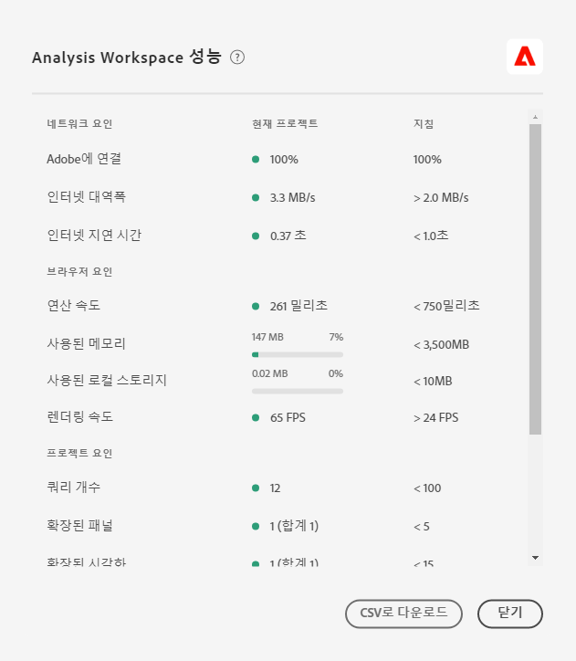

# Optimize [!UICONTROL Analysis Workspace performance]

다양한 요소들이 Analysis Workspace 내의 프로젝트 성과에 영향을 줄 수 있다. 프로젝트를 가장 최적의 방식으로 계획 및 구축할 수 있도록 프로젝트를 빌드하기 전에 이러한 기여자가 어떤 사람인지 아는 것이 중요합니다. 이 페이지에는 Analysis Workspace의 최고 성능을 보장하기 위해 수행할 수 있는 성능 및 최적화에 영향을 주는 요소 목록이 포함되어 있습니다.

## [!UICONTROL 도움말] > Analysis Workspace [!UICONTROL 의] 성능

Analysis Workspace > **도움말 [!UICONTROL >] 성능 [!UICONTROL 아래에서 네트워크, 브라우저, 프로젝트 요소 등 프로젝트 성능에 영향을 주는 요인을 확인할 수 있습니다]**. 가장 정확한 결과를 위해 성능 페이지를 열기 전에 프로젝트를 완전히 로드할 수 있도록 합니다.

* 현재 프로젝트 열에는 현재 프로젝트 및 사용자 환경에 대한 결과가 표시됩니다.
* 지침 열에는 각 요소에 대한 Adobe 권장 임계값이 표시됩니다.

또한 성능 컨텐츠를 CSV로 **다운로드하여** Adobe 고객 지원 센터 또는 내부 IT 팀과 쉽게 공유할 수 있습니다.

>[!NOTE]
>
>변수가 변경될 때마다, 성과 페이지에 대한 정보는 모달이 열릴 때마다 달라집니다. 또한, Adobe은 더 많은 데이터를 사용할 수 있게 되면 제공된 지침을 계속 세분화합니다.

## 네트워크 요소

[!UICONTROL 도움말] > [!UICONTROL 성능] 네트워크 요인은 다음과 같습니다.

| 요소 | 정의 | 영향 | 최적화 |
| --- | --- | --- | --- |
| Adobe에 연결 | 성능 페이지가 열릴 때 Adobe은 10개의 테스트 호출을 전송합니다. 성공적인 Adobe에 대한 호출의 백분율을 나타냅니다. | 로컬 네트워크 문제 또는 Adobe 문제는 이 요인에 영향을 줍니다. | status.adobe.com에서 알려진 서비스 문제가 있는지 확인하십시오. 그런 다음 로컬 네트워크 연결을 확인합니다. |
| 인터넷 대역폭 | Google Chrome에서만 사용할 수 있습니다. 사용자의 위치에 있는 대역폭에 대한 브라우저의 예상 결과입니다. 가이드라인은 2.0MB/s 입니다. | 로컬 네트워크 연결이 이 요인에 영향을 줍니다. | 로컬 네트워크 연결을 확인합니다. |
| 인터넷 지연 시간 | 성능 페이지가 열릴 때 Adobe은 10개의 테스트 호출을 전송합니다. 이것은 각 요청이 Adobe으로 이동하고 반환되는 데 평균적으로 걸리는 시간을 나타냅니다. 간단히 말해서, 이것은 당신의 위치와 Adobe 사이에 인터넷이 얼마나 빨리 있는지에 대한 측정이다. 가이드라인은 1초 미만입니다. | 로컬 네트워크 문제, 많은 개방형 브라우저 탭 또는 Adobe 문제가 이 요인에 영향을 미칩니다. | status.adobe.com에서 알려진 서비스 문제가 있는지 확인하십시오. 그런 다음 로컬 네트워크 연결을 확인하고 사용하지 않는 브라우저 탭을 닫습니다. |

## 브라우저 요소

[!UICONTROL 도움말] > [!UICONTROL 성능] 브라우저 요인은 다음과 같습니다.

| 요소 | 정의 | 영향 | 최적화 |
| --- | --- | --- | --- |
| 연산 속도 | 컴퓨터가 처리 테스트를 수행하는 속도입니다. 가이드라인은 750ms 미만입니다. | 하드웨어 및 동시 프로그램이 이러한 요인에 영향을 줄 것입니다. | 컴퓨터의 작업 관리자(PC) 또는 활동 모니터(Mac)를 열어 프로그램을 닫을 수 있는지 확인합니다. 그런 다음 사용하지 않은 브라우저 탭이나 기타 프로그램을 닫습니다.   이러한 작업이 도움이 되지 않는 경우 IT 팀과 하드웨어 세부 사항을 논의하십시오. |
| 사용된 메모리 | Google Chrome에서만 사용할 수 있습니다. Google Chrome 브라우저의 모든 작업 영역 탭은 총 4GB의 메모리를 공유합니다. 현재 프로젝트에 사용되는 메모리 허용 비율을 나타냅니다. 가이드라인은 3500MB로 작업 공간에서 메모리 오류를 표시할 수 있습니다. | 여러 탭에서 작업하거나 50000개의 데이터 행을 다운로드하면 메모리 사용이 증가하게 됩니다. | 메모리 오류가 발생하면 다른 작업 공간 탭을 닫거나 5000 행을 한 번에 다운로드할 수 있습니다. |
| 사용된 로컬 스토리지 | 브라우저에 사용할 수 있도록 컴퓨터에 로컬로 저장된 데이터 각 원본(예: experience.adobe.com)에는 10MB의 허용치가 있습니다. | Analysis Workspace은 자동 저장(기존) 프로젝트, 사용자 설정 및 기능 플래그 저장 등 여러 가지 기능에 로컬 저장소를 사용합니다. | Analysis Workspace 기능이 중단되지 않도록 experience.adobe.com 도메인에 대한 로컬 저장소를 지웁니다. |
| 렌더링 속도 | FPS는 초당 프레임 수를 의미하며, 브라우저가 화면에서 페이지를 그리는 횟수를 의미합니다. 24fps는 일반적으로 인간의 눈이 관찰할 수 있는 것이다.FPS가 이보다 낮은 경우 작업 공간에서 렌더링 문제를 관찰합니다. | FPS는 한 번에 많은 Workspace 프로젝트에서 멀티태스킹과 보고 있는 프로젝트의 크기에 영향을 받습니다. 컴퓨터에서 실행되는 다른 프로그램은 스트리밍, 백그라운드 스캐너 등과 같은 영향을 받을 수 있습니다. 또한 하드웨어는 이 요인에 영향을 미칩니다. | 컴퓨터의 작업 관리자(PC) 또는 활동 모니터(Mac)를 열어 프로그램을 닫을 수 있는지 확인합니다. 그런 다음 사용하지 않은 브라우저 탭이나 기타 프로그램을 닫습니다.   이러한 작업이 도움이 되지 않는 경우 IT 팀과 하드웨어 세부 사항을 논의하십시오. |

## 프로젝트 요소

[!UICONTROL 도움말] > [!UICONTROL 성능] 프로젝트 요소에는 다음이 포함됩니다.

| 요소 | 정의 | 최적화 |
| --- | --- | --- |
| 쿼리 개수 | 프로젝트에 표시된 데이터를 검색하기 위해 Adobe에 대한 총 쿼리(요청) 수입니다. 쿼리에는 표에 대한 등급 요청, 예외 항목 탐지, 스파크라인, 왼쪽 레일에 표시된 구성 요소 등이 포함됩니다. 축소된 패널 및 시각화를 제외합니다. 가이드라인은 100이다. | 특정 목적 또는 이해 관계자 그룹을 제공하는 여러 프로젝트로 데이터를 분할함으로써 가능한 한 프로젝트를 간소화할 수 있습니다. 태그를 사용하여 프로젝트를 테마로 구성하고 [직접 연결을](https://docs.adobe.com/content/help/ko-KR/analytics/analyze/analysis-workspace/curate-share/shareable-links.html) 통해 내부 목차를 만들어 이해 관계자가 필요한 항목을 보다 손쉽게 찾을 수 있습니다. |
| 확장된 패널(전체 패널 제외) | 프로젝트의 총 패널 수 중 확장된 패널 수입니다. 가이드라인은 5개다. | 프로젝트를 단순화하는 단계를 수행한 후 로드 시 볼 필요가 없는 프로젝트의 패널을 축소합니다. 프로젝트를 열면 확장된 패널만 처리됩니다. 축소된 패널은 사용자가 확장될 때까지 처리되지 않습니다. |
| 확장된 시각화(전체 시각화 중) | 숨겨진 데이터 소스를 포함하여 프로젝트의 총계에서 확장된 표 및 시각화의 수입니다. 가이드라인은 15개다. | 프로젝트를 단순화하는 단계를 수행한 후 로드 시 볼 필요가 없는 프로젝트의 시각화를 축소합니다. 보고서 소비자에게 가장 중요한 시각 효과를 우선시하고 필요한 경우 지원 시각적 요소를 보다 세부적인 별도 패널이나 프로젝트로 분류할 수 있습니다. |
| 자유 형식 셀 개수 | 프로젝트의 총 자유 형식 테이블 셀 수(모든 테이블의 행 * 열로 계산됨) 숨겨진 데이터 소스를 제외합니다. 가이드라인은 4000이다. | 표의 열 개수를 가장 관련성이 높은 데이터 포인트로만 줄입니다. 표 필터를 적용하거나 세그먼트를 적용하여 표의 행 수를 줄입니다. |
| 사용 가능한 구성 요소 | 프로젝트의 모든 보고서 세트에 걸쳐 프로젝트의 왼쪽 레일에서 검색된 총 구성 요소 수입니다. 이렇게 하면 왼쪽 레일이 로드되는 속도와 검색 결과 내에 반환되는 속도에 영향을 줍니다. 이 지침서는 2000년입니다. | 보다 맞춤화된 구성 요소를 포함하는 선별된 가상 보고서 세트를 만드는 방법에 대해 제품 관리자에게 문의하십시오. |
| 사용된 구성 요소 | 프로젝트에 사용된 총 구성 요소 수입니다. 가이드라인은 100이다. | 사용된 구성 요소의 수는 성능에 직접적인 영향을 주지 않습니다. 그러나 이러한 구성 요소의 복잡성은 프로젝트 성능에 기여합니다. 아래의 &quot;추가 요인&quot; 섹션에서 최적화를 참조하십시오. |
| 가장 긴 날짜 범위 | 이 인수는 프로젝트에 사용된 가장 긴 날짜 범위를 표시합니다. 가이드라인은 1년입니다 | 가능하면 필요 이상의 데이터를 가져오지 마십시오. 분석 관련 날짜로 패널 달력을 좁히거나 자유 형식 테이블에서 날짜 범위 구성 요소(자주색 구성 요소)를 사용합니다. 테이블에 사용된 날짜 범위는 패널 날짜 범위를 덮어씁니다. 예를 들어 지난 달, 지난 주 및 어제를 테이블 열에 추가하여 해당하는 특정 데이터 범위를 요청할 수 있습니다. Analysis Workspace에서 날짜 범위 작업에 대한 자세한 내용은 [이 비디오](https://docs.adobe.com/content/help/en/analytics-learn/tutorials/analysis-workspace/calendar-and-date-ranges/date-ranges-and-calendar-in-analysis-workspace.html)에서 확인하십시오.   또한 프로젝트에서 사용한 연간 비교 수를 최소화할 수 있습니다. 연도별 비교가 계산되면 관심 월들 사이의 전체 13개월 데이터를 살펴봅니다. 패널 날짜 범위를 지난 13개월로 변경하는 것과 동일한 효과가 있습니다. |

## 추가 요소

도움말 > 성능에 포함되지 않은 추가 요소는 다음과 같습니다.

| 요소 | 정의 | 영향 | 최적화 |
| --- | --- | --- | --- |
| 세그먼트 복잡도 | 복잡한 세그먼트에는 프로젝트 성능에 대한 중요한 영향이 있을 수 있습니다. | 세그먼트에 복잡성을 추가하는 요소(영향의 내림 순서로)에는 다음이 포함됩니다. <ul><li>연산자 - &quot;포함&quot;, &quot;다음 중 1개 이상의 항목 포함&quot;, &quot;일치함&quot;, &quot;다음으로 시작&quot; 또는 &quot;다음으로 끝남&quot; </li><li>특히 차원 제한(Within/After)이 사용되는 경우 순차적 세분화 </li><li>세그먼트에서 사용되는 차원 내 고유한 차원 항목의 수(예: Page에 10개의 고유 항목이 있는 Page = &#39;A&#39;는 Page에 100000개의 고유 항목이 있는 Page = &#39;A&#39;보다 빠릅니다.) </li><li>사용된 다양한 차원의 수(예: Page = &#39;Home&#39; 및 Page = &#39;Search results&#39;는 eVar 1 = &#39;red&#39; 및 eVar 2 = &#39;blue&#39;보다 빠릅니다.))</li><li>많은 OR 연산자(AND 대신)</li><li>범위가 다양한 중첩 컨테이너(예: &quot;방문자&quot; 내 &quot;방문&quot; 내의 &quot;히트&quot;)</li></ul> | 몇 가지 복잡성 요소를 방지할 수 없지만 세그먼트의 복잡성을 줄일 수 있는 기회를 모색해야 합니다. 일반적으로 세그먼트 기준을 더 특정적으로 만들수록 더 좋아집니다. 예:<ul><li>컨테이너를 통해 세그먼트 상단에서 단일 컨테이너를 사용하는 것은 일련의 중첩 컨테이너보다 빠릅니다.</li><li>연산자의 경우 &quot;같음&quot;이 &quot;포함&quot;보다 빠르며 &quot;다음 중 1개 이상의 항목과 같음&quot;이 &quot;다음 중 1개 이상의 항목 포함&quot;보다 빠릅니다.</li><li>많은 기준을 사용하면 AND 연산자가 일련의 OR 연산자보다 빠릅니다.</li></ul> 많은 OR 문을 하나의 &quot;equals any&quot; 문으로 줄일 수 있는 기회를 찾습니다.  [분류를](/help/components/classifications/c-classifications.md) 사용하면 여러 값을 간결한 그룹으로 통합하여 세그먼트를 만들 수도 있습니다. 분류 그룹에 대한 세그멘테이션을 사용하면 많은 OR 구문 또는 &quot;포함&quot; 기준을 포함하는 세그먼트에 대해 성능적인 이점이 있습니다. |
| 시각화의 복잡성(세그먼트, 지표, 필터) | 프로젝트에 기본적으로 추가된 시각화 유형(예: 폴아웃 및 자유 형식 테이블)은 프로젝트 성능에 크게 영향을 주지 않습니다. 영향을 주는 것은 처리 시간에 추가되는 시각화의 복잡성입니다. | 시각화에 복잡성을 추가하는 요소는 다음과 같습니다.<ul><li>요청한 데이터 범위</li><li>적용된 세그먼트 수(예: 자유 형식 테이블의 행으로 사용된 세그먼트 수)</li><li>복잡한 세그먼트 사용</li><li>[자유 형식 테이블의 정적 항목 행 또는 열](https://docs.adobe.com/content/help/en/analytics/analyze/analysis-workspace/visualizations/freeform-table/column-row-settings/manual-vs-dynamic-rows.html)</li><li>자유 형식 테이블의 행에 적용된 필터</li><li>포함된 지표 수, 특히 세그먼트를 사용하는 계산된 지표 수</li></ul> | 프로젝트가 원하는 대로 빠르게 로드되지 않은 경우, 가능하면 일부 세그먼트를 eVar 및 필터로 바꿔 보십시오.  비즈니스에 중요한 데이터 포인트에 대한 세그먼트와 계산된 지표를 지속적으로 사용하는 경우 구현을 개선하여 이러한 데이터 포인트를 보다 직접 캡처하는 것이 좋습니다. Adobe Experience Platform Launch 및 Adobe의 처리 규칙과 같은 태그 관리자를 사용하면 구현 변경 사항을 빠르고 쉽게 구현할 수 있습니다. |
| 보고서 세트 크기 | 보고서 세트에 수집된 데이터의 양입니다. | - | Adobe Analytics의 전반적인 경험을 개선하기 위해 구현 개선 사항이 있는지 확인하려면 구현 팀 또는 Adobe 전문가와 문의하십시오. |
