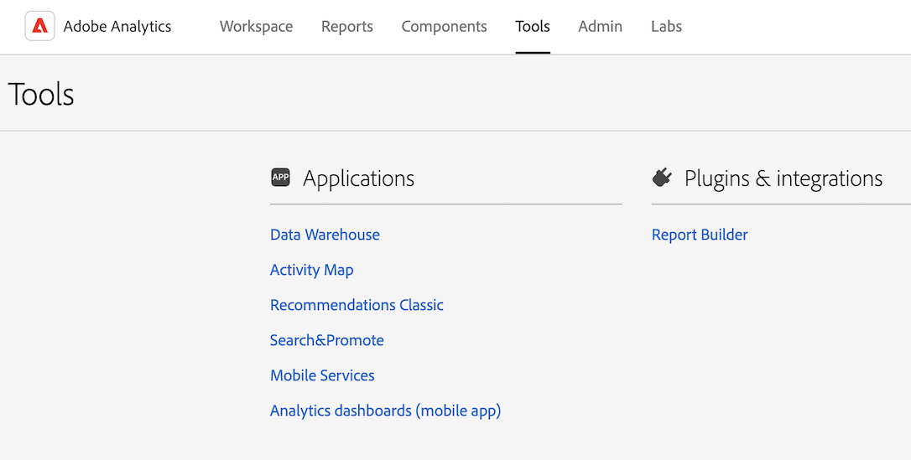

# Analytics 인터페이스 이해

Adobe Analytics 인터페이스는 Analysis Workspace에서 프로젝트 관리, 구성 요소 관리, 도구 및 관리자 기능을 위한 탭을 포함하여 다음과 같은 주요 영역으로 구성됩니다.

다음 섹션에서는 Analysis Workspace의 각 영역에 대해 설명합니다.

## 작업 영역 탭

다음 [!UICONTROL 작업 영역] 탭에는 [!UICONTROL 프로젝트] 기본적으로 회사 폴더, 사용자가 만든 모든 개인 폴더, 프로젝트 및 모바일 스코어카드를 표시하는 영역입니다.

1. Adobe Analytics에서 [!UICONTROL **작업 영역**] 탭을 선택합니다.

   

[!UICONTROL 작업 영역] 탭에서 사용할 수 있는 기능에 대한 자세한 내용은 [Adobe Analytics 랜딩 페이지](/help/analyze/landing.md)를 참조하십시오.

## 보고서 탭

2023년 12월 31일부로 Adobe는 Reports &amp; Analytics 및 관련 보고서와 기능에 대한 서비스를 중단할 예정입니다.

대신, [!UICONTROL **작업 영역**] 탭의 왼쪽 레일에 있는 [!UICONTROL **보고서**] 영역을 사용하십시오. 자세한 내용은 [Adobe Analytics 랜딩 페이지](/help/analyze/landing.md)에서 *보고서 탭 탐색*&#x200B;을 참조하십시오.

## 구성 요소 탭

[!UICONTROL 구성 요소] 탭에는 데이터 분석을 미세 조정하고 강화하는 데 도움이 되는 기능이 포함되어 있습니다.

1. Adobe Analytics에서 [!UICONTROL **구성 요소**] 탭을 선택한 다음 [!UICONTROL **모든 구성 요소**]&#x200B;를 선택합니다.

   

2. 다음 제품 기능 중 하나를 선택하여 구성하십시오.

   | 제품 기능 | 함수 | 추가 정보 |
   |---------|----------|----------|
   | 세그먼트 | Adobe Analytics를 사용하여 강력한 집중 대상자 세그먼트를 작성하고 관리하고 공유하고 Analytics 기능, Adobe Experience Cloud, Adobe Target 및 기타 통합 Adobe 제품을 통해 보고서에 적용할 수 있습니다. | [Analytics 세분화](https://experienceleague.adobe.com/docs/analytics/components/segmentation/seg-home.html?lang=ko-KR) |
   | 계산된 지표 | 계산 및 고급 계산(또는 파생) 지표는 기존의 지표에서 만들 수 있는 사용자 정의 지표입니다. 이 도구를 사용하는 마케터, 제품 관리자 및 분석가는 Analytics 구현을 변경하지 않아도 데이터에 대해 질문할 수 있습니다. | [계산 및 고급 계산(파생) 지표](https://experienceleague.adobe.com/docs/analytics/components/calculated-metrics/cm-overview.html?lang=ko) |
   | 날짜 범위 | Analysis Workspace에는 사용자가 분석을 빌드할 때 사용할 수 있는 기본 날짜 범위 목록이 포함되어 있습니다. 또한 사용자 정의 날짜 범위를 만들고 Analysis Workspace에서 사용자가 사용할 수 있도록 설정할 수 있습니다. | [사용자 정의 날짜 범위 만들기](https://experienceleague.adobe.com/docs/analytics/analyze/analysis-workspace/components/calendar-date-ranges/custom-date-ranges.html?lang=ko) <!-- should create an article in the Components Guide for managing/creating date ranges. This article in the Tools Guide needs updating. --> |
   | 가상 보고서 세트 | 가상 보고서 세트는 Adobe Analytics 데이터를 세그먼트로 분할하므로 각 세그먼트에 대한 액세스를 제어할 수 있습니다. | [가상 보고서 세트 개요](https://experienceleague.adobe.com/docs/analytics/components/virtual-report-suites/vrs-about.html?lang=ko-KR) |
   | 경고 | 지능형 경고는 경고를 더욱 세밀하게 제어할 수 있도록 해 주며 예외 항목 탐지 기능이 경고 시스템과 통합됩니다. | [지능형 경고](https://experienceleague.adobe.com/docs/analytics/components/alerts/intellligent-alerts.html?lang=ko) |
   | 타겟 | 대상을 사용하면 웹 사이트 성능을 측정하고 대상이 되는 목표를 기준으로 진행 상황을 추적할 수 있습니다. 대상을 만들 때 측정하려는 지표 또는 eVar를 선택하거나 선택한 지표에 대해 전체 사이트를 측정하도록 선택할 수 있습니다. 
타겟은 Reports &amp; Analytics의 일부입니다. Reports &amp; Analytics [서비스 종료 공지](https://express.adobe.com/page/6WnF8JK6IRDhf/)에 대해 자세히 알아보십시오.
 | [타겟](https://experienceleague.adobe.com/docs/analytics/analyze/reports-analytics/targets.html?lang=ko) |
   | 캘린더 이벤트 | 시간에 따른 트렌드 보고서의 경우 캘린더 이벤트를 통해 이벤트를 그래픽으로 표시하고 캠페인이나 다른 이벤트가 사이트 트래픽, 매출 또는 기타 지표에 영향을 미치는지 여부를 확인할 수 있습니다. | [캘린더 이벤트](https://experienceleague.adobe.com/docs/analytics/components/t-calendar-event.html?lang=ko) |
   | 주석 | 작업 영역의 주석을 사용하면 상황별 데이터 뉘앙스와 통찰력을 조직에 효과적으로 전달할 수 있습니다. 캘린더 이벤트를 특정 차원 및 지표에 연결할 수 있습니다. | [주석 관리](https://experienceleague.adobe.com/docs/analytics/analyze/analysis-workspace/components/annotations/manage-annotations.html?lang=ko) |
   | 분류 설정 | 분류 세트는 분류 및 규칙을 관리할 수 있는 단일 인터페이스를 제공합니다. 
분류란 Analytics 변수 데이터를 범주별로 분류하여 보고서를 생성할 때 여러 다른 방법으로 데이터를 표시하는 방법입니다. 변수 값 및 해당 값과 관련된 메타데이터 간의 관계를 설정합니다. 추적 코드, Prop 및 eVar와 같은 대부분의 사용자 정의 차원에서 분류를 사용할 수 있습니다.
 | [분류 세트 개요](https://experienceleague.adobe.com/docs/analytics/components/classifications/sets/overview.html?lang=ko) |
   | 위치 | 클라우드 대상에서 Adobe Analytics 분류 데이터를 가져오려면 먼저 분류 데이터를 수집할 위치를 추가하고 구성해야 합니다. 위치를 만들고, 편집하거나 삭제할 수 있습니다. | [위치 관리자](https://experienceleague.adobe.com/docs/analytics/components/locations/locations-manager.html?lang=ko) |
   | 예약된 프로젝트 | 예약된 프로젝트를 관리할 때 반복되는 프로젝트 일정을 편집하고 삭제할 수 있습니다. 검색 창에서 또는 왼쪽 레일의 필터 옵션을 사용하여 예약을 검색하십시오. 태그, 승인된 일정, 소유자 등으로 할 수 있습니다. | [예약된 프로젝트](/help/components/scheduled-projects-manager.md) |
   | 책갈피 | 책갈피를 이용하여 가장 많이 사용하는 보고서에 액세스할 수 있습니다. 사용자가 만드는 책갈피는 Experience Cloud에 추가되고 Data Connectors와 같은 통합 기능에서 사용할 수 있습니다. 
책갈피는 Reports &amp; Analytics의 일부입니다. Reports &amp; Analytics [서비스 종료 공지](https://express.adobe.com/page/6WnF8JK6IRDhf/)에 대해 자세히 알아보십시오. | [북마크 관리자](https://experienceleague.adobe.com/docs/analytics/analyze/reports-analytics/bookmarks.html?lang=ko) |
   | 대시보드 | 지표를 시각화하고 데이터와 함께 대화형 분석 기능을 제공하기 위해 대시보드가 &#x200B;&#x200B;생성됩니다. 대시보드 내의 항목을 클릭하면 데이터를 빠르고 쉽게 분류하여 분석에서 정보를 얻을 수 있습니다. 
대시보드는 Data Workbench의 일부입니다. Data Workbench의 [서비스 종료 공지](https://experienceleague.adobe.com/docs/data-workbench/using/eol.html?lang=ko)에 대해 자세히 살펴보십시오. | [대시보드 관리자](https://experienceleague.adobe.com/docs/analytics/analyze/reports-analytics/dashboard-manage.html?lang=ko) |
   | 예약된 보고서 | 관리자 수준 사용자가 조직 전체에서 예약된 보고서를 보고 관리할 수 있습니다. | [예약된 보고서 큐](https://experienceleague.adobe.com/docs/analytics/components/scheduled-reports-admin.html?lang=ko) |
   | 보고서 설정 | 이러한 설정은 Analysis Workspace 및 관련 구성 요소를 제외한 기존 Adobe Analytics 제품을 의미합니다. Analysis Workspace 설정을 조정하려면 구성 요소 > 환경 설정으로 이동합니다. |  |
   | 환경 설정 | 생성한 모든 새 프로젝트 또는 패널에 대해 Analysis Workspace 및 관련 구성 요소의 설정을 관리합니다. 기존 프로젝트 및 패널은 영향을 받지 않습니다. | [환경 설정](/help/analyze/analysis-workspace/user-preferences.md) |

   {style="table-layout:auto"}

## 도구 탭

<!-- The Tools tab ... -->

1. Adobe Analytics에서 [!UICONTROL **도구**] 탭을 선택한 다음 [!UICONTROL **모든 도구**]&#x200B;를 선택합니다.

   

2. 다음 제품 기능 중 하나를 선택하여 구성하십시오.

   | 제품 기능 | 함수 | 추가 정보 |
   |---------|----------|----------|
   | Data Warehouse | Data Warehouse는 데이터를 필터링하여 실행할 수 있는 스토리지 및 사용자 정의 보고서에 대한 Analytics 데이터 사본을 의미합니다. 
요청 관리자에서 요청을 보고, 복제하고, 요청의 우선순위를 변경할 수 있습니다.
 | [Data Warehouse 요청 관리](https://experienceleague.adobe.com/docs/analytics/export/data-warehouse/data-warehouse-requests-manage.html?lang=ko) |
   | Activity Map | Activity Map은 시각적 오버레이를 사용하여 링크에 대한 등급을 지정하고 실시간 분석 대시보드를 제공하여 웹 페이지에 대한 대상자 참여를 모니터링하도록 설계되었습니다. 이를 통해 고객 활동의 가속화를 시각적으로 식별하는 다양한 보기를 설정하고, 마케팅 이니셔티브를 수치화하고, 대상자의 필요 사항과 행동에 따라 대응할 수 있습니다. | [Activity Map 개요](https://experienceleague.adobe.com/docs/analytics/analyze/activity-map/activity-map.html?lang=ko) |
   | Recommendations Classic | Recommendations은 이전 사용자 활동, 환경 설정 또는 기타 기준을 기반으로 방문자의 흥미를 끌 수 있는 제품, 서비스 또는 콘텐츠를 자동으로 표시하는 Adobe Target 기능입니다. | [추천 항목](https://experienceleague.adobe.com/docs/target/using/recommendations/recommendations.html?lang=en) |
   | Search &amp; Promote | 이 기능은 더 이상 지원되지 않습니다. |  |
   | 모바일 서비스 | 이 기능은 더 이상 지원되지 않습니다. |  |
   | Analytics 대시보드 (모바일 앱) | Adobe Analytics 대시보드 앱은 Adobe Analytics을 통해 언제 어디서나 통찰력을 제공합니다. 앱을 통해 사용자는 Adobe Analytics 데스크탑 UI를 사용하여 만든 직관적인 스코어카드를 볼 수 있습니다. | iOS App Store 또는 Google Play 스토어의 Adobe Analytics 대시보드 앱 |
   | Report Builder | Adobe Report Builder는 Microsoft Excel용 추가 기능입니다. Adobe Analytics 데이터로 만들어진 맞춤화된 요청을 작성할 수 있고 이러한 요청은 Excel 워크시트에 삽입할 수 있습니다. 요청은 워크시트의 셀을 동적으로 참조할 수 있으며, Report Builder의 데이터 표시 방식을 업데이트하고 사용자 정의할 수 있습니다. | [Report Builder란 무엇입니까?](https://experienceleague.adobe.com/docs/analytics/analyze/report-builder/home.html?lang=ko) |

   {style="table-layout:auto"}

## 관리 탭

관리 탭에는 Adobe Analytics을 관리하는 기능과 구성 옵션이 포함되어 있습니다.

1. Adobe Analytics에서 [!UICONTROL **관리**] 탭을 선택한 다음 [!UICONTROL **모든 관리자**]&#x200B;를 선택합니다.

   

2. 다음 제품 기능 중 하나를 선택하여 구성하십시오.

   | 제품 기능 | 함수 | 추가 정보 |
   |---------|----------|----------|
   | Analytics 사용자 및 자산 | 대부분의 사용자 및 제품 관리 기능은 이제 [Adobe Admin Console](https://helpx.adobe.com/kr/enterprise/using/admin-console.html), 사용자 계정의 만료 날짜를 설정하고 한 사용자에서 다른 사용자로 자산을 전송하는 관리 기능은 Adobe Analytics 관리 영역에서만 사용할 수 있습니다. | [사용자 자산 전송 또는 계정 만료 설정](https://experienceleague.adobe.com/docs/analytics/admin/admin-tools/user-product-management/users-assets.html?lang=en) |
   | 사용자 ID 마이그레이션 | Analytics 사용자 ID 마이그레이션을 통해 관리자는 Analytics 사용자 관리에서 Adobe Admin Console로 사용자 계정을 쉽게 마이그레이션할 수 있습니다. | [Adobe Admin Console로 Analytics 사용자 마이그레이션](https://experienceleague.adobe.com/docs/analytics/admin/admin-tools/user-product-management/migrate-users/c-migration-tool.html?lang=ko) |
   | 사용자 관리 홈(기존) | 사용자 및 제품 관리 기능은 Adobe Admin Console로 이동되었습니다. Adobe Admin Console을 사용하여 Adobe Analytics 사용자에 대한 사용자 권한 관리를 시작합니다. | [Adobe Admin Console의 Analytics](https://experienceleague.adobe.com/docs/analytics/admin/admin-console/home.html?lang=ko-KR) |
   | 그룹 (기존) | 그룹 관리가 Adobe Admin Console으로 이동되었습니다. Adobe Admin Console을 사용하여 Adobe Analytics에 대한 그룹 관리를 시작합니다. | [Adobe Admin Console의 Analytics](https://experienceleague.adobe.com/docs/analytics/admin/admin-console/home.html?lang=ko-KR) |
   | 보고서 세트 액세스 권한 | 보고서 세트 도구에 대한 액세스 권한을 부여하는 방법이 Adobe Admin Console으로 이동되었습니다. Adobe Admin Console을 사용하여 Adobe Analytics 사용자에게 보고서 세트 액세스 권한을 부여합니다. | [보고서 세트 도구에 대한 제품 프로필 권한](https://experienceleague.adobe.com/docs/analytics/admin/admin-console/permissions/report-suite-tools.html?lang=en) |
   | 관리 도구 홈 | Analytics 관리 도구 영역은 Adobe Analytics 인스턴스를 관리하는 기본 영역으로서, 대부분의 관리 작업을 수행할 수 있습니다. | [관리 도구 개요](https://experienceleague.adobe.com/docs/analytics/admin/admin-tools/c-admin-tools.html?lang=en) |
   | 보고서 세트 | 보고서 세트에서 데이터가 처리되는 방식을 제어하는 규칙을 정의할 수 있습니다. | [보고서 세트 관리자](https://experienceleague.adobe.com/docs/analytics/admin/admin-tools/manage-report-suites/report-suites-admin.html?lang=en) |
   | Analytics 사용자 및 자산 | 사용자 및 에셋 관리가 Adobe Admin Console으로 이동되었습니다. Adobe Admin Console을 사용하여 Adobe Analytics 사용자에 대한 사용자 권한 관리를 시작합니다. | [Adobe Admin Console의 Analytics](https://experienceleague.adobe.com/docs/analytics/admin/admin-console/home.html?lang=ko-KR) |
   | 분류 가져오기 | 가져오기 도구를 사용하여 분류를 Adobe Analytics에 업로드합니다. 데이터를 가져오기 전에 업데이트를 위해 데이터를 내보낼 수도 있습니다. | [분류 가져오기 개요](https://experienceleague.adobe.com/docs/analytics/components/classifications/classifications-importer/c-working-with-saint.html?lang=en) |
   | 분류 규칙 빌더 | 코드 변경을 추적할 때마다 분류를 유지 관리하고 업로드하는 대신 규칙 기반의 자동 분류를 만들어 여러 보고서 세트에 적용할 수 있습니다. | [분류 규칙 빌더 워크플로](https://experienceleague.adobe.com/docs/analytics/components/classifications/classifications-rulebuilder/classification-rule-builder.html?lang=en) |
   | 데이터 소스  | 데이터 소스 관리자를 사용하여 데이터 소스를 만들거나 편집하거나 비활성화합니다. 이 인터페이스를 사용하여 데이터 소스 FTP 위치에 업로드된 파일의 상태를 추적할 수도 있습니다. | [데이터 소스 관리](https://experienceleague.adobe.com/docs/analytics/import/data-sources/manage.html?lang=en) |
   | 코드 관리자 | 코드 관리자에서는 웹 및 모바일 플랫폼에 대한 데이터 수집 코드를 다운로드할 수 있습니다 | [코드 관리자](https://experienceleague.adobe.com/docs/analytics/admin/admin-tools/code-manager-admin.html?lang=ko-KR) |
   | 트래픽 관리 | 트래픽 관리 페이지에서 예상되는 트래픽 볼륨 변경을 지정할 수 있습니다. 이러한 설정을 통해 Adobe는 적절한 리소스를 할당하여 적시에 트래픽을 추적하고 처리할 수 있습니다. | [트래픽 관리 개요](https://experienceleague.adobe.com/docs/analytics/admin/admin-tools/manage-report-suites/edit-report-suite/traffic-management/traffic-management.html?lang=en) |
   | 서버 호출 사용량 | 서버 호출은 데이터를 처리할 수 있도록 Adobe 서버로 보내는 인스턴스로서, &quot;히트&quot; 또는 &quot;이미지 요청&quot;이라고도 합니다. 서버 호출 사용량 데이터를 추적하고 이를 계약 제한과 비교하는 서버 호출 사용량 대시보드를 사용할 수 있습니다. 초과 사용을 방지하기 위해 경고를 설정할 수 있습니다. | [서버 호출 사용량 개요](https://experienceleague.adobe.com/docs/analytics/admin/admin-tools/server-call-usage/overage-overview.html?lang=en) |
   | 로그 | 사용자가 로그인하는 시점, 사용자의 사용, 액세스, 보고서 세트 및 관리 변경을 확인하는 데 도움이 되는 로그 파일입니다. | [로그](https://experienceleague.adobe.com/docs/analytics/admin/admin-tools/logs.html?lang=ko) |
   | Advertising Analytics | 모든 Google 및 Bing 유료 검색 데이터를 나란히 표시하도록 Adobe Analytics을 구성합니다. | [Advertising Analytics 구성](https://experienceleague.adobe.com/docs/analytics/admin/admin-tools/manage-report-suites/edit-report-suite/advertising-analytics-config.html?lang=en) |
   | 데이터 피드 | 데이터 피드는 Adobe Analytics에서 원시 데이터를 가져오는 강력한 방법입니다. 이러한 원시 데이터는 Adobe 외부의 다른 플랫폼에서 조직의 재량에 따라 사용할 수 있습니다. | [Analytics 데이터 피드 개요](https://experienceleague.adobe.com/docs/analytics/export/analytics-data-feed/data-feed-overview.html?lang=ko-KR) |
   | IP 주소별 제외 | 보고서에서 내부 웹 사이트 활동, 사이트 테스트 및 직원 사용과 같은 특정 IP 주소의 데이터를 제거할 수 있습니다. IP 주소 데이터를 제외하여 데이터를 제외하면 보고서 정확도가 향상됩니다. 또한 보고서 데이터를 왜곡할 수 있는 서비스 거부나 기타 악의적인 이벤트의 데이터를 제거할 수 있습니다. 방화벽을 사용하여 제외를 구성할 수 있습니다. | [IP 주소별 제외](https://experienceleague.adobe.com/docs/analytics/admin/admin-tools/exclude-ip.html?lang=en) |
   | 게시 위젯 | 웹 페이지에 Reports &amp; Analytics 시각화를 포함할 수 있습니다. 
2023년 12월 31일부로 Adobe는 Reports &amp; Analytics 및 관련 보고서와 기능에 대한 서비스를 중단할 예정입니다. Reports &amp; Analytics [서비스 종료 공지](https://www.adobe.com/go/analytics_rnaeol_kr)에 대해 자세히 알아보십시오.

이제 이 기능에 대한 대체 요소로 다음 작업을 수행할 수 있습니다 [모든 사용자 내에서 프로젝트 공유](https://experienceleague.adobe.com/docs/analytics/analyze/analysis-workspace/curate-share/share-projects.html?lang=ko#share-public-link) 로그인 없이도 가능합니다.
 
관리자는에서 이 기능을 구성할 수 있습니다. [회사 환경 설정](https://experienceleague.adobe.com/docs/analytics/analyze/analysis-workspace/user-preferences.html?lang=ko#company-preferences)
 |  |
   | 보고 활동 관리자 | 보고 활동 관리자를 사용하면 조직의 각 보고서 세트에 대한 보고 용량을 확인할 수 있습니다. 보고 사용량에 대한 상세한 가시성을 제공하며 최대 보고 시간 동안 용량 문제를 쉽게 진단하고 해결할 수 있도록 도와줍니다. | [보고 활동 관리자](https://experienceleague.adobe.com/docs/analytics/admin/admin-tools/reporting-activity.html?lang=en) |
   | 데이터 거버넌스 프라이버시 라벨링 | 보고서 세트 데이터에 레이블을 지정하는 것은 지정된 보고서 세트의 각 변수에 ID, 감도 및 데이터 거버넌스 레이블을 지정하는 것을 의미합니다. | [보고서 세트 데이터에 레이블 지정](https://experienceleague.adobe.com/docs/analytics/admin/admin-tools/data-governance/data-labels/gdpr-setup-reportsuite.html?lang=en) |
   | 회사 설정 홈 | 회사 설정 페이지에서는 조직에서 관리하는 모든 보고서 세트에 적용되는 설정을 구성할 수 있습니다. | [회사 설정 개요](https://experienceleague.adobe.com/docs/analytics/admin/admin-tools/company-settings/c-company-settings.html?lang=ko) |
   | 보안 관리자 | 보안 관리자를 사용하여 보고 데이터에 대한 액세스를 제어할 수 있습니다. 강력한 암호, 암호 만료일, IP 로그인 제한 및 이메일 도메인 제한 옵션이 제공됩니다. | [보안 관리자](https://experienceleague.adobe.com/docs/analytics/admin/admin-tools/company-settings/security-manager.html?lang=en) |
   | 지원 정보 | 지원 정보 페이지는 Reports &amp; Analytics 전체에 표시되는 지원 정보를 관리합니다. Reports &amp; Analytics. 
2023년 12월 31일부로 Adobe는 Reports &amp; Analytics 및 관련 보고서와 기능에 대한 서비스를 중단할 예정입니다. Reports &amp; Analytics [서비스 종료 공지](https://www.adobe.com/go/analytics_rnaeol_kr)에 대해 자세히 알아보십시오.
 |  |
   | 웹 서비스 | 웹 서비스 API를 사용하면 Analytics 인터페이스를 통해 사용 가능한 기능을 복제하고 늘릴 수 있는 마케팅 보고서 및 기타 Suite 서비스에 체계적으로 액세스할 수 있습니다. | [웹 서비스](https://experienceleague.adobe.com/docs/analytics/admin/admin-tools/company-settings/web-services-admin.html?lang=en) |
   | Report Builder 보고서 | Report Builder 사용자에 할당된 라이선스 관리 | [Report Builder 보고서](https://experienceleague.adobe.com/docs/analytics/admin/admin-tools/company-settings/report-builder-reports-admin.html?lang=en) |
   | Single Sign-On 서비스 | Adobe Experience Cloud의 단일 사인온은 Admin Console을 통해 구현됩니다. | [Adobe Admin Console의 Analytics](https://experienceleague.adobe.com/docs/analytics/admin/admin-console/home.html?lang=ko-KR) |
   | Adobe Experience Cloud 공동 브랜딩 | 공동 브랜딩 이미지 관리 페이지에서는 Reports &amp; Analytics에서 다운로드한 보고서 및 기존 대시보드에 회사 로고를 표시할 수 있습니다. 공동 브랜딩은 Analysis Workspace에서 사용되지 않습니다.
2023년 12월 31일부로 Adobe는 Reports &amp; Analytics 및 관련 보고서와 기능에 대한 서비스를 중단할 예정입니다. Reports &amp; Analytics [서비스 종료 공지](https://www.adobe.com/go/analytics_rnaeol_kr)에 대해 자세히 알아보십시오.
 | [공동 브랜딩](https://experienceleague.adobe.com/docs/analytics/admin/admin-tools/company-settings/co-branding-admin.html?lang=en) |
   | 보고서 세트 숨기기 | 사용자와 사용자가 보고서 세트를 더 이상 사용할 수 없게 하려는 경우 Adobe Analytics 사용자 인터페이스에서 보고서 세트를 숨길 수 있습니다. | [보고서 세트 숨기기](https://experienceleague.adobe.com/docs/analytics/admin/admin-tools/company-settings/c-hide-report-suites.html?lang=en) |  |

   {style="table-layout:auto"}

## Analysis Workspace

Analysis Workspace를 사용하면 신속하게 분석을 빌드하여 인사이트를 수집한 다음 해당 인사이트를 다른 사람과 공유할 수 있습니다. 드래그하여 놓기 브라우저를 사용하여 분석을 만들고, 시각화를 추가하여 데이터를 생동감 있게 표현하고, 데이터 세트를 조정하며, 원하는 누구와도 프로젝트를 공유 및 예약할 수 있습니다.

다음 이미지와 함께 제공되는 표에서는 Analysis Workspace의 주요 영역 중 일부를 설명합니다.

Analysis Workspace에 대한 자세한 개요는 를 참조하십시오. [Analysis Workspace 개요](/help/analyze/analysis-workspace/home.md).

| 이미지의 위치 | 이름 및 기능 |
|---------|----------|
| A | **맨 왼쪽 레일:** Analysis Workspace에 패널, 시각화 및 구성 요소를 추가하기 위한 탭이 포함되어 있습니다. 데이터 사전을 여는 데 사용되는 데이터 사전 아이콘도 포함되어 있습니다. |
| B | **왼쪽 레일:** 맨 왼쪽 레일에서 선택한 탭에 따라 이 영역에는 개별 패널, 시각화 또는 구성 요소가 포함됩니다. |
| C | **캔버스:** 왼쪽 레일에서 콘텐츠를 드래그하여 프로젝트를 빌드하는 기본 영역입니다. 패널, 시각화 및 구성 요소를 캔버스에 추가하면 프로젝트가 동적으로 업데이트됩니다. |
| D | **보고서 세트 드롭다운 메뉴:** Analysis Workspace의 각 패널에 대해 보고서 세트 드롭다운 메뉴를 사용하면 데이터 소스로 사용할 보고서 세트를 선택할 수 있습니다. |