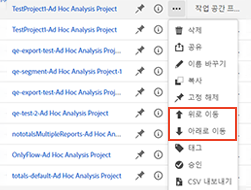
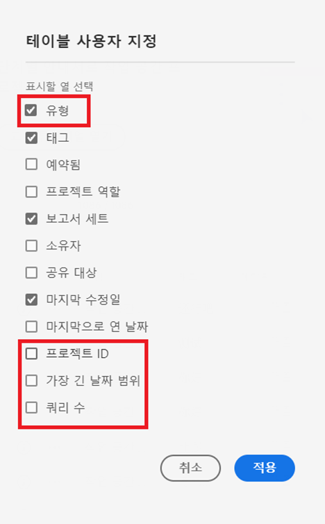
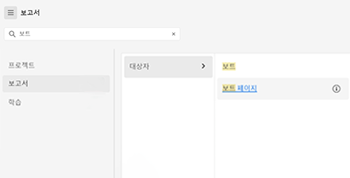
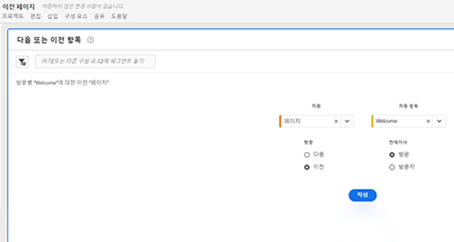
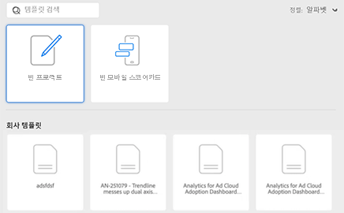

# Adobe Analytics의 랜딩 페이지

Adobe Analytics의 랜딩 페이지는 [!DNL Analysis Workspace] 및 [!DNL Reports & Analytics]를 [!DNL Workspace] 하의 단일 인터페이스와 액세스 포인트에 통합합니다. 여기에는 프로젝트 관리자 홈 페이지, 업데이트된 보고서 메뉴, 현대화된 보고서 및 보다 효과적으로 시작하는 데 도움이 되는 학습 섹션도 포함되어 있습니다. 다음은 비디오 개요입니다.

>[!VIDEO](https://video.tv.adobe.com/v/334278/?quality=12)

## 새로운 랜딩 페이지 기능 {#new-features}

| 기능 | 설명 | 스크린샷 |
| --- | --- | --- |
| [!UICONTROL 프로젝트] 표를 전체 화면으로 확장 | 표를 확장하려면 햄버거 메뉴 아이콘을 클릭합니다. 이 작업을 수행하면 왼쪽 레일 탭이 축소됩니다. |  |
| 열 너비 사용자 정의 | 이전에는 열 너비가 고정되어 있었습니다. 이제 열 구분 기호를 드래그하여 열 너비를 조정할 수 있습니다. |  |
| 고정 항목 순서 바꾸기 | 고정 항목을 위아래로 이동하려면 고정 항목 옆에 있는 생략 부호를 클릭한 다음 **[!UICONTROL 위로 이동]** 또는 **[!UICONTROL 아래로 이동]**&#x200B;을 선택합니다. |  |
| 새 테이블 열 | 표 오른쪽 상단의 [!UICONTROL 표 사용자 정의] 아이콘을 클릭합니다. 새 테이블 열에는 다음이 포함됩니다. <ul><li>**[!UICONTROL 예약됨]**: 프로젝트가 예약되어 있을 때에는 [!UICONTROL 켜짐]으로, 그렇지 않을 때에는 [!UICONTROL 꺼짐]으로 설정되어 있습니다. [!UICONTROL 켜짐]을 클릭하면 예약된 프로젝트에 대한 정보를 확인할 수 있습니다. 프로젝트 소유자는 [프로젝트 일정을 편집](/help/analyze/analysis-workspace/curate-share/t-schedule-report.md)할 수도 있습니다.</li><li>**[!UICONTROL 프로젝트 ID]**: 프로젝트 ID는 프로젝트 디버깅에 사용할 수 있습니다.</li><li>**[!UICONTROL 가장 긴 날짜 범위]**: 가장 긴 날짜 범위는 프로젝트 복잡성을 증가시키며 이로 인해 처리 및 로드 시간이 길어질 수 있습니다. </li><li>**[!UICONTROL 쿼리 개수]**: 프로젝트가 로드될 때 Analytics에 대해 수행된 총 요청 개수입니다. 프로젝트 쿼리 수가 많으면 프로젝트 복잡성을 증가시키며 이로 인해 처리 및 로드 시간이 길어질 수 있습니다. 이 데이터는 프로젝트가 로드되거나 예약된 프로젝트가 전송된 후에만 사용할 수 있습니다. </li></ul> |  |
| 한 번 클릭하여 보고서 열기 | 이전에는 더블 클릭해야 했습니다. |  |
| **[!UICONTROL Reports &amp; Analytics]** 보고서로의 새 링크 | <ul><li>**[!UICONTROL 보고서]** > **[!UICONTROL 대상자]** > **[!UICONTROL 봇]**</li><li>**[!UICONTROL 보고서]** > **[!UICONTROL 대상자]** > **[!UICONTROL 봇 페이지]**<li>**[!UICONTROL 보고서]** > **[!UICONTROL 참여]** > **[!UICONTROL 실시간]**</li></ul> |  |
| 새로운 기본 제공 보고서 | <ul><li>**[!UICONTROL 보고서]** > **[!UICONTROL 자주 사용하는 항목]** > **[!UICONTROL 다음 페이지]**</li><li>**[!UICONTROL 보고서]** > **[!UICONTROL 자주 사용하는 항목]** > **[!UICONTROL 이전 페이지]**</li><li>**[!UICONTROL 보고서]** > **[!UICONTROL 참여]** > **[!UICONTROL 페이지 분석]** > **[!UICONTROL 페이지 요약]**</li></ul>이들 보고서는 [!UICONTROL 작업 영역] 형식이며 구성 및 빌드가 필요합니다. 출력은 높은 수준의 지표, 트렌드 데이터, [!UICONTROL 플로우] 시각화 등으로 구성되어 있습니다. 이들 보고서를 수정하고 자원, 차원 항목 등을 변경할 수 있습니다. 이들 보고서는 [작업 영역] 패널 하의 패널로도 사용할 수 있습니다. |  |
| **[!UICONTROL 프로젝트 만들기]** 모달이 다시 옴 | 를 클릭하면 **[!UICONTROL 프로젝트 만들기]** 작업 공간에서 다음 중 한 번 [!UICONTROL 빈 프로젝트] 그리고 [!UICONTROL 빈 모바일 스코어카드]. 귀사에서 제작한 템플릿 중에서 선택할 수도 있습니다. |  |
| Customer Journey Analytics에서도 사용 가능 | 수정된 양식으로 이 랜딩 페이지를 CJA에서도 사용할 수 있습니다. |  |

{style=&quot;table-layout:auto&quot;}

## 상단 메뉴 구조 {#top-menu}

* 상단 Analytics 메뉴: 대부분의 보고서는 이제 왼쪽 레일의 [!UICONTROL 보고서] 메뉴에 있습니다.
* 왼쪽 레일에는 [!UICONTROL 프로젝트], [!UICONTROL 보고서], [!UICONTROL 학습] 등 세 가지 탭이 있습니다.

### 용어

* **[!UICONTROL 프로젝트]** 빌드한 데이터 구성 요소, 표 및 시각화를 결합하거나 다른 사람이 사용자와 빌드하고 공유한 사용자 지정된 디자인입니다. [!UICONTROL 프로젝트]는 빈 프로젝트 및 빈 모바일 스코어카드를 의미하기도 합니다.
* **[!UICONTROL 보고서]**&#x200B;는 Reports &amp; Analytics의 보고서 및 작업 영역의 템플릿과 같이 Adobe에서 미리 빌드한 모든 것을 의미합니다.
* **[!UICONTROL 템플릿]**&#x200B;은 더 이상 Adobe의 사전 제작된 작업 영역 프로젝트에 대한 용어로 사용되지 않습니다. 이제 [!UICONTROL 보고서] 아래에 있습니다. [!UICONTROL 템플릿]이라는 용어는 귀사에서 제작한 템플릿에 계속 사용할 수 있습니다.

## [!UICONTROL 프로젝트] 탭 탐색 {#navigate-projects}

[!UICONTROL 프로젝트]는 [!UICONTROL Workspace] 홈 페이지 역할을 합니다. 프로젝트 탭에는 회사 폴더, 작성한 개인 폴더, 프로젝트 및 모바일 스코어카드가 표시됩니다. 폴더, 프로젝트 및 모바일 스코어카드를 보고, 만들고, 수정할 수 있습니다. 자세한 내용은 [Analytics의 폴더 정보](/help/analyze/analysis-workspace/build-workspace-project/workspace-folders/about-folders.md).

합니다.

>[!NOTE]
>
>다음 설정 중 일부는 세션 중 및 세션 간에 유지됩니다. 예를 들어 선택한 탭, 선택한 필터, 선택한 열 및 열 정렬 방향이 있습니다. 검색 결과는 지속적이지 않습니다.

| UI 요소 | 정의 |
| --- | --- |
| 환경 설정 편집 | [!UICONTROL 튜토리얼 보기] 및 [사용자 환경 설정 편집](/help/analyze/analysis-workspace/user-preferences.md)을 사용할 수 있습니다. |
| [!UICONTROL 새로 만들기] | Workspace 프로젝트 또는 모바일 스코어카드를 만들거나 회사 템플릿을 열 수 있는 프로젝트 모달을 엽니다. |
| [!UICONTROL 적게 표시  자세히 보기] | 배너 표시 안 함과 표시 간 전환:  |
| [!UICONTROL 작업 영역 프로젝트] | 빈 항목 만들기 [작업 공간 프로젝트](https://experienceleague.adobe.com/docs/analytics/analyze/analysis-workspace/home.html?lang=ko) 을 사용하여 을 디자인하고 빌드할 수 있습니다. |
| [!UICONTROL 모바일 스코어카드] | 빈 항목 만들기 [모바일 스코어카드](https://experienceleague.adobe.com/docs/analytics/analyze/mobapp/curator.html) 을 사용하여 을 디자인하고 빌드할 수 있습니다. |
| [!UICONTROL 교육 튜토리얼 열기] | 단계별 자습서에서 새로운 시작 프로젝트를 만드는 과정을 안내하는 작업 공간 교육 자습서를 엽니다. |
| [!UICONTROL 릴리스 정보 열기] | 최신 Adobe Experience Cloud 릴리스 정보의 Adobe Analytics 섹션을 엽니다. |
| 필터 아이콘 | 태그, 보고서 세트, 소유자, 유형 및 기타 필터(내 소유, 나와 공유, 즐겨찾기 및 승인됨)별 필터 |
| 검색창 | 테이블의 모든 열을 검색합니다. |
| 선택 상자 | 수행할 수 있는 프로젝트 관리 작업을 표시할 하나 이상의 프로젝트를 선택합니다. **삭제**, **공유**, **이름 변경**, **복사**, **고정 해제**, **위로 이동**, **아래로 이동**, **태그**, **승인**, **CSV 내보내기**, 및 **이동 위치**. 나열된 모든 작업을 수행할 권한이 없을 수 있습니다. |
| [!UICONTROL 즐겨찾기] | 필터로 사용할 수 있는 즐겨찾기 프로젝트 또는 폴더 옆에 별모양을 추가합니다. |
| [!UICONTROL 이름] | 프로젝트의 이름을 식별합니다. |
| 고정 아이콘 | 항목이 항상 목록 맨 위에 표시되도록 고정하지만 순서를 위나 아래로 이동하여 순서를 다시 조정할 수 있습니다. 줄임표 옵션 메뉴를 사용하고 을 선택합니다 **위로 이동** 또는 **아래로 이동** 참조하십시오. |
| 정보(i) 아이콘 | 프로젝트에 대한 다음 정보를 표시합니다. 유형, 프로젝트 역할, 소유자, 설명 및 공유자 또한 누가 이 프로젝트를 [편집 또는 복제](https://experienceleague.adobe.com/docs/analytics/analyze/analysis-workspace/curate-share/share-projects.html)할 수 있는지도 나타냅니다. |
| 생략 부호 (...) | 수행할 수 있는 프로젝트 관리 작업을 표시합니다. **삭제**, **공유**, **이름 변경**, **복사**, **고정 해제**, **위로 이동**, **아래로 이동**, **태그**, **승인**, **CSV 내보내기**, 및 **이동 위치**. 나열된 모든 작업을 수행할 권한이 없을 수 있습니다. |
| [!UICONTROL 유형] | 이 유형이 Workspace 프로젝트, 모바일 스코어카드 또는 폴더인지 여부를 나타냅니다. |
| [!UICONTROL 태그] | 프로젝트에 태그를 지정하여 그룹으로 구성합니다. |
| [!UICONTROL 프로젝트 역할] | 프로젝트 역할을 식별합니다. 프로젝트 소유자인지, 프로젝트를 편집 또는 복제할 권한이 있는지 여부. |
| [!UICONTROL 보고서 세트] | 프로젝트와 연결된 보고서 세트를 식별합니다. 패널 내의 테이블 및 시각화는 패널의 오른쪽 상단에서 선택한 보고서 세트에서 데이터를 가져옵니다. 보고서 세트는 왼쪽 레일에서 사용할 수 있는 구성 요소도 결정합니다. 분석 사용 사례에 따라 프로젝트 내에서 하나 또는 여러 보고서 세트를 사용할 수 있습니다. 보고서 세트 목록은 관련성을 기준으로 정렬됩니다. Adobe는 현재 사용자가 보고서 세트를 얼마나 최근에 얼마나 자주 사용했는지, 그리고 조직 내에서 보고서 세트를 얼마나 자주 사용했는지에 따라 관련성을 정의합니다. |
| [!UICONTROL 소유자] | 프로젝트를 만든 사람을 식별합니다. |
| [!UICONTROL 마지막으로 연 날짜] | 프로젝트를 마지막으로 연 날짜를 식별합니다. |
| 표 사용자 정의 아이콘 | 테이블에서 볼 열을 선택합니다. 프로젝트 목록에서 열을 추가하거나 제거하려면 열 아이콘( )을 클릭하여 열 제목을 선택하거나 선택 취소합니다. |
| 표시: 폴더 및 프로젝트 또는 모든 프로젝트 | 폴더 조직에 따라 폴더 및 프로젝트를 표시하도록 테이블의 보기 설정을 변경합니다 **또는** 구성되지 않은 목록에 모든 프로젝트를 표시합니다. |
| &lt; (뒤로 버튼) | Workspace 프로젝트 또는 보고서에서 가장 최근 랜딩 페이지 구성으로 돌아갑니다. 랜딩 페이지를 나갈 때 사용한 페이지 구성은 돌아올 때 지속됩니다. |

### 프로젝트 관리자 페이지의 사용 중단 {#deprecate-pm-page}

새 랜딩 페이지가 릴리스되면 구성 요소 관리자 아래에 나열된 대로 프로젝트 관리자가 더 이상 사용되지 않습니다. 새 랜딩 페이지는 이전 프로젝트 관리자 페이지의 모든 기능 등을 처리합니다.

프로젝트 관리자 페이지의 일반적인 사용 사례는 모든 프로젝트를 보는 것이었습니다.

필터 레일을 사용하여 새 랜딩 페이지에서 모든 프로젝트를 보려면 을 선택합니다 **기타 필터** 그런 다음 **모두 표시**.

&quot;폴더 및 프로젝트&quot; 보기에 있는 경우, 모달이 &quot;모든 프로젝트&quot; 보기로 전환할지 여부를 묻는 팝업되어, 폴더 외부에서 모든 프로젝트를 쉽게 볼 수 있게 됩니다.   선택 **&quot;모든 프로젝트&quot; 보기로 전환** 액세스 권한이 있는 모든 프로젝트를 보다 잘 보려면 .

관리자의 다른 사용 사례는 보고서를 삭제, 이름 변경, 태그 지정 또는 승인하기 위해 회사 보고서를 관리하는 것입니다. 보고서 관리에 대한 자세한 내용은 [회사 보고서 관리](#manage-company-reports).

## [!UICONTROL 보고서] 탭 탐색 {#navigate-reports}

[!UICONTROL 보고서] 탭은 다음과 같은 세 가지 보고서 세트를 통합합니다.

* 이전에 [!UICONTROL Workspace] > [!UICONTROL 프로젝트] > [!UICONTROL 새로 만들기] 아래에 있던 미리 빌드된 [!UICONTROL Workspace] 템플릿. Adobe는 이 컨텍스트에서 “템플릿”이라는 단어를 더 이상 사용하지 않습니다.
* 미리 작성된 대부분의 보고서 이전 Adobe Analytics [!UICONTROL 보고서] 상단 메뉴 아래에 있는 대부분의 미리 빌드된 보고서. 이러한 보고서들은 이제 [Analysis Workspace](https://experienceleague.adobe.com/docs/analytics/analyze/analysis-workspace/home.html)에 표시됩니다.

>[!IMPORTANT]
>
>보고서 메뉴에서 즐겨찾기 폴더는 새 보고서를 즐겨찾기로 표시한 경우에만 표시됩니다. 기존 Reports &amp; Analytics 즐겨찾기는 이월되지 않습니다.

앞서 언급한 바와 같이, 이전에 Reports &amp; Analytics에 그룹화되었던 가장 일반적으로 사용되는 보고서만 여기에서 사용할 수 있습니다. 거의 사용되지 않거나 더 이상 관련이 없는 소수의 보고서는 이전되지 않았습니다. 자세한 내용은 아래 FAQ를 참조하십시오.

### 메뉴 및 하위 메뉴 {#menus}

다음은 메뉴와 해당 하위 메뉴입니다. 특정 보고서를 찾을 수 없는 경우 “페이지에서 검색”을 수행하여 찾습니다.

| 메뉴 항목 | 이 메뉴 항목 아래의 보고서 |
| --- | --- |
| **[!UICONTROL 가장 빈도가 높음]** | <ul><li>교육 튜토리얼(기존 Workspace 템플릿)</li><li>페이지(내 상위 페이지는 무엇입니까?)</li><li>페이지 조회수(얼마나 많은 페이지 조회수를 생성하고 있습니까?)</li><li>방문수(얼마나 많은 방문을 받고 있습니까?)</li><li>방문자수(얼마나 많은 방문자를 얻고 있습니까?)</li><li>주요 지표(내 가장 중요한 지표의 성과는 어떻습니까?)</li><li>사이트 섹션(내 사이트의 어느 섹션에서 가장 많은 페이지 조회수가 생성되었습니까?)</li><li>다음 페이지(내 방문자가 다음으로 방문하는 페이지는 무엇입니까?)</li><li>이전 페이지(내 방문자가 이전에 방문한 페이지는 무엇입니까?)</li><li>캠페인(내 주요 지표를 유도하는 캠페인은 무엇입니까?)</li><li>제품(내 주요 지표를 유도하는 제품은 무엇입니까?)</li><li>마지막 터치 채널(성과가 가장 좋은 마지막 터치 채널은 무엇입니까?)</li><li>마지막 터치 채널 세부 정보(다른 채널보다 뛰어난 성과를 보이는 특정 마지막 터치 채널은 무엇입니까?)</li><li>매출(내 매출의 성과는 어떻습니까?)</li><li>주문(내 주문의 성과는 어떻습니까?)</li><li>개수(얼마나 많은 개수를 판매하고 있습니까?)</li></ul> |
| **[!UICONTROL 참여]** | <ul><li>주요 지표(내 가장 중요한 지표의 성과는 어떻습니까?)</li><li>페이지 조회수(얼마나 많은 페이지 조회수를 생성하고 있습니까?)</li><li>페이지(내 상위 페이지는 무엇입니까?)</li><li>방문수(얼마나 많은 방문을 받고 있습니까?)</li><li>방문자수(얼마나 많은 방문자를 얻고 있습니까?)</li><li>방문당 체류 시간(내 사용자는 방문당 얼마나 많은 시간을 소비합니까?)</li><li>이벤트 이전 시간(내 사용자는 성공 이벤트 전에 얼마나 많은 시간을 소비합니까?)</li><li>사이트 섹션(내 사이트의 어느 섹션에서 가장 많은 페이지 조회수가 생성되었습니까?)</li><li>웹 콘텐츠 사용량(어떤 콘텐츠가 가장 많이 소비되고 사용자의 관심을 끌고 있습니까?)</li><li>미디어 콘텐츠 사용량(어떤 콘텐츠가 가장 많이 소비되고 사용자의 관심을 끌고 있습니까?)</li><li>다음 및 이전 페이지 흐름(내 방문자가 선택한/선택했던 다음/이전 경로는 무엇입니까?)</li><li>폴아웃(내 디지털 속성 전체에서 어디에 폴아웃이 보입니까?)</li><li>디바이스 간 분석(Analysis Workspace에서 디바이스 간 분석 사용)</li><li>웹 유지(충성도가 높은 사용자는 누구이며 그들이 무슨 작업을 수행합니까?)</li><li>미디어 오디오 사용량(오디오 사용량의 트렌드 및 주요 지표는 무엇입니까?)</li><li>미디어 최신성, 빈도, 충성도(충성도 높은 독자는 누구입니까?)</li><li>페이지 분석 > 다시 로드(어떤 페이지가 가장 많은 다시 로드를 발생시킵니까?)</li><li>페이지 분석 > 방문당 체류 시간(내 사용자가 내 페이지에서 보내는 시간은 얼마입니까?)</li><li>시작 및 종료 > 시작 페이지(상위 시작 페이지는 무엇입니까?)</li><li>시작 및 종료 > 원래 시작 페이지(내 방문자가 원래 어떤 페이지에서 입장했습니까?)</li><li>시작 및 종료 >단일 페이지 방문(단일 페이지 방문이 가장 많이 발생한 페이지는 무엇입니까?)</li><li>시작 및 종료 > 종료 페이지(상위 종료 페이지는 무엇입니까?)</li></ul> |
| **[!UICONTROL 전환]** | <ul><li>제품 > 제품(내 주요 지표를 유도하는 제품은 무엇입니까?)</li><li>제품 > 제품 성과(성과가 가장 좋은 제품은 무엇입니까?)</li><li>제품 > 범주(내 제품 범주 중 가장 성과가 좋은 것은 무엇입니까?)</li><li>장바구니 > 장바구니(몇 명의 사용자가 장바구니에 제품을 추가했습니까?)</li><li>장바구니 > 장바구니 보기(내 방문자가 장바구니를 본 횟수는 몇 번입니까?)</li><li>장바구니 > 장바구니 추가(사용자가 얼마나 자주 장바구니에 제품을 추가합니까?)</li><li>장바구니 > 장바구니 제거(사용자가 얼마나 자주 장바구니에 제품을 제거합니까?)</li><li>구매 > 매출(내 매출의 성과는 어떻습니까?)</li><li>구매 > 주문(내 주문의 성과는 어떻습니까?)</li><li>구매 > 개수(얼마나 많은 개수를 판매하고 있습니까?)</li><li>[Magento: 마케팅 및 상거래](https://experienceleague.adobe.com/docs/analytics/analyze/analysis-workspace/build-workspace-project/starter-projects.html#commerce)</li></ul> |
| **[!UICONTROL 대상자]** | <ul><li>사람 지표(얼마나 많은 사람들이 내 브랜드와 상호작용하고 있습니까?)</li><li>방문자 프로필 > 위치 개요(사용자들 사이에서 가장 많은 사용량을 유도하는 위치는 어디입니까?)</li><li>방문자 프로필 > 지리적 세분화 > 지리적 카운티, 지리적 미국 주, 지리적 지역, 지리적 도시, 지리적 미국 DMA(내 사용자는 어느 지역에서 방문합니까?)</li><li>방문자 프로필 > 언어(내 사용자가 선호하는 언어는 무엇입니까?)</li><li>방문자 프로필 > 시간대(내 사용자가 방문하는 시간대는 무엇입니까?)</li><li>방문자 프로필 > 도메인(내 방문자가 내 사이트에 액세스하는 데 사용하는 ISP는 무엇입니까?)</li><li>방문자 프로필 > 최상위 도메인(내 사이트로 트래픽을 유도하는 도메인은 무엇입니까?)</li><li>방문자 프로필 > 기술 > 기술 개요(사람들이 내 사이트에 액세스하는 데 사용하는 기술은 무엇입니까?)</li><li>방문자 프로필 > 기술 > 브라우저, 브라우저 유형, 브라우저 너비, 브라우저 높이(사람들이 내 사이트에 액세스하는 데 어떤 회사의 브라우저, 브라우저 버전, 너비 및 높이를 사용하고 있습니까?)</li><li>방문자 프로필 > 기술 > 운영 체제, 운영 체제 유형(내 방문자는 어떤 OS와 버전을 사용합니까?)</li><li>방문자 프로필 > 기술 > 이동통신사(내 방문자가 내 사이트에 액세스하는 데 사용하는 이동통신사는 무엇입니까?)</li><li>방문자 유지 > 재방문 주기(내 사용자의 현재 방문과 이전 방문 사이에 시간이 얼마나 걸립니까?)</li><li>방문자 유지 > 재방문 횟수(내 방문 중 재방문 사용자가 몇 명입니까?)</li><li>방문자 유지 > 방문 횟수(내 주요 지표의 대부분을 차지하는 방문 횟수 버킷은 무엇입니까?)</li><li>방문자 유지 > 판매 주기 > 고객 충성도(내 사용자는 어떤 충성도 세그먼트에 속합니까?)</li><li>방문자 유지 > 판매 주기 > 첫 구매까지 소요된 일 수(내 사용자의 첫 방문과 첫 구매 사이에 며칠이 지났습니까?)</li><li>방문자 유지 > 판매 주기 > 마지막 구매 이후 일 수(내 사용자의 현재 방문과 마지막 구매 사이에 며칠이 지났습니까?) ).</li><li>방문자 유지 > 모바일 > 디바이스 및 디바이스 유형(내 사용자가 사용하는 디바이스와 디바이스 유형은 무엇입니까?)</li><li>방문자 유지 > 모바일 > 제조업체(내 방문자가 사용하는 모바일 디바이스 제조업체는 무엇입니까?)</li><li>방문자 유지 > 모바일 > 화면 크기, 화면 높이, 화면 너비(내 방문자의 모바일 화면 크기/높이/너비는 무엇입니까?)</li><li>방문자 유지 > 모바일 > [모바일 앱 사용 현황](https://experienceleague.adobe.com/docs/analytics/analyze/analysis-workspace/build-workspace-project/starter-projects.html#mobile)</li><li>방문자 유지 > 모바일 > [모바일 앱 여정](https://experienceleague.adobe.com/docs/analytics/analyze/analysis-workspace/build-workspace-project/starter-projects.html#mobile)</li><li>방문자 유지 > 모바일 > [모바일 앱 지표](https://experienceleague.adobe.com/docs/analytics/analyze/analysis-workspace/build-workspace-project/starter-projects.html#mobile)</li><li>방문자 유지 > 모바일 > [모바일 앱 메시지](https://experienceleague.adobe.com/docs/analytics/analyze/analysis-workspace/build-workspace-project/starter-projects.html#mobile)</li><li>방문자 유지 > 모바일 > [모바일 앱 성과](https://experienceleague.adobe.com/docs/analytics/analyze/analysis-workspace/build-workspace-project/starter-projects.html#mobile)</li><li>방문자 유지 > 모바일 > [모바일 앱 보존](https://experienceleague.adobe.com/docs/analytics/analyze/analysis-workspace/build-workspace-project/starter-projects.html#mobile)</li></ul> |
| **[!UICONTROL 획득]** | <ul><li>마케팅 채널 > 첫 번째 터치 채널, 첫 번째 터치 채널 세부 정보(성과가 가장 좋은 첫 번째 터치 채널과 특정 첫 번째 터치 채널은 무엇입니까?)</li><li>마케팅 채널 > 마지막 터치 채널, 마지막 터치 채널 세부 정보(성과가 가장 좋은 마지막 터치 채널과 특정 마지막 터치 채널은 무엇입니까?)</li><li>캠페인 > 캠페인(내 주요 지표를 유도하는 캠페인은 무엇입니까?)</li><li>캠페인 > 캠페인 성과(가장 많은 매출을 창출하는 캠페인은 무엇입니까?)</li><li>캠페인 > 추적 코드(어떤 캠페인 추적 코드가 가장 성과가 좋습니까?)</li><li>[웹 고객 확보](https://experienceleague.adobe.com/docs/analytics/analyze/analysis-workspace/build-workspace-project/starter-projects.html#web)</li><li>[모바일 고객 확보](https://experienceleague.adobe.com/docs/analytics/analyze/analysis-workspace/build-workspace-project/starter-projects.html#mobile)</li><li>[Advertising Analytics 유료 검색](https://experienceleague.adobe.com/docs/analytics/analyze/analysis-workspace/build-workspace-project/starter-projects.html#advertising)</li><li>검색 키워드 - 모두, 유료, 자연어(어떤 검색 키워드와 유료/자연어 검색 키워드가 주요 지표를 가장 잘 유도합니까?)</li><li>검색 엔진 - 모두, 유료, 자연어(어떤 검색 키워드와 유료/자연어 검색 엔진 주요 지표를 가장 잘 유도합니까?)</li><li>전체 검색 페이지 순위(내 사용자는 어떤 검색 페이지에서 방문합니까?)</li><li>참조 도메인(내 사이트로 트래픽을 유도하는 도메인은 무엇입니까?)</li><li>원래 참조 도메인(내 사이트를 방문하기 전에 첫 번째 도메인 사용자는 무슨 도메인에 있었습니까?)</li><li>레퍼러(사용자가 내 사이트를 클릭하기 전에 어떤 URL을 사용했습니까?)</li><li>레퍼러 유형(내 추천 URL은 어떤 범주에 속합니까?)</li></ul> |

### 템플릿 위치(이제 보고서라고 함) {#templates}

| 보고서(템플릿) 이름 | 보고서 위치 |
| --- | --- |
| 교육 튜토리얼 | 추천 > 교육 튜토리얼 |
| 웹 콘텐츠 사용량 | 참여 > 웹 콘텐츠 사용량 |
| 미디어 콘텐츠 사용량 | 참여 > 미디어 콘텐츠 사용량 |
| 크로스 디바이스 분석 | 디바이스 > 크로스 디바이스 분석 |
| 웹 유지 | 참여 > 웹 유지 |
| 미디어 오디오 사용량 | 참여 > 미디어 오디오 사용량 |
| 미디어 최신성, 빈도, 충성도 | 참여 > 미디어 최신성, 빈도, 충성도 |
| ITP 영향 | 참여 > ITP 영향 |
| 제품 성과 | 전환 > 제품 > 제품 성과 |
| Magento: 마케팅 및 상거래 | 전환 > Magento: 마케팅 및 상거래 |
| 사용자 지표 | 대상자 > 사용자 지표 |
| 위치 개요 | 대상자 > 방문자 프로필 > 위치 개요 |
| 기술 개요 | 대상자 > 방문자 프로필 > 기술 > 기술 개요 |
| 모바일 앱 사용 현황 | 대상자 > 모바일 > 모바일 앱 사용 |
| 모바일 앱 여정 | 대상자 > 모바일 > 모바일 앱 여정 |
| 모바일 앱 지표 | 대상자 > 모바일 > 모바일 앱 메시지 |
| 모바일 앱 성과 | 대상자 > 모바일 > 모바일 앱 성과 |
| 모바일 앱 유지 | 대상자 > 모바일 > 모바일 앱 유지 |
| 캠페인 성과 | 고객 확보 > 캠페인 > 캠페인 성과 |
| 모바일 고객 확보 | 고객 확보 > 모바일 고객 확보 |
| 웹 고객 확보 | 고객 확보 > 웹 고객 확보 |
| Advertising Analytics 유료 검색 | 고객 확보 > Advertising Analytics: 유료 검색 |

### 보고서 탭 사용 {#use-reports}

Reports &amp; Analytics의 현재 사용자를 위해 사용하던 보고서와 현재 Workspace에 표시되는 보고서를 사용하는 방법에 대한 간단한 소개가 있습니다. 보고서는 기존 템플릿처럼 작동합니다. 보고서를 변경하면 다른 보고서를 탐색하거나 다른 보고서로 이동할 때 변경 사항을 저장/취소하라는 메시지가 표시됩니다. 그리고 변경 사항을 저장하려는 경우 보고서를 새 프로젝트로 저장합니다.

1. [!UICONTROL 보고서] 탭으로 이동합니다.
1. 보려는 보고서를 선택합니다. 예를 들어 [!UICONTROL 추천] 아래에서 [!UICONTROL 페이지] 보고서를 선택합니다.
1. 오른쪽에서 **[!UICONTROL 보고서 열기]**&#x200B;를 클릭합니다.

   

1. Analysis Workspace에 표시되는 페이지 보고서에는 두 개의 [시각화](/help/analyze/analysis-workspace/visualizations/freeform-analysis-visualizations.md) ([막대 차트](/help/analyze/analysis-workspace/visualizations/bar.md) 및 [요약 번호](/help/analyze/analysis-workspace/visualizations/summary-number-change.md))와 [자유 형식 테이블](/help/analyze/analysis-workspace/visualizations/freeform-table/freeform-table.md)이 표시됩니다. 사용된 지표는 발생 횟수입니다.
1. 여기에서 여러 옵션이 있습니다. 다음은 이러한 옵션 중 일부입니다.

   * 보고서를 그대로 사용할 수 있습니다.
   * 하나 이상의 세그먼트를 상단의 세그먼트 드롭 영역으로 드래그할 수 있습니다. 예를 들어 [!UICONTROL 모바일 고객]을 드래그하여 결과가 변경되는지 확인합니다.
   * 오른쪽 상단의 달력으로 이동하여 날짜 범위를 변경할 수 있습니다.
   * 차원 분류를 추가하고, 다른 지표를 드래그하고, 일반적으로 원하는 방식으로 보고서를 사용자 정의할 수 있습니다.

### 사용자 지정 회사 보고서 만들기 {#company-report}

로그인 회사에서 사용할 수 있도록 만들어 저장된 사용자 지정 보고서를 회사 보고서라고 합니다. 이전에 만든 회사 보고서와 새로 만든 회사 보고서는 아래 표시된 대로 프로젝트 만들기 모달에 나열되어 있습니다.

새 회사 보고서를 만들려면

1. 원하는 상태로 작업 영역을 빌드합니다.
1. [!UICONTROL 프로젝트] 메뉴를 열고 **[!UICONTROL 회사 보고서로 저장…]**&#x200B;을 클릭합니다.

   

1. 원하는 모든 필드를 모달에 추가하고 저장합니다.

   보고서는 프로젝트 만들기 모달의 회사 보고서 목록에 추가되며 로그인 회사에서 사용할 수 있습니다.

더 많은 학습 옵션:

* 사용자가 여는 보고서의 왼쪽 상단에서 Analysis Workspace의 20분짜리 비디오 개요에 액세스할 수 있습니다.
* 신규 사용자를 위해서는 새 프로젝트를 구축하는 과정을 안내하는 [교육 튜토리얼](https://www.youtube.com/watch?v=lCH1Kl1q9Wk) 비디오를 권장합니다.
* [전체 Analysis Workspace 설명서](/help/analyze/analysis-workspace/home.md)에 대한 링크입니다.
* 전체 [Analysis Workspace용 YouTube 재생 목록](https://www.youtube.com/playlist?list=PL2tCx83mn7GuNnQdYGOtlyCu0V5mEZ8sS)입니다.

### 회사 보고서 관리 {#manage-company-reports}

관리자는 프로젝트 목록을 필터링하여 회사 보고서를 표시하고 관리할 수 있습니다. 고정된 항목 뒤에  보고서 아이콘 을 참조하십시오. 이 보기에서 하나 이상의 보고서를 삭제, 이름 변경, 태그 지정 또는 승인할 수 있습니다.

회사 보고서를 표시하고 관리하려면

1. 필터 레일에서 를 선택합니다. **기타 필터** 그런 다음 **회사 보고서**.
회사 보고서 목록이 표시됩니다. 고정된 경우가 아니라면 모든 일반 프로젝트가 표시되지 않습니다.

   

   회사 보고서가 표시되면 관리자는 보고서를 삭제, 이름 변경, 태그 추가 또는 승인할 수 있습니다.

1. 보고서 목록에서 단일 보고서를 선택하거나 여러 보고서를 선택합니다.

1. 을(를) 클릭합니다. **...** 보고서 옆에 있는 정렬 아이콘을 사용하여 사용 가능한 옵션(삭제, 이름 변경, 태그 및 승인)을 볼 수 있습니다.

   

1. 옵션(삭제, 이름 변경, 태그 및 승인)을 선택합니다.

1. 작업이 완료되면 일반 보기로 돌아가려면 필터 레일에서 회사 보고서 옵션의 선택을 다시 취소하십시오.

### 회사 보고서 삭제

관리자는 회사 보고서 목록 옵션(위에 설명됨)을 사용하여 보고서를 삭제하거나 프로젝트 만들기 모달에서 보고서를 삭제할 수 있습니다.

## 학습 탭 탐색 {#navigate-learning}

학습 페이지에는 실습형 비디오 둘러보기, 튜토리얼, 설명서 링크가 포함되어 있습니다.

* [!UICONTROL Workspace 기본 사항] 둘러보기는 Workspace로 바로 이동하여 Workspace 레이아웃과 가장 일반적인 작업을 찾거나 수행할 위치를 안내합니다. 이 둘러보기는 패널 헤더의 도구 설명 팝업을 통해 Workspace에서 바로 다시 실행할 수도 있습니다.
* 비디오/투어를 클릭하면 **[!UICONTROL 조회함]** 태그가 추가됩니다. 이 태그는 학습 콘텐츠 진행 상황을 추적하는 데 도움이 됩니다. 태그를 클릭할 수 있고 아직 콘텐츠를 완료하지 않은 경우에는 태그가 사라집니다.
* 비디오 모달의 **[!UICONTROL 자세히 알아보기]** 버튼을 누르면 방금 시청한 비디오와 관련된 추가 도움말 콘텐츠가 포함된 Adobe Experience League 설명서 페이지로 이동합니다.  **[!UICONTROL 많은 비디오 보기]**&#x200B;는 전체 Analysis Workspace YouTube 재생 목록으로 이동합니다.

## 랜딩 페이지 설정 {#set-landing}

사용자는 자신이 선호하는 랜딩 페이지를 설정할 수 있습니다.

1. Analytics > [!UICONTROL 구성 요소] > [!UICONTROL 환경 설정] > [!UICONTROL 일반]으로 이동합니다.
1. 선호하는 랜딩 페이지에 확인 표시를 합니다.

   

## 보고서 탭 숨기기 {#hide-reports}

관리자는 자신의 조직 내에서 모든 사용자에 대해 보고서 탭을 숨길 수 있습니다.

1. [!UICONTROL Analytics] > [!UICONTROL 구성 요소] > [!UICONTROL 환경 설정] > [!UICONTROL 회사]로 이동합니다.
1. **[!UICONTROL 보고서 탭 숨기기]**&#x200B;에 확인 표시를 합니다.

## 랜딩 페이지 FAQ {#landing-faq}

| 질문 | 답변 |
| --- | --- |
| [!UICONTROL 작업 영역]에서 자주 보는 템플릿은 어디에 있습니까? | 이러한 템플릿들은 [!UICONTROL 보고서] 탭 아래에 그룹화되어 있습니다. |
| Beta 프로그램 UI에서 수행하는 작업이 프로덕션 [!UICONTROL 작업 영역] 경험으로 이어집니까? | 예. Beta에서 수행된 모든 작업은 이전/현재 [!UICONTROL 작업 영역] 경험으로 이어집니다. |
| 현재 [!DNL Reports & Analytics] 즐겨찾기가 이월됩니까? | 아니요. 이월되지 않습니다. 단, 모든 [!UICONTROL 작업 영역] 프로젝트 즐겨찾기는 이월됩니다. |
| 고정할 수 있는 최대 프로젝트 수가 있습니까? | 아니요. 고정할 수 있는 프로젝트 수에는 제한이 없습니다. |
| 관리자가 사용자를 위해 이 랜딩 페이지를 지정할 수 있습니까? | 아니요. 관리자는 사용자를 대신하여 랜딩 페이지를 지정할 수 없습니다. 개별 사용자가 직접 토글을 켜야 합니다. |
| 현재 [!DNL Reports & Analytics]에 있는 모든 보고서를 계속 사용할 수 있습니까? | 아니요. 다음 보고서는 전반적인 사용 데이터를 기반으로 폐지되었습니다. <ul><li>모든 사용자 정의 eVar/props/이벤트/분류<li>내 권장 보고서</li><li>시간별/일별/주별/월별/분기별/연간 고유 방문자</li><li>일별/주별/월별/분기별/연간 고유 고객</li><li>작업 이름 깊이</li><li>작업 이름 요약</li><li>대시보드 추가</li><li>연령</li><li>오디오 지원</li><li>과금 정보</li><li>페이지 클릭 수</li><li>색상 심도</li><li>쿠키 지원</li><li>쿠키</li><li>연결 유형</li><li>크리에이티브 요소</li><li>신용카드 유형</li><li>크로스셀</li><li>사용자 정의 이벤트 유입 경로</li><li>사용자 정의 링크</li><li>고객 ID</li><li>요일</li><li>시작 작업 이름</li><li>종료 작업 이름</li><li>종료 링크</li><li>폴아웃</li><li>파일 다운로드</li><li>스토어에서 찾기</li><li>전체 경로</li><li>성별</li><li>히트 유형 VISTA 규칙</li><li>이미지 지원</li><li>Java</li><li>JavaScript</li><li>JavaScript 버전</li><li>책갈피 관리</li><li>대시보드 관리</li><li>모니터 색상 심도</li><li>모니터 해상도</li><li>뉴스레터 신청</li><li>다음 작업 이름</li><li>다음 작업 이름 흐름</li><li>Null 검색</li><li>운영 체제</li><li>주문 검토</li><li>오늘의 페이지</li><li>페이지를 찾을 수 없음</li><li>경로 탐색</li><li>경로 길이</li><li>이전 작업 이름</li><li>이전 작업 이름 흐름</li><li>제품 활동</li><li>제품 비용</li><li>제품 부서</li><li>제품 재고 범주</li><li>제품 이름</li><li>제품 평가</li><li>제품 시즌</li><li>제품 공유</li><li>제품 확대/축소</li><li>다시 로드</li><li>검색 결과</li><li>서버</li><li>단일 페이지 방문 횟수</li><li>배송 정보</li><li>사이트 계층</li><li>소셜 언급</li><li>하루 중 시간</li><li>작업 이름에 소요된 시간</li><li>비디오 지원</li><li>방문자 통계</li></ul> |
