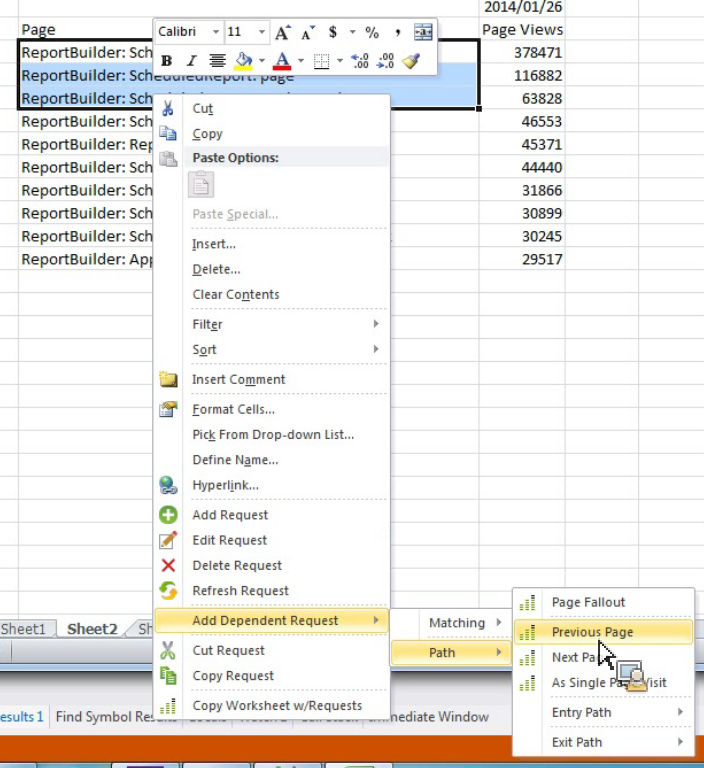

# 종속 요청을 추가하여 경로 보고서 필터링

{{legacy-arb}}

미리 정의한 필터로 경로 보고서를 만드는 방법을 설명합니다.

Report Builder은 경로 보고서를 독립 실행형 보고서로 제공하지 않지만 **[!UICONTROL 종속 요청 추가]** > **[!UICONTROL 경로]** 컨텍스트 메뉴를 통해 만들 수 있습니다. 다음 보고서를 사용할 수 있습니다.

* 경로 > 페이지 폴아웃
* 경로 > 시작 경로
* 경로 > 종료 경로
* 경로 > 다음 페이지
* 경로 > 시작 페이지 > 다음 페이지
* 경로 > 이전 페이지
* 경로 > 종료 경로 > 이전 페이지
* 경로 > 시작 경로 > 시작 페이지로
* 경로 > 종료 경로 > 종료 페이지로

1. 기존 요청에서 여러 행을 선택한 다음 **[!UICONTROL 종속 요청 추가]** > **[!UICONTROL 경로]**&#x200B;를 마우스 오른쪽 단추로 클릭합니다. **[!UICONTROL 페이지 폴아웃]** 메뉴 항목을 보려면 행을 세 개 이상 선택해야 합니다.

   

2. 미리 정의된 필터(예: **[!UICONTROL 이전 페이지]**)를 선택합니다.

   이전 페이지 지표가 이미 선택된 상태로 요청 마법사가 나타납니다. 1. 요청 마법사에서 요청을 계속 세분하고 요청을 생성합니다.
