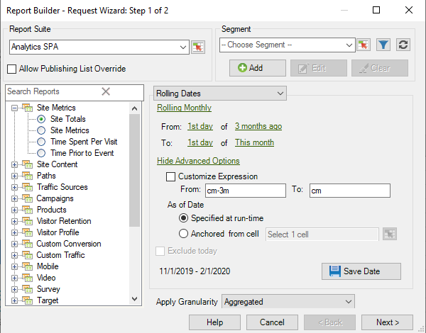

# 사용자 지정된 날짜 표현식

{{legacy-arb}}

사용자 지정 표현식을 만들어 복합적인 날짜 범위를 지정할 수 있습니다.

표현식을 작성할 때 달력을 참조하여 주 및 일 수를 올바르게 지정하십시오. Excel에는 날짜 간의 일, 업무일, 월 및 년 수를 계산할 수 있도록 해주는 몇 가지 내장 함수들이 있습니다. 공식에 이 함수들을 사용하여 주 수 및 분기 수와 같은 다른 간격들을 계산할 수 있습니다.

**사용자 지정 표현식을 활성화하는 방법**

다음 예제에서는 **[!UICONTROL 순환 날짜]**&#x200B;에 대해 사용자 지정 식을 활성화하는 방법을 보여 줍니다.

1. [!UICONTROL 요청 마법사: 1]단계에서 **[!UICONTROL 사전 설정 날짜]**&#x200B;를 사용하는 대신 **[!UICONTROL 순환 날짜]**&#x200B;를 선택합니다.

   

1. 주별, 월별, 분기별 또는 연간 롤링으로 전환합니다. 아래 옵션이 어떻게 변경되는지 확인합니다.
1. 추가 사용자 지정 옵션을 보려면 **[!UICONTROL 고급 옵션 표시]**&#x200B;를 클릭하십시오.

   

1. 예를 들어, 위의 날짜를 3개월 전 첫 번째 날짜에서 이번 달 첫 번째 날짜로 매월 롤링하도록 변경하면, 사전 옵션 부분의 날짜가 다음과 같이 업데이트됩니다.

   

1. **[!UICONTROL 식 사용자 지정]**&#x200B;을 사용하도록 설정합니다. **[!UICONTROL 순환 날짜]**&#x200B;에서 옵션을 선택하면 사용자 지정 날짜 식의 구문을 쉽게 볼 수 있습니다.

   

   고급 옵션을 사용하여 사용자 지정 날짜 표현식을 혼합하고 일치시킬 수 있습니다. 예를 들어, 올해 초부터 지난 전체 달 말까지 데이터를 보려면 다음을 입력할 수 있습니다. `From: cy` `To: cm-1d`. 마법사에서 해당 날짜는 2020/1/1/1/31/2020로 표시됩니다.
