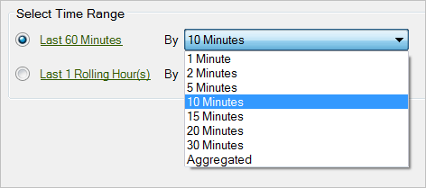

# 실시간 요청 구성

{{legacy-arb}}

실시간 요청을 구성하려면 다음 작업을 수행합니다.

1. [관리 도구](/help/admin/tools/manage-rs/edit-settings/realtime/t-realtime-admin.md)에서 실시간 보고가 활성화되어 있는지 확인하십시오.
1. [!UICONTROL 요청 마법사: 1단계]에서 **[!UICONTROL 실시간 보고서]** > **[!UICONTROL `<report type>`]**&#x200B;를 클릭합니다.

   예를 들어 트래픽 보고서를 선택합니다. 실시간 보고서 유형을 선택하면 [!UICONTROL 시간 범위 선택] 옵션이 표시됩니다.

1. 분 또는 시간 단위로 위를 선택합니다.

   

   실시간 보고는 지난 20시간 동안만 사용할 수 있습니다. 세부 기간의 경우 1분 세부 기간에서 30분을 선택할 수 있습니다.
1. **[!UICONTROL 다음]**&#x200B;을 클릭하고 [요청 레이아웃 구성](/help/analyze/legacy-report-builder/layout/layout.md)을 계속합니다.
