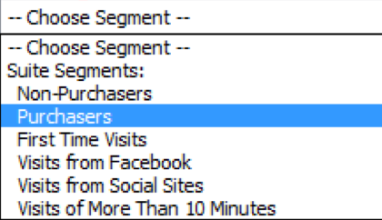

# 양방향 컨트롤

{{legacy-arb}}

양방향 컨트롤을 사용하면 워크시트에서 직접 하나 이상의 요청에 대한 세그먼트 및 날짜 범위를 편집할 수 있습니다. 이렇게 하면 Report Builder 요청을 업데이트할 때 보다 유연해집니다.

양방향 컨트롤은 분석가가 통합 문서를 만들고 이러한 통합 문서를 마케팅 조직과 공유하는 일반적인 워크플로가 있을 때 생성됩니다. 양방향 컨트롤을 사용하면 Report Builder 작동 방식에 대한 깊이 있는 지식이 없이도 마케터가 요청을 수정하고 새로 고칠 수 있습니다. (요청을 새로 고치려면 통합 문서 수신자가 Report Builder 사용자여야 합니다.) 이러한 컨트롤은 예약된 통합 문서 내에서 작동합니다. 현재 두 가지 유형의 양방향 컨트롤을 사용할 수 있습니다.

* 순환 날짜 범위
* 세그먼트

>[!IMPORTANT]
>
>양방향 컨트롤을 사용하려면 Report Builder v5.0이 설치되어 있어야 합니다. >
>* Windows에서 Microsoft Excel을 실행하고 있지만, 더 낮은 버전의 Report Builder을 실행하고 있거나, Report Builder이 설치되어 있지 않은 경우: 대화형 컨트롤에서 값을 변경할 수 있지만, 연결된 요청이 새로 고쳐지거나, 요청의 연결된 매개 변수가 업데이트되지 않습니다.
>* Mac에서 Excel을 실행하고 있는 경우 제어의 값을 변경하면 다음 메시지가 표시됩니다. &quot;매크로 ‘Adobe.ReportBuilder.Bridge.FormControlClick.Event’를 찾을 수 없습니다.&quot;
>

>[!WARNING]
>
>제어의 이름은 함부로 변경하지 마십시오. (이 이름을 보려면 제어에 초점을 둡니다. 그러면 왼쪽 위의 Excel 표 바로 위에 제어 이름이 나타납니다.)

## 양방향 날짜 범위 제어 구현 {#section_39B228F2D2C44985863D31424C953280}

1. 예를 들어 요청 마법사의 1단계에서 **[!UICONTROL 페이지]** 보고서를 선택합니다.
1. **[!UICONTROL 일반적으로 사용되는 날짜]** 드롭다운 옆에 있는 **[!UICONTROL 컨트롤 설정]** 아이콘을 클릭합니다.

   컨트롤 설정 아이콘을 강조 표시하는 요청 마법사 1단계의 

1. 컨트롤 설정 대화 상자에서 양방향 컨트롤에 표시할 날짜 범위 항목을 모두 선택합니다. 또한 컨트롤의 왼쪽 상단 셀 위치를 지정합니다.

   

1. 옵션 &quot;연결된 요청을 항목 선택에 따라 자동으로 새로 고칩니다”를 확인합니다.

   * 선택하면 이 컨트롤을 사용하는 모든 요청이 새로 고쳐집니다.
   * 선택하지 않으면 관련 요청 매개변수가 업데이트되지만 요청이 새로 고쳐지지 않습니다.

1. **[!UICONTROL 확인]**&#x200B;을 클릭합니다. 컨트롤은 지정한 셀 위치에 나타납니다.

1. 이제 날짜 범위를 변경할 수 있으며 요청이 해당 날짜 범위로 새로 고쳐집니다.

   

1. 요청을 복사하고 마우스 오른쪽 버튼을 클릭하여 두 개의 요청 붙여넣기 옵션 중 하나를 사용할 수 있습니다.

   * **[!UICONTROL 요청 붙여넣기]** > **[!UICONTROL 절대 입력 셀 사용]**. 즉, 복사된 요청이 원래 요청과 동일한 대화형 날짜 범위 컨트롤을 가리킵니다.

   * **[!UICONTROL 요청 붙여넣기]** > **[!UICONTROL 상대 입력 셀 사용]** 이것은 복사한 요청이 자체 컨트롤을 지시함을 의미합니다.

     >[!NOTE]
     >
     >일반 Microsoft Excel 잘라내기/복사/붙여넣기 컨트롤 기능을 사용할 수 있습니다. Report Builder는 새로 추가한 컨트롤을 자동으로 인식합니다.

## 양방향 세그먼트 컨트롤 구현 {#section_5003D3F724644280BF1BCD6E1B0CB784}

양방향 세그먼트 컨트롤을 구현하는 것은 날짜 범위 컨트롤을 구현하는 것과 비슷합니다.

1. 요청 마법사의 1단계에서 **[!UICONTROL 세그먼트]** 드롭다운 목록 옆에 있는 세그먼트 컨트롤 설정 아이콘을 선택합니다.

   

1. 세그먼트 컨트롤 설정 대화 상자에서 드롭다운에 포함할 세그먼트를 선택합니다. 또한 컨트롤의 왼쪽 상단 셀 위치를 지정합니다.

   

1. 이제 새 양방향 컨트롤이 통합 문서에 나타납니다.

   
