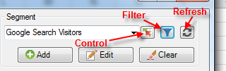

# 세그먼트 관리

{{legacy-arb}}

Report Builder에서 Adobe Analytics 세그먼트 추가, 편집, 적용 및 필터링 방법

Report Builder에는 세그먼트를 만들고 관리할 수 있도록 하는 요청 마법사 1단계의 세그멘테이션 패널이 있습니다.

## 세그먼트 추가 또는 편집 {#section_B2BC136F9A53498D90C7C2ECC5DB892B}

>[!NOTE]
>
>세그먼트를 추가하거나 편집할 수 있게 Report Builder 세그먼트 인터페이스는 Microsoft Internet Explorer 창에서 Analytics 세그먼트 빌더를 시작합니다. Report Builder 세션이 활성 상태로 유지됩니다. 이 작업에는 Internet Explorer 이외의 브라우저가 지원되지 않습니다.

1. 요청 마법사의 1단계에 있는 세그먼트 패널에서 **[!UICONTROL 추가]**&#x200B;를 클릭합니다.
1. Analytics 세그먼트 빌더 인터페이스를 여는 Internet Explorer 창이 실행됩니다. 세그먼트 빌드 방법에 대한 자세한 내용은 [분석 세그먼트](/help/components/segmentation/seg-home.md)를 참조하십시오.
1. 세그먼트를 정의하고 저장한 후 요청 마법사로 돌아갑니다.
1. 새로 고침 아이콘을 클릭하여 세그먼트 목록을 새로 고칩니다.

>[!IMPORTANT]
>
>이 목록은 캐시되며, 새로 생성된 세그먼트는 새로 고침을 하지 않는 경우 나타나지 않습니다.

## 컨텍스트 내 세그먼트 만들기 {#section_6DD2C663B2854469AA1075438F907678}

세그먼트로 전환하려는 특정 보고서 차원 조합이 있을 수 있습니다. Report Builder 인터페이스에서 이러한 세그먼트를 만들 수 있습니다. 예를 들어 페이지 요청 출력에서 몇 개의 페이지를 선택하고 이 값을 기반으로 세그먼트를 만듭니다.

1. 세그먼트로 전환할 보고서 출력 항목을 선택합니다.
1. 마우스 오른쪽 버튼을 클릭하여 **[!UICONTROL 컨텍스트 내 세그먼트 만들기]**&#x200B;를 선택하고 적절한 컨테이너(히트 컨테이너, 방문 컨테이너, 방문자 컨테이너)를 지정합니다.

   

   컨테이너에 대한 자세한 내용은 [세그먼테이션 안내서](/help/components/segmentation/seg-home.md)를 참조하세요.

1. 이제 Internet Explorer에서 세그먼트 빌더 UI가 실행됩니다. 세그먼트 빌더 UI는 지정한 컨테이너 및 필터로 초기화됩니다.
1. 세그먼트에 이름과 설명을 추가한 후 저장합니다.
1. Report Builder으로 돌아가서 새로 고침 아이콘을 클릭하여 세그먼트 목록을 새로 고칩니다.
1. 이제 이 세그먼트를 적용할 준비가 되었습니다.

## 세그먼트 검색 및 적용

Reports &amp; Analytics(사용 종료), Report Builder 또는 Data Warehouse에서 만든 모든 세그먼트가 이 세그먼트 목록에 표시됩니다. 목록을 새로 고치려면 새로 고침 아이콘 을 클릭합니다.

주어진 요청에 하나 이상의 세그먼트를 적용할 수 있습니다. 여기에는 순차적 세그먼트가 포함됩니다.

1. **[!UICONTROL 세그먼트]** 드롭다운 목록으로 이동한 후 **[!UICONTROL 세그먼트 선택]** 상자의 작은 아래쪽 화살표를 클릭하여 모든 세그먼트를 표시합니다.

1. 적용할 세그먼트를 선택합니다.

   

>[!NOTE]
>
>관리자이든, 관리자가 아니든, Report Builder에서 소유하는 세그먼트와 다른 사용자와 공유하는 세그먼트만 볼 수 있습니다.

## 세그먼트 필터링 {#filter}

필터 아이콘 **필터 아이콘**&#x200B;을 클릭하여  세그먼트

사용 가능한 필터는 다음과 같습니다.

| 필터 이름 | 설명 |
|---|---|
| 태그 | 특정 태그가 있는 세그먼트를 필터링할 수 있습니다. 태그 필터는 AND 연산자를 사용합니다. 태그 두 개를 선택하면 오른쪽 창에 **모두** 태그로 태그가 지정된 세그먼트가 표시됩니다. |
| 소유자 | 소유자별로 세그먼트를 필터링할 수 있습니다. 소유자 필터는 OR 연산자를 사용합니다. 두 명의 소유자를 확인하면 오른쪽 창에 **한 명 중** 소유자가 소유한 세그먼트가 표시됩니다. |
| 기타 필터 > *보고서 세트 이름*&#x200B;만 | Adobe Analytics의 세그먼트 빌더에서 &quot;*보고서 세트 이름*&#x200B;만&quot; 필터를 적용한 다음 [!DNL Report Builder]에 고급 필터를 표시하면 고급 필터에 선택한 보고서 세트에 대한 세그먼트만 표시됩니다. |
| 기타 필터 > 내 소유 | 소유한 모든 세그먼트를 표시합니다. |
| 기타 필터 > 나와 공유 | 다른 사용자가 사용자와 공유한 모든 세그먼트를 표시합니다. |
| 기타 필터 > 즐겨찾기 | 즐겨찾기로 표시한 모든 세그먼트를 표시합니다. |
| 기타 필터 > 승인됨 | 공식적으로 승인된 모든 세그먼트를 표시합니다. |

## 통합 문서에 세그먼트 컨트롤 추가 {#segment-control}

세그먼트 컨트롤을 추가하면 요청 마법사로 이동할 필요 없이 통합 문서 내에서 세그먼트 간을 전환할 수 있습니다.

1. 세그먼트 드롭다운 옆에 있는 컨트롤 아이콘 을(를) 클릭합니다.

1. 세그먼트 컨트롤에 표시할 모든 세그먼트를 선택하거나 **[!UICONTROL 모두 선택]**&#x200B;을 선택합니다.

   모든 세그먼트가 선택된 컨트롤 설정 대화 상자의 

1. **[!UICONTROL 항목 선택 시 연결된 요청을 자동으로 새로 고칩니다]** 옵션에 주목하십시오.

   * 선택하면 이 컨트롤을 사용하는 모든 요청이 새로 고쳐집니다.
   * 선택하지 않으면 관련 요청 매개변수가 업데이트되지만 요청이 새로 고쳐지지 않습니다.

1. 세그먼트 컨트롤의 왼쪽 위 셀 위치를 지정합니다.

1. **[!UICONTROL 확인]**&#x200B;을 클릭하면 세그먼트 컨트롤이 지정된 위치에 나타납니다.

   

## 세그먼트 목록 새로 고침 {#refresh}

언제든지 새 세그먼트를 추가하거나 기존 세그먼트를 편집할 때는 새로 고침 아이콘 을 클릭하여 캐시된 세그먼트 목록을 새로 고쳐야 합니다.

## 요청에 있는 세그먼트 관리 {#manage}

v5.4 이전의 Report Builder에서는 여러 요청에 대한 세그먼트를 변경할 수 있었습니다. 그러나 이 프로세스는 항상 기존 세그먼트를 대체했습니다. 세그먼트를 추가하면 각 요청에 이미 할당된 이전 세그먼트 세트가 제거되므로 각 요청에 하나의 새 세그먼트를 추가하려는 사용자는 이 작업을 수행할 수 없습니다.

Report Builder 5.4를 사용하면 여러 요청에 대해 세그먼트 추가, 제거, 바꾸기 및 모두 바꾸기를 수행할 수 있습니다.

1. 통합 문서에서 여러 요청을 선택합니다.
1. 마우스 오른쪽 단추를 클릭하고 **[!UICONTROL 요청 편집]** > **[!UICONTROL 세그먼트별]**&#x200B;을 선택합니다.

   

1. [그룹 편집] 대화 상자에서 다음 네 가지 옵션 중 하나를 선택합니다.

   | 옵션 | 설명 |
   |---|---|
   | 세그먼트 추가 | 현재 세그먼트 목록에 추가할 세그먼트를 하나 이상 선택할 수 있습니다. |
   | 세그먼트 바꾸기 | 하나 이상의 세그먼트로 대체할 세그먼트를 선택할 수 있습니다. |
   | 모든 세그먼트 바꾸기 기준 | 현재 세그먼트를 바꿀 세그먼트를 하나 이상 선택할 수 있습니다. |
   | 세그먼트 제거 | 요청에서 세그먼트를 제거할 수 있습니다. |
