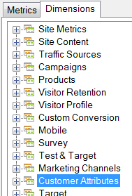

# 고객 속성

사용자 특성은 VisAttr이라는 새로운 유형의 요소에 저장되며 이것은 차원이나 지표로 구성할 수 있습니다.

사용자 특성을 업로드하는 방법에 대한 자세한 내용은 [Experience Cloud 도움말](https://experienceleague.adobe.com/docs/core-services/interface/customer-attributes/attributes.html)을 참조하십시오.

* 지표로 구성된 경우 VisAttr은 지표와 &quot;차원&quot;으로 모두 노출됩니다.

   

* eVar와 동일한 분류를 지원합니다(모두를 무엇으로든 분류 가능).
* VisAttr은 모든 eVar 지표를 지원합니다.
* 지표로서의 VisAttr은 &quot;버킷화&quot;(0~ 30, 31~ 60 등 사이트에서 보낸 시간)를 지원합니다.
* VisAttr은 세그멘테이션 차원으로 사용할 수 있습니다.
