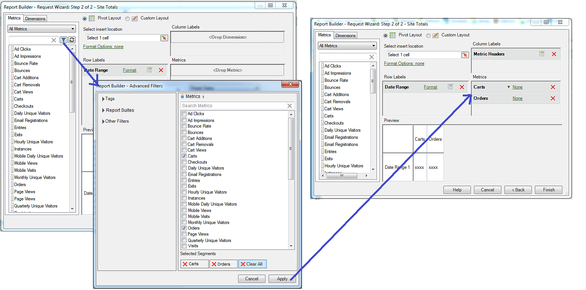

# 계산된 지표

{{legacy-arb}}

Report Builder 5.2 이상 버전은 Adobe Analytics 계산된 지표를 지원합니다. 이제 모든 계산된 지표에 글로벌 ID가 있습니다. 더 이상 하나의 보고서 세트로 제한되지 않습니다.

>[!NOTE]
>
>기존 통합 문서가 기존 지표 ID를 보유한 요청을 가리킬 수 있습니다. Report Builder 5.2를 사용하는 경우 이러한 기존 지표 ID는 새 글로벌 ID로 변환됩니다. 이 통합 문서를 Report Builder v5.1 이전 버전의 사용자와 공유하는 경우, 해당 사용자는 계산된 지표를 볼 수 없습니다.

새 계산된 지표 빌더 및 Manager로 계산된 지표를 생성 및 관리하는 방법에 대한 자세한 내용은 [계산된 지표](/help/components/calculated-metrics/cm-overview.md) 안내서를 참조하십시오.

요청 마법사의 2단계에서 계산된 지표를 필터링하고 적용할 수 있습니다.

## 계산된 지표 필터링 {#section_376E986D3E684999A7CDB08E53854159}

**필터 아이콘을 클릭하여 계산된 지표를 필터링**: 

고급 필터 대화 상자는 표준 지표와 계산된 지표로 채워집니다.

사용 가능한 필터는 다음과 같습니다.

| 필터 이름 | 설명 |
|---|---|
| 태그 | 특정 태그가 있는 계산된 지표만 필터링할 수 있습니다. 태그 필터는 AND 연산자를 사용합니다. 태그 두 개를 선택하면 오른쪽 창에 **모두** 태그로 태그가 지정된 지표가 표시됩니다. |
| 보고서 세트 | [!DNL Adobe Analytics]의 계산된 지표 빌더에서 &quot;*보고서 세트 이름*&#x200B;만&quot; 필터를 적용한 다음 [!DNL Report Builder]에 고급 필터를 표시하면 고급 필터에 선택한 보고서 세트에 대한 계산된 지표만 표시됩니다. |
| 소유자 | 소유자별로 지표를 필터링할 수 있습니다. 소유자 필터는 OR 연산자를 사용합니다. 두 명의 소유자를 확인하면 오른쪽 창에 **또는** 소유자가 소유한 지표가 표시됩니다. |
| 기타 필터 > 승인됨 | 공식적으로 승인된 모든 지표를 표시합니다. |
| 기타 필터 > 즐겨찾기 | 즐겨찾기로 표시한 모든 지표를 표시합니다. |
| 기타 필터 > 내 소유 | 소유한 모든 지표를 표시합니다. |
| 기타 필터 > 나와 공유 | 다른 사용자가 사용자와 공유한 모든 지표를 표시합니다. |

## 계산된 지표 적용 {#section_DF5CF349460A45FDA4B6E6BB8B52F18E}

필터를 선택한 다음 **[!UICONTROL 적용]**&#x200B;을 클릭하여 필터를 요청에 적용합니다. 선택한 지표가 이제 보고서 레이아웃에 추가됩니다.

