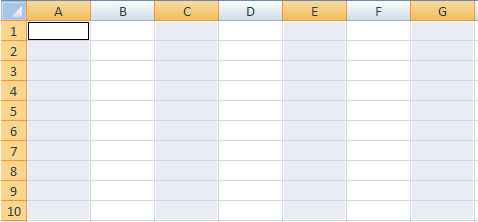

# 지표 및 차원을 셀에 매핑

{{legacy-arb}}

항목을 스프레드시트에 매핑하기 전에 스프레드시트가 보호되어 있지 않은지 확인하십시오. 워크시트에 대한 보호 체계로 인해 사용자 작업이 차단되는 경우 스프레드시트에서 셀을 선택할 수 없습니다. 먼저 시트 보호를 해제한 다음 셀 매핑을 추가합니다.

매핑할 영역 및 셀의 수는 선택한 지표, 세부기간, 날짜 범위 및 설정한 필터에 따라 다릅니다. 예를 들어 [!UICONTROL 사이트 지표] > [!UICONTROL 트래픽 보고서]를 선택하고 [!UICONTROL 주] 세부기간을 설정하고 [!UICONTROL 최근 2주]에 대한 날짜 범위를 설정하면 [!UICONTROL 요청 마법사: 2단계]에서 세 개의 셀을 매핑하라는 메시지가 표시됩니다([!UICONTROL 사용자 지정 레이아웃]을 사용할 때). 요청은 1주차 데이터와 2주차 데이터를 검색합니다. 여기서 각 데이터 포인트 값은 페이지 보기의 값과 동일합니다. 세 번째 셀은 [!UICONTROL 서식 옵션]을 사용하여 구성할 수 있는 행 머리글로 사용됩니다.

스프레드시트에서 호환되지 않는 위치를 실수로 매핑하면 Report Builder에서 오류가 발생합니다.

자세한 내용은 다음 섹션을 참조하십시오.

* [셀 범위 선택](/help/analyze/legacy-report-builder/layout/map-metrics-and-dimensions-to-cells.md#section_1E37FB46DA194FB7A1050B8833A48AC6)
* [셀을 선택하는 기술](/help/analyze/legacy-report-builder/layout/map-metrics-and-dimensions-to-cells.md#section_760421C3D7F84D67A639174710C93B22)
* [매핑 시 문제](/help/analyze/legacy-report-builder/layout/map-metrics-and-dimensions-to-cells.md#section_CC1BCF841291447EB3A994EB08F3A099)

## 셀 범위 선택 {#section_1E37FB46DA194FB7A1050B8833A48AC6}

[!UICONTROL 요청 마법사: 2단계]에서, 트렌드 요청에 대해 [!UICONTROL 사용자 지정 레이아웃]을 활성화하면 요청을 셀 범위에 매핑할 수 있습니다.

매핑할 항목 옆에 있는 **[!UICONTROL 범위 선택기]** 를 클릭합니다.

* **범위의 모든 셀:** [!UICONTROL 사용자 지정 레이아웃] 스타일 요청에 대한 셀 그룹을 선택해야 합니다.
* **범위의 첫 번째 셀:** 범위의 맨 위 왼쪽 셀을 선택하도록 하고 [!UICONTROL 범위] 방향을 표시하여 입력 및 출력 셀의 수평 또는 수직 방향(열 또는 행)을 지정합니다. 이 옵션을 사용하여 Report Builder에서 자동으로 셀을 선택하도록 하십시오.
* **범위 방향:** 셀 범위를 열 또는 행으로 방향을 정하도록 합니다.
* **범위의 위쪽 셀 위치 선택:** 셀 참조를 표시합니다.

## 셀 선택 기술 {#section_760421C3D7F84D67A639174710C93B22}

**[!UICONTROL 범위 선택]** 아이콘 를 클릭하여 데이터를 선택합니다

을 클릭하고 스프레드시트의 원하는 셀 범위를 마우스로 클릭한 채 드래그하여 데이터를 선택합니다. 연속 선택 영역은 검정색 테두리로 윤곽선이 표시됩니다.

별도의 선택한 행에는 각 행 주위에 얇은 흰색 테두리가 있습니다.

한 요청에서 별도의 행을 매핑하려면 [!UICONTROL Control] 키를 사용한 다음, 커서를 클릭하여 원하는 셀 위로 끕니다. 요청이 40개의 셀이 함께 있는 연속적인 영역이 아니라 각각 10개의 셀이 있는 4개의 영역을 필요로 하는 경우 이렇게 해야 합니다.

셀을 선택한 후 [!UICONTROL 범위 선택] 양식에서 **[!UICONTROL 범위 선택기]**&#x200B;을 다시 클릭하여 [!UICONTROL 요청 마법사: 2단계]&#x200B;(으)로 돌아갑니다.

## 매핑 문제 해결{#section_CC1BCF841291447EB3A994EB08F3A099}

이미 활성화된 매핑이 있는 셀에 매핑하도록 잘못 선택한 경우 범위 선택기 아이콘 옆에 있는 텍스트 상자에 셀 참조가 표시되지 않습니다. [!UICONTROL 확인]을 클릭하면 Report Builder에 오류가 표시됩니다. *선택한 범위가 다른 요청의 범위와 교차합니다. 선택 내용을 변경하십시오.*

* 여전히 셀을 사용해야 하는 경우 원하는 셀을 마우스 오른쪽 단추로 클릭하고 **[!UICONTROL 요청 삭제]**&#x200B;를 선택합니다.

이 메시지를 방지하려면 다음 두 가지 방법을 사용할 수 있습니다.

* 요청 및 매핑이 있는 셀에 형식을 추가하여 보고서 형식을 계획합니다
* 매핑이 포함된 스프레드시트 영역 테스트

포함된 요청이 있는 영역을 테스트하려면 다음을 수행할 수 있습니다.

* [!UICONTROL 요청 관리자]를 시작하고 표에 나열된 개별 요청을 클릭합니다. 요청을 클릭하면 요청이 매핑된 스프레드시트의 셀이 강조 표시됩니다.
* 스프레드시트에서 새 매핑에 사용할 셀을 선택하고 [!UICONTROL 시트에서]를 클릭합니다. [!UICONTROL 요청 관리자]가 목록에서 선택한 셀과 교차하는 출력 항목이 있는 요청을 선택합니다. 요청을 선택하지 않으면 셀을 사용할 수 있습니다.
* 스프레드시트에서 셀을 선택하고 컨텍스트 메뉴를 마우스 오른쪽 단추로 클릭한 다음 [!UICONTROL 요청 편집]을 사용할 수 있는지 확인하십시오. 이 경우 이러한 셀과 관련된 요청이 있습니다.
