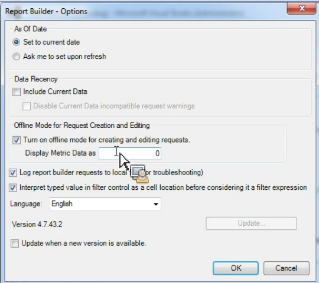

# 요청을 만들고 편집하기 위한 오프라인 모드

{{legacy-arb}}

오프라인 모드는 요청을 만들고 편집하는 과정을 가속하는 자리 표시자 데이터를 반환합니다.

새 요청을 만들거나 편집할 때 응답을 검색하기 위해 보고서 API 호출이 수행됩니다. 경우에 따라 이러한 호출은 다음 단계로 이동하기 전에 데이터가 반환될 때까지 기다려야 하므로 요청 생성 프로세스 속도가 느려집니다. 오프라인 모드는 자리 표시자 데이터만 반환하고 API는 만들어지지 않습니다.

오프라인 모드를 활성화하려면

1. Report Builder 메뉴에서 **[!UICONTROL 옵션]**&#x200B;을 클릭합니다.

   오프라인 코드가 선택된 옵션 화면의 

1. **[!UICONTROL 요청 생성 및 편집을 위한 오프라인 모드를 켭니다.]** 옆의 확인란을 선택합니다.
1. **[!UICONTROL 지표 데이터를 다음으로 표시]** 필드에 요청에서 반환하려는 자리 표시자 데이터를 입력합니다. 예를 들어 &quot;1&quot;을 입력합니다.
1. **[!UICONTROL 확인]**&#x200B;을 클릭합니다.
1. 요청 마법사를 사용하여 요청을 오프라인 모드로 만들고 실행합니다. 다음 스크린샷은 자리 표시자 데이터로 &quot;1&quot;이 있는 요청의 예를 보여줍니다.

   

   >[!IMPORTANT]
   >
   >실제 데이터로 요청을 실행하려면 먼저 오프라인 모드를 비활성화해야 합니다.
