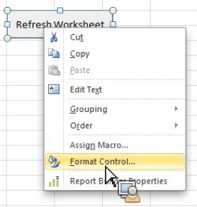

# Microsoft Excel에서 Report Builder 함수 사용

{{legacy-arb}}

Report Builder 사용자 인터페이스에 액세스하지 않고도 Report Builder 기능을 사용하여 기능에 액세스할 수 있습니다.

예를 들어 다른 소스에서 Excel로 가져온 데이터를 기반으로 입력 필터로 Report Builder 요청을 자동으로 새로 고치려면 문자열 RefreshRequestsInCellsRange(..) 함수를 사용합니다. 모든 호출은 비동기적으로 수행되며 즉시 반환되고 완전히 실행될 때까지 기다리지 않습니다.

**요구 사항**

* Report Builder 5.0 이상이 필요합니다.

다음 표에는 노출된 함수가 나열되어 있습니다.

| 함수 이름 | 유형 | 설명 |
|:---| --- | ---|
| AsyncRefreshAll() | 문자열 | 통합 문서에 있는 모든 Report Builder 요청을 새로 고칩니다. |
| AsyncRefreshRange(string rangeAddressInA1Format) | 문자열 | 지정된 셀 범위 주소(A1 형식의 셀 범위를 나타내는 문자열 식(예: &quot;Sheet1!A2:A10&quot;))에 있는 모든 Report Builder 요청을 새로 고칩니다. |
| AsyncRefreshRangeAltTextParam() | 문자열 | Ms 양식 컨트롤의 대체 텍스트를 통과하는 지정된 셀 범위에 있는 모든 Report Builder 요청을 새로 고칩니다. |
| AsyncRefreshActiveWorksheet() | 문자열 | 활성 워크시트에 있는 모든 Report Builder 요청을 새로 고칩니다. |
| AsyncRefreshWorksheet(string worksheetName) | 문자열 | 지정된 워크시트(탭에 나타나는 워크시트 이름)에 있는 모든 Report Builder 요청을 새로 고칩니다. |
| AsyncRefreshWorksheetAltTextParam(); | 문자열 | Ms 양식 컨트롤의 대체 텍스트를 통과하는 특정 워크시트 이름에 있는 모든 Report Builder 요청을 새로 고칩니다. |
| tring GetLastRunStatus() | 문자열 | 마지막 실행의 상태를 설명하는 문자열을 반환합니다. |

Report Builder 함수에 액세스하려면 **[!UICONTROL 수식]** > **[!UICONTROL 함수 삽입]**(으)로 이동하십시오. 검색 필드를 사용하여 기능을 검색하거나 범주를 선택하여 해당 범주에 있는 기능을 나열합니다.


## 예 {#section_034311081C8D4D7AA9275C1435A087CD}

다음 예제에서는 *셀 P5의 값이 텍스트이거나 비어 있으면 셀 P9에 있는 범위를 새로 고치십시오*.

```
=IF(OR(ISTEXT(P5),ISBLANK(P5)),AsyncRefreshRange("P9"),"")
```

## 컨트롤 서식을 사용하여 Report Builder 함수 사용 {#section_26123090B5BD49748C8D8ED7A1C5ED84}

만든 컨트롤에 매크로를 지정할 수 있으며 이 컨트롤은 통합 문서 요청을 새로 고치는 함수가 될 수 있습니다. 예를 들어 함수 AsyncRefreshActiveWorksheet는 워크시트의 모든 요청을 새로 고칩니다. 그러나 특정 요청만 새로 고침하는 경우가 있습니다.

1. 매크로 매개 변수를 설정합니다.
1. 컨트롤을 마우스 오른쪽 단추로 클릭하고 **[!UICONTROL Assign Macro]**.
1. Report Builder 함수 이름을 입력합니다(매개 변수 또는 괄호 없음).


## 컨트롤 서식을 사용하여 Report Builder 함수에 매개 변수 전달 {#section_ECCA1F4990D244619DFD79138064CEF0}

매개 변수를 사용하는 두 함수는 Format Control에 사용할 수 있습니다. **대체 텍스트:** 필드를 사용해야 합니다.

* AsyncRefreshRange(string rangeAddressInA1Format)
* AsyncRefreshWorksheet(string worksheetName)

컨트롤 서식을 사용하여 Report Builder 함수에 매개 변수를 전달하려면

1. 컨트롤을 마우스 오른쪽 단추로 클릭하고 **[!UICONTROL 컨트롤 서식]**&#x200B;을 선택합니다.

   

1. **[!UICONTROL 대체 텍스트]** 탭을 클릭합니다.

   

1. **[!UICONTROL 대체 텍스트]**&#x200B;에서 새로 고치려는 셀 범위를 입력합니다.
1. **[!UICONTROL 수식]** > **[!UICONTROL 함수 삽입]**> **[!UICONTROL Adobe.ReportBuilder.Bridge]**&#x200B;에서 Report Builder 매개 변수 목록을 엽니다.

1. AltTextParam으로 끝나는 두 함수 중 하나를 선택하고 **[!UICONTROL 확인]**&#x200B;을 클릭합니다.
