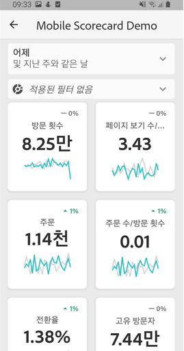
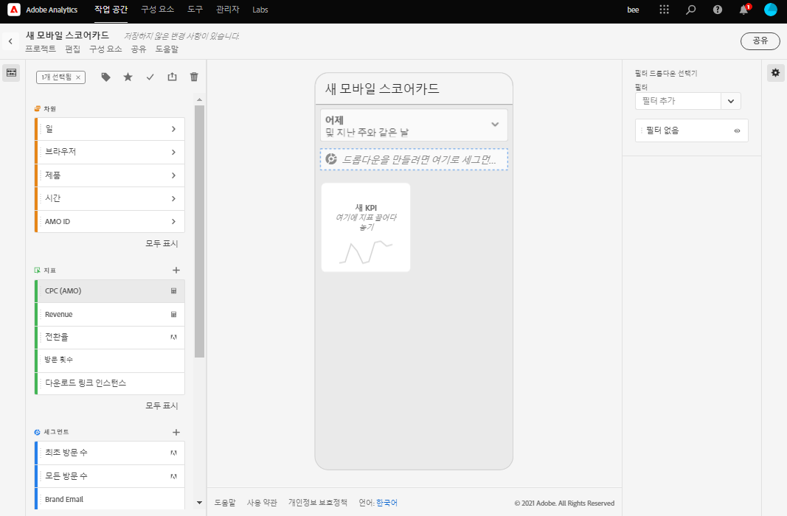
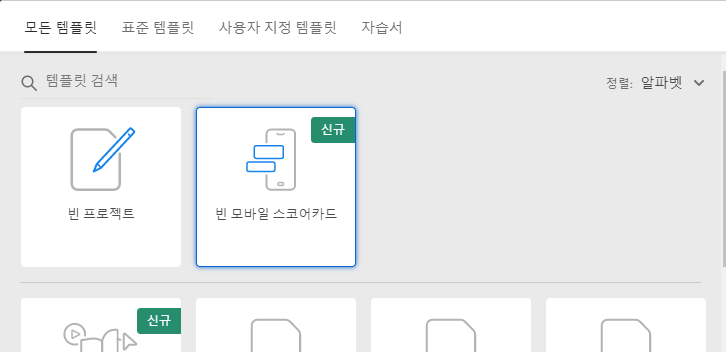
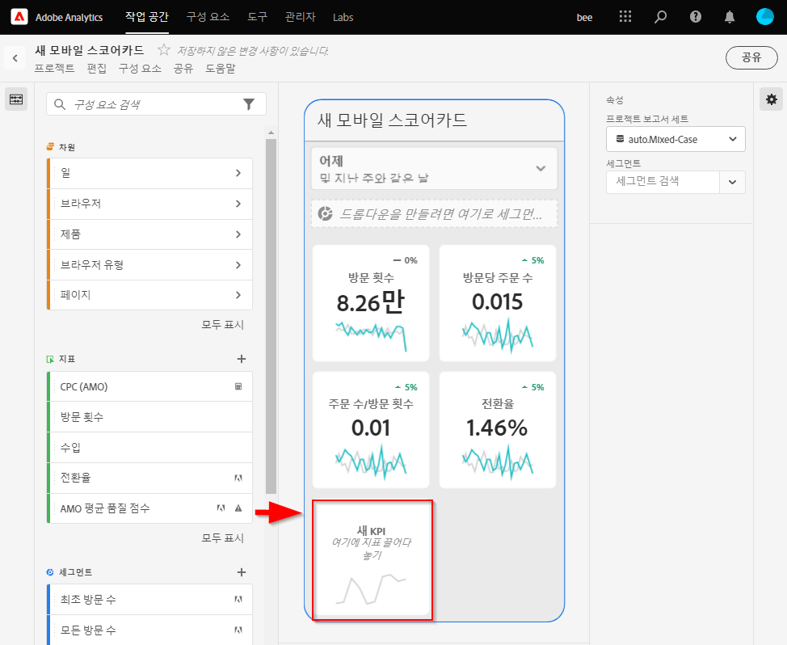
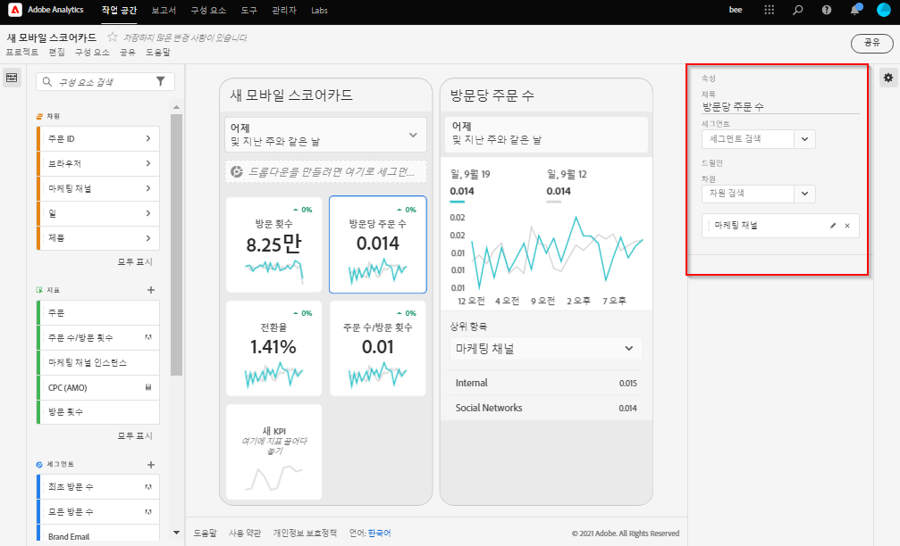
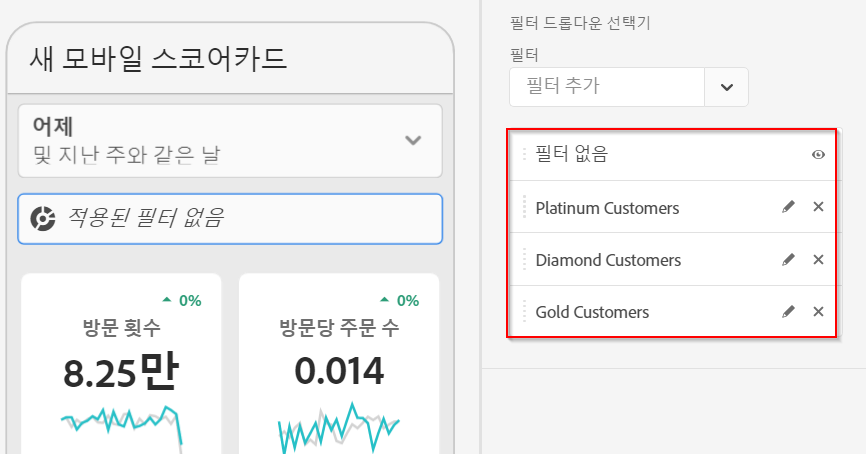
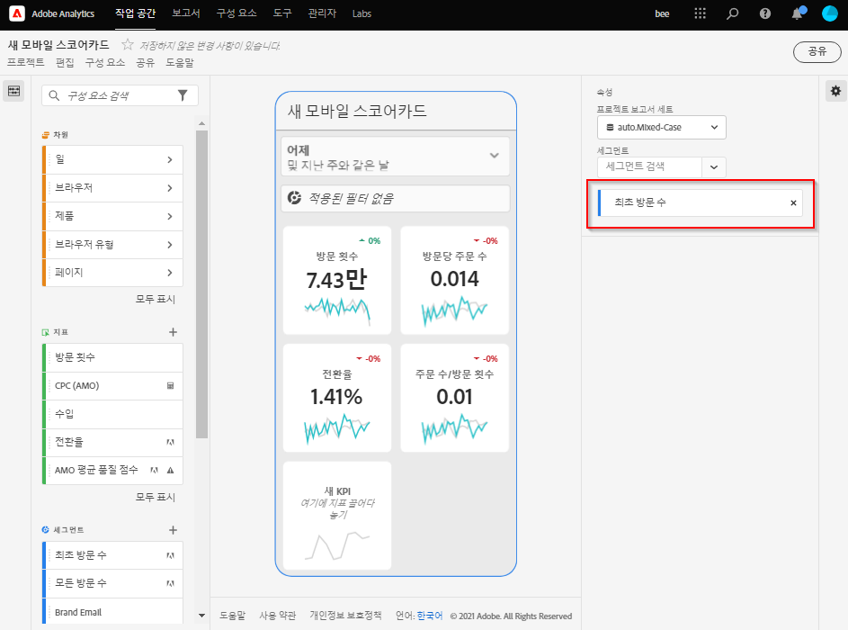
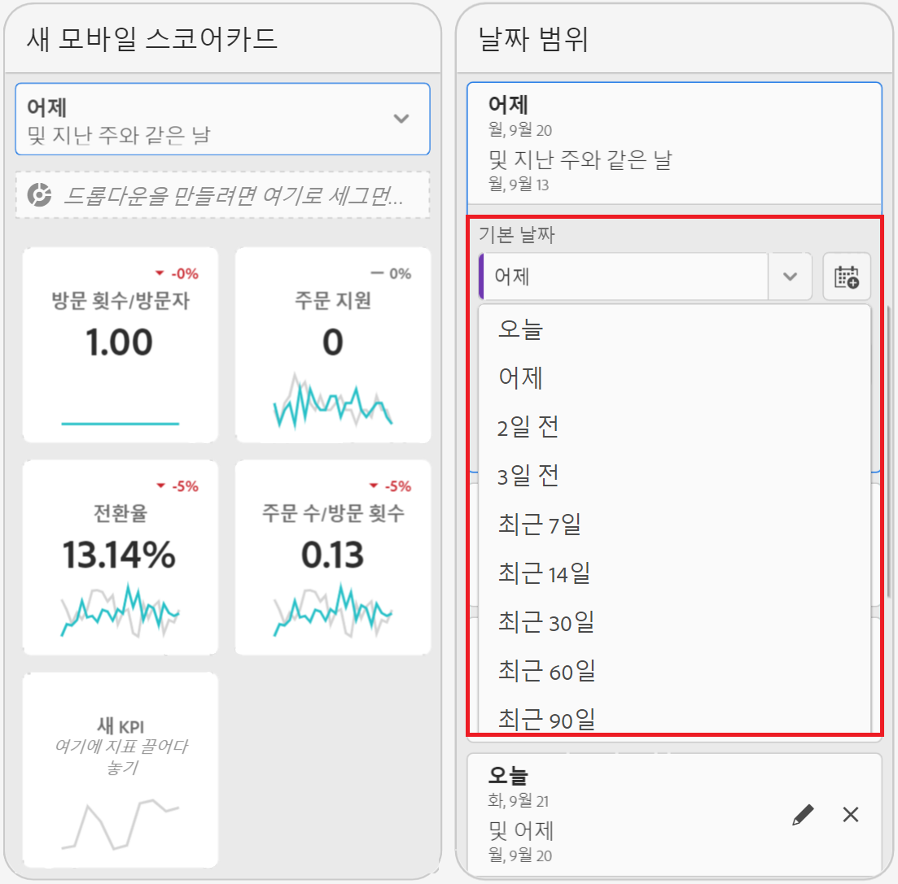
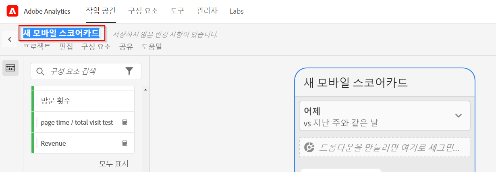

# 스코어카드 만들기

다음 정보는 Adobe Analytics 큐레이터에게 경영진 사용자의 대시보드를 구성 및 제공하는 방법에 대해 설명합니다. 시작하려면 Adobe Analytics 대시보드 스코어카드 빌더 비디오를 볼 수 있습니다.

>[!VIDEO](https://video.tv.adobe.com/v/34544)

Adobe Analytics 스코어카드는 아래에 표시된 대로 타일 레이아웃에 경영진 사용자에 대한 주요 데이터 시각화를 표시합니다.

이 스코어카드의 큐레이터로서 스코어카드 빌더를 사용하여 경영진 소비자의 스코어카드에 표시되는 타일을 구성할 수 있습니다. 또한 타일을 탭하여 세부 보기 또는 분류를 조정하는 방법을 구성할 수 있습니다. 스코어카드 빌더 인터페이스가 아래에 표시되어 있습니다.

스코어카드를 만들려면 다음을 수행해야 합니다.

1. [!UICONTROL 빈 모바일 스코어카드] 템플릿에 액세스합니다.
2. 데이터를 사용하여 스코어카드를 구성하고 저장합니다.

## [!UICONTROL 빈 모바일 스코어카드] 템플릿에 액세스

새 프로젝트를 만들거나 도구 메뉴에서 [!UICONTROL 빈 모바일 스코어카드] 템플릿에 액세스할 수 있습니다.

### 새 프로젝트 만들기

1. Adobe Analytics를 열고 **[!UICONTROL 작업 공간]** 탭을 클릭합니다.
1. **[!UICONTROL 프로젝트 만들기]**&#x200B;를 클릭하고 **[!UICONTROL 빈 모바일 스코어카드]** 프로젝트 템플릿을 선택합니다.
1. **[!UICONTROL 만들기]**&#x200B;를 클릭합니다.

### 도구 템플릿

1. **[!UICONTROL 도구]** 메뉴에서 **[!UICONTROL Analytics 대시보드 (모바일 앱)]**&#x200B;를 선택합니다. 
1. 다음에 나오는 화면에서 **[!UICONTROL 새 스코어카드 만들기]** 버튼을 클릭합니다.

## 데이터를 사용하여 스코어카드 구성 및 저장

스코어카드 템플릿을 구현하려면:

1. **[!UICONTROL 속성]** (오른쪽 레일)에서 데이터를 사용할 **[!UICONTROL 프로젝트 보고서 세트]**&#x200B;를 지정합니다.

   

1. 스코어카드에 새 타일을 추가하려면 왼쪽 패널의 지표를 **[!UICONTROL 여기에 지표 드래그 앤 드롭]** 영역으로 끌어다 놓습니다. 비슷한 작업 과정을 사용하여 두 타일 사이에 지표를 삽입할 수도 있습니다.

   

   *각 타일에서 관련 차원 목록에 대한 최상위 항목 등, 지표에 대한 추가 정보를 표시하는 상세 보기에 액세스할 수 있습니다.*

### 차원 또는 지표 추가

지표에 관련 차원을 추가하려면:

왼쪽 패널에서 차원을 타일에 끌어다 놓습니다.

예를 들면 적절한 차원 (이 예제의 경우 **[!DNL DMA Region]**)을 타일에 드래그 앤 드롭하여 **[!UICONTROL 고유 방문자 수]** 지표에 추가할 수 있습니다. 추가한 차원은 타일별 **[!UICONTROL 속성]**&#x200B;의 분류 섹션에 표시됩니다. 각 타일에 여러 차원을 추가할 수 있습니다.

### 타일 속성 보기 및 구성

스코어카드 빌더에서 타일을 클릭하면 오른쪽 레일에 해당 타일과 연관된 속성 및 특성이 표시됩니다. 이 레일에서 타일에 새 **[!UICONTROL 제목]**&#x200B;을 제공하고, 왼쪽 레일에서 끌어다 놓는 대신 구성 요소를 지정하여 타일을 구성할 수 있습니다.

또한 타일을 클릭하면 앱에서 분류 보기가 경영진 사용자에게 표시되는 방법이 동적 팝업에 나타납니다. 차원이 타일에 적용되지 않은 경우 분류 차원은 기본 날짜 범위에 따라 **시간** 또는 **일**&#x200B;이 됩니다.

타일에 추가된 각 차원이 앱의 상세 보기에서 드롭다운 목록에 어떻게 표시되는지 확인합니다. 그러면 경영진 사용자는 드롭다운 목록에 나열된 옵션 중에서 선택할 수 있습니다.

### 세그먼트 적용

세그먼트를 개별 타일에 적용하려면 왼쪽 패널의 세그먼트를 타일 위에 바로 드롭합니다.

스코어카드의 모든 타일에 세그먼트를 적용하려면 스코어카드의 맨 위에 타일을 놓습니다. 또는 날짜 범위 아래의 필터 메뉴에서 세그먼트를 선택하여 세그먼트를 적용할 수도 있습니다. Adobe Analytics Workspace에서 수행한 것과 동일한 방식으로 [스코어카드에 필터를 구성하고 적용](https://experienceleague.adobe.com/docs/analytics-learn/tutorials/analysis-workspace/using-panels/using-drop-down-filters.html?lang=ko-KR)합니다.

### 구성 요소 제거

마찬가지로 전체 스코어카드에 적용된 구성 요소를 제거하려면 타일 바깥쪽에 있는 스코어카드의 아무 곳이나 클릭한 다음 **첫 번째 방문** 세그먼트에 대해 아래에 표시된 대로 구성 요소를 마우스로 가리키면 표시되는 **x**&#x200B;를 클릭하여 제거합니다.

### 날짜 범위

날짜 범위 드롭다운을 선택하여 스코어카드에서 선택할 수 있는 날짜 범위 조합을 추가 및 제거합니다.

각 새 스코어카드는 오늘과 어제의 데이터를 중심으로 6개의 날짜 범위 조합으로 시작합니다. x를 클릭하여 불필요한 날짜 범위를 제거할 수도 있고 연필을 클릭하여 각 날짜 범위 조합을 편집할 수도 있습니다.

기본 날짜를 만들거나 변경하려면 드롭다운을 사용하여 사용 가능한 날짜 범위에서 선택하거나 날짜 구성 요소를 오른쪽 레일에서 드롭 영역으로 끌어다 놓습니다.

비교 날짜를 만들려면 드롭다운 메뉴에서 일반 시간 비교를 위해 편리한 사전 설정에서 선택할 수 있습니다. 오른쪽 레일에서 날짜 구성 요소를 끌어서 놓을 수도 있습니다.

원하는 날짜 범위를 아직 만들지 않은 경우 달력 아이콘을 클릭하여 새 날짜 범위를 만들 수 있습니다.

그러면 새 날짜 범위 구성 요소를 만들고 저장할 수 있는 날짜 범위 작성기로 이동합니다.

## 스코어카드에 이름 지정

스코어카드에 이름을 지정하려면 화면 왼쪽 상단의 네임스페이스를 클릭하고 새 이름을 입력합니다.

## 스코어카드 공유

스코어카드를 경영진 사용자와 공유하려면:

1. **[!UICONTROL 공유]** 메뉴를 클릭하고 **[!UICONTROL 스코어카드 공유]**&#x200B;를 선택합니다.

1. **[!UICONTROL 모바일 스코어카드 공유]** 양식에서 다음 방법으로 필드를 작성합니다.

   * 스코어카드의 이름 제공
   * 스코어카드에 대한 설명 제공
   * 관련 태그 추가
   * 스코어카드 수신자 지정

1. **[!UICONTROL 공유]**&#x200B;를 클릭합니다.

스코어카드를 공유하면 수신자가 자신의 Analytics 대시보드에서 액세스할 수 있습니다. 스코어카드 빌더에서 스코어카드를 추가로 변경하면 공유 스코어카드에서 자동으로 업데이트됩니다. 경영진 사용자가 자신의 앱에서 스코어카드를 새로 고치면 변경 사항이 표시됩니다.

새 구성 요소를 추가하여 스코어카드를 업데이트하는 경우 경영진 사용자가 이러한 변경 사항에 액세스할 수 있도록 스코어카드를 다시 공유 (그리고 **[!UICONTROL 포함된 구성 요소 공유]** 옵션 선택)할 수 있습니다.