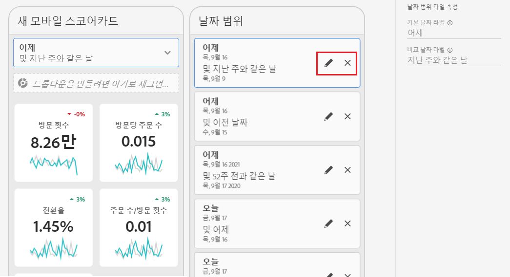
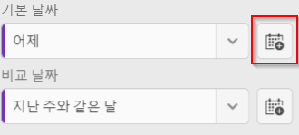

# 모바일 스코어카드 만들기

다음 정보는 Adobe Analytics 큐레이터에게 경영진 사용자의 모바일 스코어카드를 구성하고 제공하는 방법에 대해 알려 줍니다. 시작하는 데 도움이 되는 “Adobe Analytics 대시보드 스코어카드 빌더” 비디오를 시청하십시오.

>[!VIDEO](https://video.tv.adobe.com/v/34544)

Adobe Analytics 스코어카드는 아래에 표시된 대로 타일 레이아웃에 경영진 사용자에 대한 주요 데이터 시각화를 표시합니다.

이 스코어카드의 큐레이터로서 스코어카드 빌더를 사용하여 경영진 소비자를 위해 스코어카드에 표시할 타일을 구성할 수 있습니다. 또한 타일을 탭하여 세부 보기 또는 분류를 조정하는 방법을 구성할 수 있습니다. 스코어카드 빌더 인터페이스가 아래에 표시되어 있습니다.

스코어카드를 만들려면 다음 작업을 수행해야 합니다.

1. [!UICONTROL 빈 모바일 스코어카드] 템플릿에 액세스합니다.
2. 데이터를 사용하여 스코어카드를 구성하고 저장합니다.

## [!UICONTROL 빈 모바일 스코어카드] 템플릿에 액세스 {#template}

새 프로젝트를 생성하거나 도구 메뉴에서 [!UICONTROL 빈 모바일 스코어카드] 템플릿에 액세스할 수 있습니다.

### 새 프로젝트 만들기 {#create}

1. Adobe Analytics를 열고 **[!UICONTROL 작업 영역]** 탭을 클릭합니다.
1. **[!UICONTROL 프로젝트 만들기]**&#x200B;를 클릭하고 **[!UICONTROL 빈 모바일 스코어카드]** 프로젝트 템플릿을 선택합니다.
1. **[!UICONTROL 만들기]**&#x200B;를 클릭합니다.

### 도구 메뉴

1. **[!UICONTROL 도구]** 메뉴에서 **[!UICONTROL Analytics 대시보드(모바일 앱)]**&#x200B;를 선택합니다.
1. 다음에 나타나는 화면에서 **[!UICONTROL 새 스코어카드 만들기]**&#x200B;를 클릭합니다.

## 데이터를 사용하여 스코어카드를 구성하고 저장합니다. {#configure}

스코어카드 템플릿을 구현하려면:

1. **[!UICONTROL 속성]** (오른쪽 레일)에서 데이터를 사용할 **[!UICONTROL 프로젝트 보고서 세트]**&#x200B;를 지정합니다.

   

1. 스코어카드에 새 타일을 추가하려면 왼쪽 패널의 지표를 **[!UICONTROL 여기에 지표 드래그 앤 드롭]** 영역으로 끌어다 놓습니다. 비슷한 작업 과정을 사용하여 두 타일 사이에 지표를 삽입할 수도 있습니다.

   

1. 각 타일에서 관련 차원 목록에 대한 최상위 항목 등, 지표에 대한 추가 정보를 표시하는 상세 보기에 액세스할 수 있습니다.

## 차원 또는 지표 추가 {#dimsmetrics}

지표에 관련 차원을 추가하려면 왼쪽 패널에서 차원을 드래그하여 타일에 놓습니다.

예를 들어 타일에 드래그 앤 드롭하여 적절한 차원(이 예에서는 **[!DNL Marketing Channel]**)을 **[!UICONTROL 고유 방문자]** 지표에 추가할 수 있습니다. 차원 분류는 세부 슬라이드별 **[!UICONTROL 속성]**&#x200B;의 [!UICONTROL 드릴인] 섹션에 표시됩니다. 각 타일에 여러 차원을 추가할 수 있습니다.

## 세그먼트 적용 {#segments}

세그먼트를 개별 타일에 적용하려면 왼쪽 패널의 세그먼트를 타일 위에 바로 드롭합니다.

스코어카드의 모든 타일에 세그먼트를 적용하려면 스코어카드의 맨 위에 타일을 놓습니다. 또는 날짜 범위 아래의 필터 메뉴에서 세그먼트를 선택하여 세그먼트를 적용할 수도 있습니다. Adobe Analytics Workspace에서 수행한 것과 동일한 방식으로 [스코어카드에 필터를 구성하고 적용](https://experienceleague.adobe.com/docs/analytics-learn/tutorials/analysis-workspace/using-panels/using-drop-down-filters.html?lang=ko-KR)합니다.

## 날짜 범위 추가 {#dates}

날짜 범위 드롭다운을 선택하여 스코어카드에서 선택할 수 있는 날짜 범위 조합을 추가 및 제거합니다.

각 새 스코어카드는 오늘과 어제의 데이터를 중심으로 6개의 날짜 범위 조합으로 시작합니다. x를 클릭하여 불필요한 날짜 범위를 제거할 수도 있고 연필을 클릭하여 각 날짜 범위 조합을 편집할 수도 있습니다.

기본 날짜를 만들거나 변경하려면 드롭다운을 사용하여 사용 가능한 날짜 범위에서 선택하거나 날짜 구성 요소를 오른쪽 레일에서 드롭 영역으로 끌어다 놓습니다.

비교 날짜를 만들려면 드롭다운 메뉴에서 일반 시간 비교를 위해 편리한 사전 설정에서 선택할 수 있습니다. 오른쪽 레일에서 날짜 구성 요소를 드래그 앤 드롭할 수도 있습니다.

원하는 날짜 범위를 아직 만들지 않은 경우 캘린더 아이콘을 클릭하여 새 날짜 범위를 만들 수 있습니다.

그러면 새 날짜 범위 구성 요소를 만들고 저장할 수 있는 날짜 범위 빌더로 이동합니다.

### 비교 날짜 범위 표시/숨기기 {#show-comparison-dates}

비교 날짜 범위를 표시하거나 숨기려면 **비교 날짜 포함** 설정을 전환합니다.

이 설정은 기본적으로 *켜져 있습니다*. 비교 날짜를 보지 않으려면 옵션을 선택 취소하십시오.

## 시각화 적용 {#viz}

모바일 스코어카드용 시각화에 대한 비디오 보기:

>[!VIDEO](https://video.tv.adobe.com/v/337570/?quality=12&learn=on)

Analytics 대시보드는 차원 항목 및 지표에 대한 뛰어난 통찰력을 제공하는 네 가지 시각화를 제공합니다. 타일 [!UICONTROL 속성]의 [!UICONTROL 차트 유형]을 변경하여 다른 시각화로 변경할 수 있습니다. 오른쪽 타일을 선택한 다음 차트 유형을 변경하기만 하면 됩니다.

또는 왼쪽 레일에서 [!UICONTROL 시각화] 아이콘을 클릭하고 오른쪽 시각화를 타일로 드래그 앤 드롭합니다.

### [!UICONTROL 요약 번호]

프로젝트에서 중요한 큰 숫자를 강조 표시하려면 요약 번호 시각화를 사용하십시오.

### [!UICONTROL 도넛]

파이 차트와 유사하게 이 시각화는 데이터를 전체의 일부 또는 세그먼트로 표시합니다. 합계의 백분율을 비교할 때 도넛 그래프를 사용하십시오. 예를 들어 총 고유 방문자 수에 기여한 광고 플랫폼을 확인하려고 한다고 가정해 보겠습니다.

### [!UICONTROL 라인]

라인 시각화는 일정 기간 동안 값이 어떻게 변하는지를 보여 주기 위해 라인을 사용하여 지표를 나타냅니다. 라인 차트는 시간 경과에 따른 차원을 표시하지만 모든 시각화에서 작동합니다. 이 예에서는 제품 범주 차원을 시각화하고 있습니다.

### [!UICONTROL 가로 막대]

이 시각화는 하나 이상의 지표에서 다양한 값을 나타내는 가로 막대를 보여 줍니다. 예를 들어 상위 제품이 무엇인지 쉽게 확인하려면 원하는 시각화에 [!UICONTROL 가로 막대]를 사용하십시오.

### [!UICONTROL 지정되지 않음] 차원 항목 제거

데이터에서 [!UICONTROL 지정되지 않음] 차원 항목을 제거하려면 다음 작업을 수행하십시오.

1. 올바른 타일을 선택합니다.
1. 오른쪽 레일의 **[!UICONTROL 드릴인]** 아래에서 제거하려는 **[!UICONTROL 지정되지 않음]** 항목이 있는 차원 항목 옆의 오른쪽 화살표를 선택합니다.

   

1. 보고에서 지정되지 않은 데이터를 제거하려면 **[!UICONTROL 지정되지 않음]** 옆에 있는 아이콘을 클릭합니다. (다른 차원 항목을 제거할 수도 있습니다.)

## 타일 속성 보기 및 구성 {#tiles}

스코어카드 빌더에서 타일을 클릭하면 오른쪽 레일에 해당 타일 및 세부 슬라이드와 관련된 속성 및 특성이 표시됩니다. 이 레일에서 타일에 새 **제목**&#x200B;을 제공하고, 세그먼트를 적용하여 타일을 구성할 수 있습니다.

## 세부 슬라이드 보기 {#view-detail-slides}

타일을 클릭하면 앱에서 경영진 사용자에게 세부 슬라이드가 표시되는 방식이 동적 팝업 창에 표시됩니다. 차원을 추가하여 특정 요구 사항에 맞게 데이터를 분류할 수 있습니다. 차원이 적용되지 않았다면 분류 차원은 기본 날짜 범위에 따라 **시간** 또는 **일**&#x200B;이 됩니다.

분류는 문자 그대로 지표를 다음과 같은 차원 항목으로 분류하여 분석을 구체화합니다.

* 광고 플랫폼(AMO ID)별로 분류된 고유 방문자 지표
* 제품 범주(소매)별로 분류된 방문 횟수
* 제품 이름별로 분류된 총 매출

세부 슬라이드에 추가된 각 차원이 앱에서 세부 슬라이드의 보기에서 드롭다운 목록에 어떻게 표시되는지 확인합니다. 그러면 경영진 사용자는 드롭다운 목록에 나열된 옵션 중에서 선택할 수 있습니다.

## 세부 슬라이드 사용자 정의 {#customize-detail-slide}

사용자 정의 세부 슬라이드를 사용하면 대상자와 공유하는 정보에 대해 훨씬 더 정확하게 지정할 수 있습니다.

>[!VIDEO](https://video.tv.adobe.com/v/3410002)

각 세부 슬라이드의 레이아웃을 수정하고 텍스트를 추가하여 최종 사용자가 데이터에서 볼 수 있는 내용을 더 잘 설명할 수 있습니다. 드롭다운 메뉴를 사용하여 차트 유형을 변경할 수도 있습니다.

### 슬라이드 레이아웃 변경

가장 중요한 정보에 초점을 맞추도록 슬라이드 레이아웃을 변경합니다. 예를 들어 차트 또는 표만 표시하도록 레이아웃을 변경할 수 있습니다. 슬라이드 레이아웃을 변경하려면 미리 설계된 형식 중 하나를 선택합니다.

또한 시각화 구성 요소를 왼쪽 레일에서 캔버스로 드래그 앤 드롭하여 슬라이드 레이아웃을 변경할 수 있습니다. 각 세부 슬라이드는 한 번에 두 개의 시각화만 수용할 수 있습니다.

### 슬라이드에 설명 텍스트 추가

차트에 포함된 내용에 대한 의미 있는 정보 또는 데이터에 대한 뉘앙스를 제공하는 텍스트를 추가할 수 있습니다.

세부 슬라이드에 텍스트를 추가하려면 `T` 기호를 표시하는 레이아웃을 선택하거나 텍스트 시각화 구성 요소를 왼쪽 레일에서 드래그 앤 드롭합니다. 텍스트 편집기는 새 텍스트 시각화를 추가하거나 텍스트가 있는 슬라이드 레이아웃을 선택하면 자동으로 열립니다. 텍스트 편집기는 텍스트 형식을 지정하는 모든 표준 옵션을 제공합니다. 단락, 제목 및 부제목과 같은 텍스트 스타일을 적용하고 굵은 글꼴과 기울임꼴 글꼴을 적용할 수 있습니다. 텍스트를 맞추고, 글머리 기호 및 번호 매기기 목록을 추가하고, 링크를 추가할 수 있습니다. 편집을 마치면 텍스트 편집기의 오른쪽 상단에 있는 최소화 버튼을 선택하여 닫습니다. 이미 추가한 텍스트를 편집하려면 연필 아이콘을 선택하여 텍스트 편집기를 다시 엽니다.

## 구성 요소 제거 {#remove}

마찬가지로 전체 스코어카드에 적용된 구성 요소를 제거하려면 타일 바깥쪽에 있는 스코어카드의 아무 곳이나 클릭한 다음 **첫 번째 방문** 세그먼트에 대해 아래에 표시된 대로 구성 요소를 마우스로 가리키면 표시되는 **x**&#x200B;를 클릭하여 제거합니다.

## 스코어카드 미리보기 {#preview}

Analytics 대시보드 앱에 게시되면 스코어카드가 어떻게 보이는지와 기능을 미리 볼 수 있습니다.

1. 화면 오른쪽 상단에 있는 **[!UICONTROL 미리보기]**&#x200B;를 클릭합니다.

   

1. 다른 디바이스에서 스코어카드가 어떻게 보이는지 확인하려면 [!UICONTROL 디바이스 미리보기] 드롭다운 메뉴에서 디바이스를 선택합니다.

   

1. 다음과 같이 미리보기와 상호 작용할 수 있습니다.

   * 전화기 화면을 탭하는 것을 시뮬레이션하려면 왼쪽 클릭합니다.

   * 손가락으로 전화기 화면을 스크롤하는 것을 시뮬레이션하려면 컴퓨터의 스크롤 기능을 사용합니다.

   * 전화기 화면에서 손가락을 길게 누르는 것을 시뮬레이션하려면 길게 클릭합니다. 상세 보기에서 시각화와 상호 작용하는 데 유용합니다.

## 스코어카드 이름 지정 {#name}

스코어카드에 이름을 지정하려면 화면 왼쪽 상단의 네임스페이스를 클릭하고 새 이름을 입력합니다.

## 스코어카드 공유 {#share}

스코어카드를 경영진 사용자와 공유하려면:

1. **[!UICONTROL 공유]** 메뉴를 클릭하고 **[!UICONTROL 스코어카드 공유]**&#x200B;를 선택합니다.

1. **[!UICONTROL 모바일 스코어카드 공유]** 양식에서 다음 방법으로 필드를 작성합니다.

   * 스코어카드의 이름 제공
   * 스코어카드에 대한 설명 제공
   * 관련 태그 추가
   * 스코어카드 수신자 지정

1. **[!UICONTROL 공유]**&#x200B;를 클릭합니다.

스코어카드를 공유하면 수신자가 자신의 Analytics 대시보드에서 액세스할 수 있습니다. 스코어카드 빌더에서 스코어카드를 추가로 변경하면 공유 스코어카드에서 자동으로 업데이트됩니다. 경영진 사용자가 자신의 앱에서 스코어카드를 새로 고치면 변경 사항이 표시됩니다.

새 구성 요소를 추가하여 스코어카드를 업데이트하는 경우 경영진 사용자가 이러한 변경 사항에 액세스할 수 있도록 스코어카드를 다시 공유(그리고 **[!UICONTROL 임베드된 구성 요소 공유]** 옵션 선택)할 수 있습니다.
