# 베타:Adobe Analytics 대시보드에 대한 큐레이터 가이드

## 소개

Adobe Analytics 대시보드는 Adobe Analytics를 통해 언제 어디서나 통찰력을 제공합니다. 이 앱을 사용하면 사용자 모바일에서는 Adobe Analytics의 데스크탑 UI에서 만들고 공유하는 직관적인 스코어카드에 액세스를 할 수 있습니다. 스코어카드는 더 자세한 분류 및 트렌드 보고서용으로 탭할 수 있는 타일식 레이아웃에 표시되는 주요 지표 및 기타 구성 요소의 컬렉션입니다. 본인에게 가장 중요한 데이터에 따라 스코어카드를 조정할 수 있습니다. Analytics 대시보드는 iOS 및 Android 운영 체제에서 모두 지원됩니다.

## 이 안내서 정보

이 안내서는 Adobe Analytics 데이터 큐레이터가 Analytics 대시보드에서 경영진 사용자의 스코어카드를 구성하는 데 도움이 되도록 마련되었습니다. 큐레이터는 앱 스코어카드 설정을 담당하는 조직의 관리자나 다른 역할을 맡고 있는 사람일 수 있으며, 이를 통해 경영진 사용자가 자신의 모바일 장치에서 중요한 요약 데이터에 대한 광범위한 렌더링을 빠르고 쉽게 볼 수 있습니다. 경영진 사용자는 Analytics 대시보드의 최종 사용자이지만 이 가이드는 데이터 큐레이터가 해당 사용자를 위해 앱을 효과적으로 설정하는 데 도움이 됩니다.

## 용어집

다음 표에서는 Analytics 대시보드의 대상, 기능 및 운영을 이해하는 용어에 대해 설명합니다.

| 용어 | 정의 |
|--- |--- |
| 소비자 | 모바일 장치의 Analytics를 통해 주요 지표와 통찰력을 보는 경영진 사용자 |
| 큐레이터 | Analytics에서 통찰력을 찾아 배포하고 소비자가 볼 스코어카드를 구성하는 데이터 사용 가능 사용자 |
| 큐레이션 | 소비자에 대한 관련 지표, 차원 및 기타 구성 요소가 포함된 모바일 스코어카드를 만들거나 편집하는 행위 |
| 득점 카드 | 하나 이상의 타일이 포함된 대시보드 보기 |
| 타일 | 스코어카드 보기 내에 있는 지표에 대한 렌더링 |
| 분류 | 스코어카드에서 타일을 탭하여 액세스할 수 있는 보조 보기. 이 보기는 타일에 표시되는 지표를 확장하고 선택적으로 추가 분류 차원에 대해 보고합니다. |
| 날짜 범위 | 대시보드 보고를 위한 기본 날짜 범위 |
| 비교 날짜 범위 | 기본 날짜 범위와 비교되는 날짜 범위 |

 
## 경영진 사용자를 위한 스코어카드 만들기

성과 기록표는 아래와 같이 타일 레이아웃에서 경영진 사용자에 대한 주요 데이터 시각화를 표시합니다.

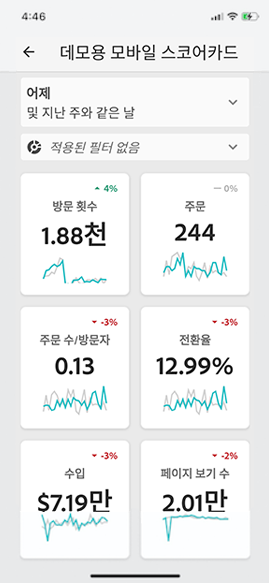

이 스코어카드의 큐레이터로서 스코어카드 빌더를 사용하여 소비자의 스코어카드에 표시되는 타일을 구성할 수 있습니다. 또한 타일을 탭하여 세부 보기 또는 분류를 조정하는 방법을 구성할 수 있습니다. 스코어카드 빌더 인터페이스가 아래에 표시되어 있습니다.

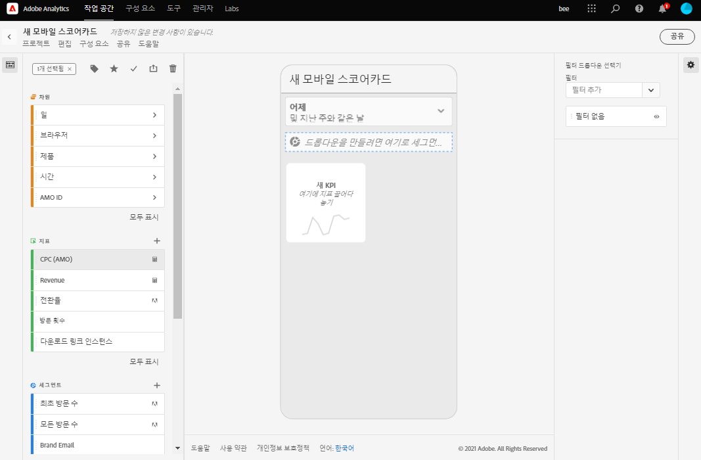

스코어카드 빌더를 만들려면 다음을 수행해야 합니다.

1. 빈 모바일 스코어카드 템플릿에 액세스합니다.
2. 데이터를 사용하여 스코어카드를 구성하고 저장합니다.

### 빈 모바일 스코어카드 템플릿에 액세스

다음 방법 중 하나로 빈 모바일 스코어카드 템플릿에 액세스할 수 있습니다.

**새 프로젝트 만들기**

1. Adobe Analytics를 열고 **작업 공간** 탭을 클릭합니다.
2. **새 프로젝트 만들기** 단추를 클릭하고 빈 **빈 모바일 스코어카드** 프로젝트 템플릿을 선택합니다.
3. **만들기** 단추를 클릭합니다.

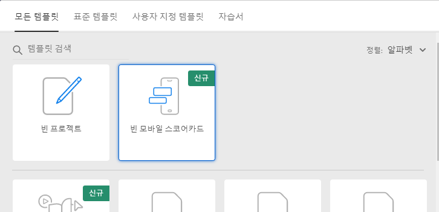

*참고: 아래와 같이 빈 모바일 스코어카드 템플릿이 표시되지 않는 경우 귀사는 아직 베타를 사용할 수 있게 활성화되지 않은 것입니다. 고객 서비스 관리자에게 문의하십시오.*

**프로젝트 추가**

**프로젝트** 화면의 **구성 요소** 탭에서 **추가** 단추를 클릭하고 **모바일 스코어카드**&#x200B;를 선택합니다.

**Analytics 도구 사용**

In Analytics, click the **Tools** menu and select **dashboards**. 다음에 나오는 화면에서 **스코어카드 만들기** 단추를 클릭합니다.

### 데이터를 사용하여 스코어카드 구성 및 저장

스코어카드 템플릿을 구현하려면:

1. **속성**(오른쪽 레일)에서 데이터를 사용할 **프로젝트 보고서 세트**&#x200B;를 지정합니다.

   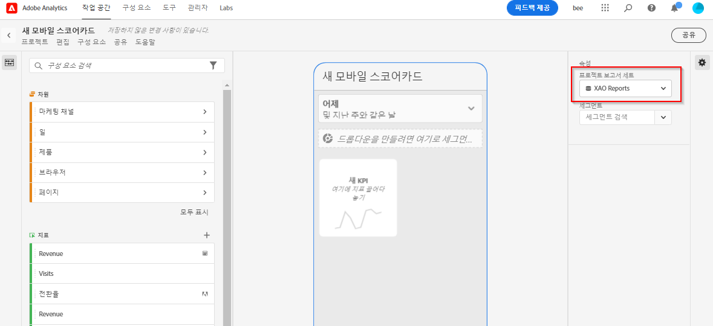

2. 스코어카드에 새 타일을 추가하려면 왼쪽 패널의 지표를 **여기에 지표 끌어다 놓기** 영역으로 끌어다 놓습니다. 비슷한 작업 과정을 사용하여 두 타일 사이에 지표를 삽입할 수도 있습니다.

   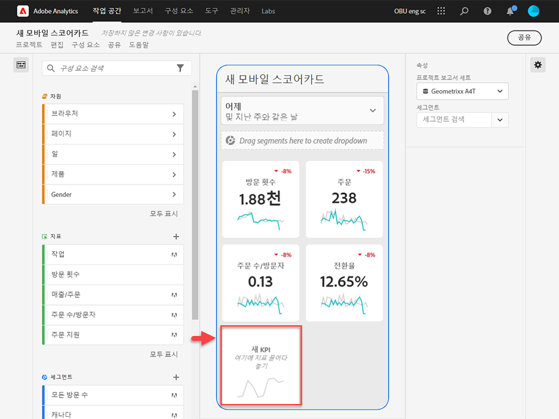

   *각 타일에서 관련 차원 목록에 대한 최상위 항목 등, 지표에 대한 추가 정보를 표시하는 상세 보기에 액세스할 수 있습니다.*

3. 지표에 관련 차원을 추가하려면 왼쪽 패널에서 차원을 끌어서 타일에 놓습니다. 예를 들면 적절한 차원(이 예제의 경우 **DMA 영역**)을 타일에 끌어다 놓아 **고유 방문자 수** 지표에 추가할 수 있습니다. 추가한 차원은 타일별 **속성**&#x200B;의 분류 섹션에 표시됩니다. 각 타일에 여러 차원을 추가할 수 있습니다.

   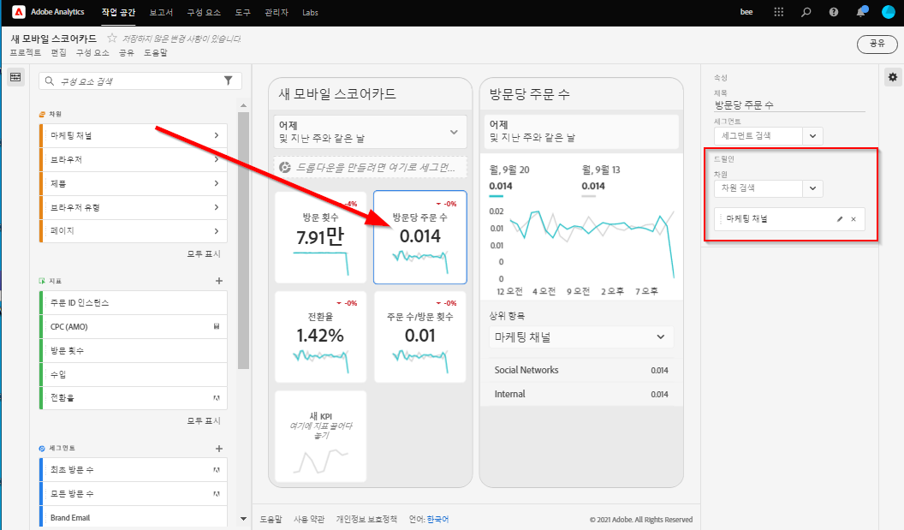

   *참고: 차원을 스코어카드 캔버스에 끌어다 놓아 모든 타일에 추가할 수도 있습니다.*

   스코어카드 빌더에서 타일을 클릭하면 오른쪽 레일에 해당 타일과 연관된 속성 및 특성이 표시됩니다. 이 레일에서 타일에 새 **제목**&#x200B;을 제공하고, 왼쪽 레일에서 끌어다 놓는 대신 구성 요소를 지정하여 타일을 구성할 수 있습니다.

   또한 타일을 클릭하면 앱에서 분류 보기가 경영진 사용자에게 표시되는 방법이 동적 팝업에 나타납니다. 차원이 타일에 적용되지 않은 경우 분류 차원은 기본 날짜 범위에 따라 **시간** 또는 **일**&#x200B;이 됩니다.

   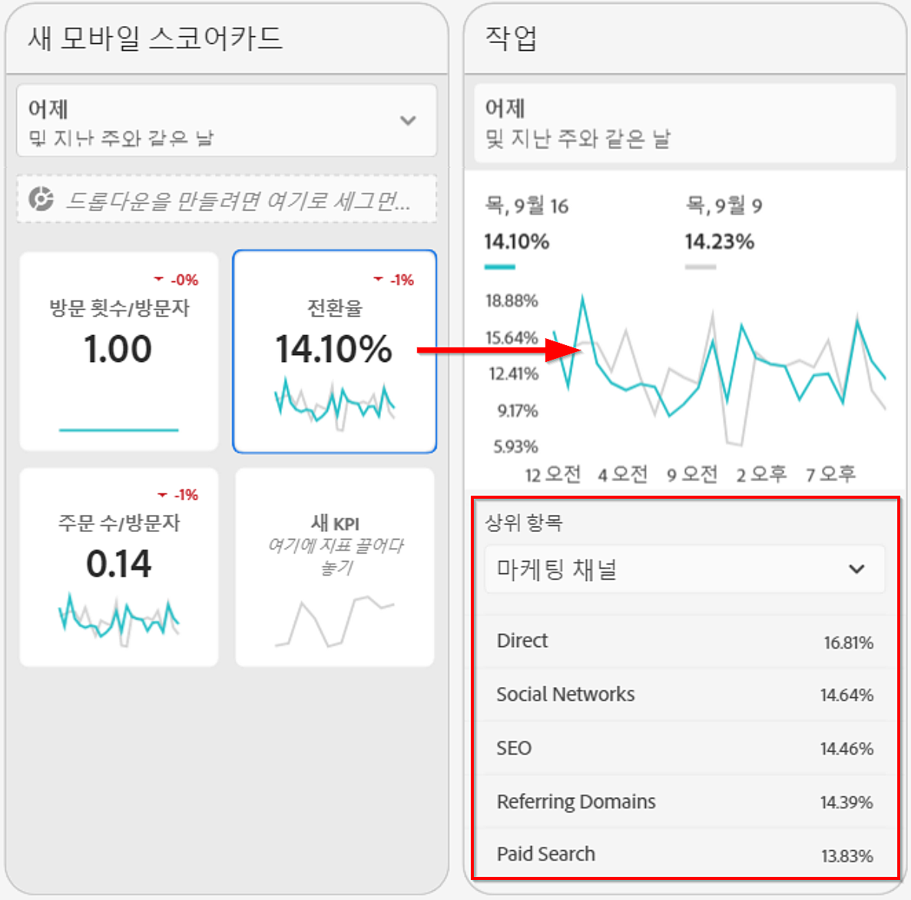

   *타일에 추가된 각 차원이 앱의 상세 보기에서 드롭다운 목록에 어떻게 표시되는지 확인합니다. 그러면 경영진 사용자는 드롭다운 목록에 나열된 옵션 중에서 선택할 수 있습니다.*

4. 세그먼트를 개별 타일에 적용하려면 왼쪽 패널의 세그먼트를 타일 위에 직접 끌어서 놓습니다. 스코어카드의 모든 타일에 세그먼트를 적용하려면 스코어카드의 맨 위에 타일을 놓습니다.

5. 마찬가지로 전체 스코어카드에 적용된 구성 요소를 제거하려면 타일 바깥쪽에 있는 스코어카드의 아무 곳이나 클릭한 다음 **모바일 고객** 세그먼트에 대해 아래에 표시된 대로 구성 요소를 마우스로 가리키면 표시되는 **x**&#x200B;를 클릭하여 제거합니다.

   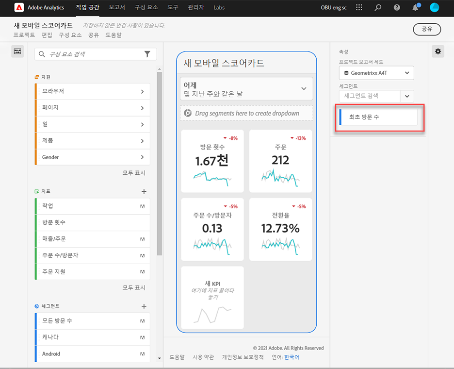

6. 스코어카드 **속성**&#x200B;에서 다음을 선택적으로 지정할 수도 있습니다.

   * **기본 날짜 범위**. 여기서 지정하는 범위는 경영진 사용자가 앱에 있는 스코어카드에 처음 액세스할 때 적용된 것과 동일합니다.

   * **비교 날짜 범위**

   * 전체 스코어카드에 적용할 모든 **세그먼트**

7. 스코어카드에 이름을 지정하려면 화면 왼쪽 상단의 네임스페이스를 클릭하고 새 이름을 입력합니다.

   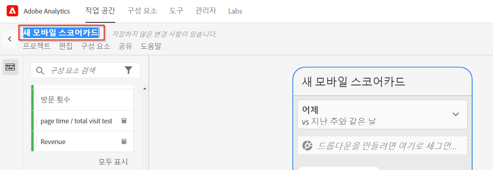

## 스코어카드 공유

스코어카드를 경영진 사용자와 공유하려면:

1. **공유** 메뉴를 클릭하고 **스코어카드 공유**&#x200B;를 선택합니다.

2. **공유** 양식에서 다음 방법으로 필드를 작성합니다.

   * 스코어카드의 이름 제공
   * 스코어카드에 대한 설명 제공
   * 관련 태그 추가
   * 스코어카드 수신자 지정
   * 경영진 사용자가 스코어카드의 모든 구성 요소에 액세스할 수 있도록 하려면 **수신자와 임베드된 구성요소 공유** 옵션을 선택합니다.

3. **공유**&#x200B;를 클릭합니다.

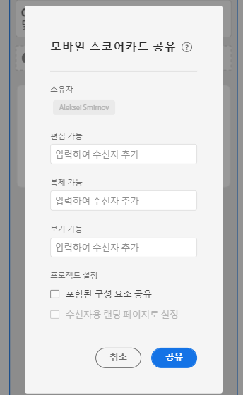

Scorecard를 공유한 후 수신자가 Analytics 대시보드에서 액세스할 수 있습니다. 스코어카드 빌드에서 스코어카드를 추가로 변경하면 공유 스코어카드에서 자동으로 업데이트됩니다. 경영진 사용자가 자신의 앱에서 스코어카드를 새로 고치면 변경 사항이 표시됩니다.

*참고: 새 구성 요소를 추가하여 스코어카드를 업데이트하는 경우 경영진 사용자가 이러한 변경 사항에 액세스할 수 있도록 스코어카드를 다시 공유(및&#x200B;**수신자와 임베드된 구성요소 자동 공유**선택)할 수 있습니다.*

## 앱을 사용하여 경영진 사용자 설정

경우에 따라 경영진 사용자는 앱에 액세스하고 앱을 사용하기 위해 추가 지원이 필요할 수 있습니다. 이 섹션에서는 그러한 지원을 제공하는 데 도움이 되는 정보를 제공합니다.

### 경영진 사용자가 액세스할 수 있게 지원

경영진 사용자가 앱에서 스코어카드에 액세스할 수 있도록 지원하려면 다음을 확인합니다.

* 해당 장치의 최소 모바일 OS 요구 사항은 iOS 버전 10 이상 또는 Android 버전 4.4(KitKat) 이상입니다.
* 경영진 사용자에게 Adobe Analytics에 대한 유효한 로그인 권한이 있습니다.
* 경영진 사용자에 대한 모바일 스코어카드를 올바르게 생성하고 이러한 스코어카드를 해당 사용자와 공유합니다.
* Analysis Workspace 및 스코어카드가 기반으로 하는 보고서 세트에 액세스할 수 있습니다.
* 스코어카드에 포함된 구성 요소에 액세스할 수 있습니다. 참고: 스코어카드를 공유할 때 **수신자와 임베드된 구성요소 자동 공유** 옵션을 선택할 수 있습니다.

### 경영진 사용자의 앱 사용 지원

베타 단계 중 및 앱을 공개하기 전에 앱에 액세스할 수 있는 사람을 제어할 수 있습니다.

1. 경영진 사용자가 앱을 다운로드하여 설치할 수 있도록 지원합니다. 이렇게 하려면 경영진 사용자의 iOS 또는 Android 장치 사용 여부에 따라 경영진 사용자에 대한 액세스 권한을 확장합니다.

   **iOS를 사용하는 경영진 사용자:**

   1. Click the following public link (it is also available in Analytics under **Tools** > **dashboards**):

      [iOS 링크](https://testflight.apple.com/join/WtXMQxlI): `https://testflight.apple.com/join/WtXMQxlI`

      이 링크를 클릭하면 다음과 같은 Testflight 화면이 나타납니다.

      

   2. 화면에서 **App Store에서 보기** 링크를 탭하여 Testflight 앱을 다운로드합니다.

   3. Testflight 앱을 설치한 후 아래와 같이 Testflight 내에서 Adobe Analytics 대시보드를 찾아 설치합니다.

      

   **Android를 사용하는 경영진 사용자:**

   1. Tap the following Play Store link on the user&#39;s device (It is also available in Analytics under **Tools** > **dashboards**):
      [Android](https://play.google.com/apps/testing/com.adobe.analyticsmobileapp): `https://play.google.com/apps/testing/com.adobe.analyticsmobileapp`

      링크를 탭한 후에 다음 화면에서 테스트 되기 링크를 탭합니다.

      

   2. 다음 화면에서 **Google Play에서 다운로드** 링크를 탭합니다.

      

   3. 앱을 다운로드하여 설치합니다.
다운로드하여 설치했으면 경영진 사용자가 자신의 기존 Adobe Analytics 자격 증명을 사용하여 앱에 로그인할 수 있습니다. Adobe는 Adobe 와 Enterprise/Federated ID를 모두 지원합니다.

   

2. 경영진 사용자가 스코어카드에 액세스할 수 있도록 지원합니다. 경영진 사용자가 앱에 로그인하면 **회사 선택** 화면이 표시됩니다. 이 화면에 경영진 사용자가 속한 로그인 회사가 나열됩니다. 경영진 사용자가 스코어카드에 도달하도록 지원하려면:

   * 공유한 스코어카드에 적용되는 로그인 회사 또는 Experience Cloud 조직의 이름을 탭합니다. 스코어카드 목록에는 해당 로그인 회사 아래에 경영진과 공유된 모든 스코어카드가 표시됩니다.
   * 해당되는 경우 **가장 최근에 수정됨**&#x200B;별로 이 목록을 정렬할 수 있습니다.
   * 스코어카드의 이름을 탭하여 봅니다.

   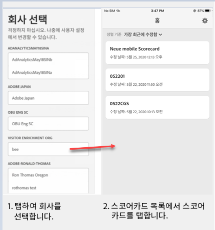

   참고: 경영진 사용자가 로그인했을 때 아무 것도 공유되지 않았다는 메시지가 표시되는 경우:

   * 경영진 사용자가 잘못된 Analytics 인스턴스를 선택했을 수 있음
   * 스코어카드가 경영진 사용자와 공유되지 않았을 수 있음

      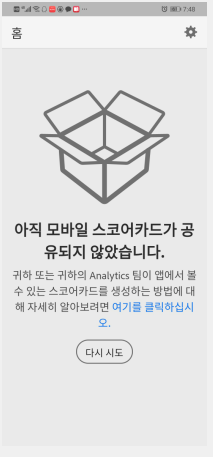

   경영진 사용자가 올바른 Analytics 인스턴스에 로그인할 수 있으며 스코어카드가 공유되었는지 확인합니다.

3. 경영진 사용자에게 공유한 스코어카드에 타일이 어떻게 표시되는지 설명합니다.

   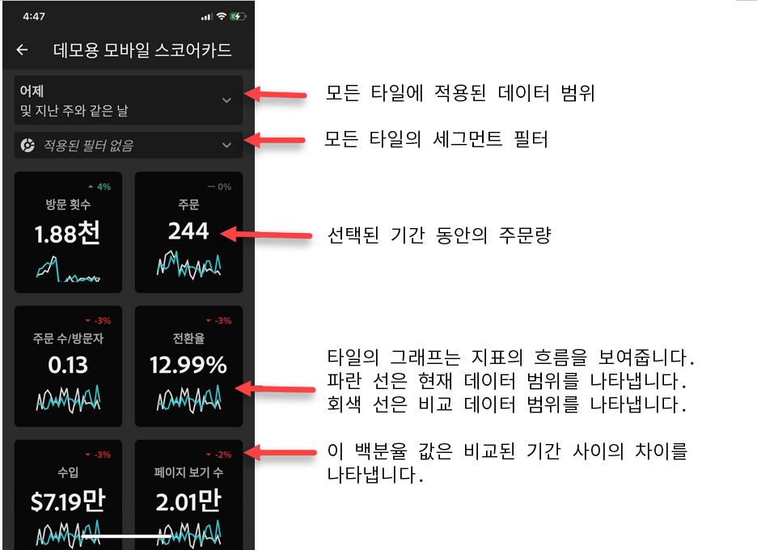

   타일에 대한 추가 정보:

   * 스파크라인의 세부기간은 날짜 범위의 길이에 따라 달라집니다.
      * 하루는 시간별 트렌드를 표시함
      * 이틀 이상 및 1년 미만은 일별 트렌드를 표시함
      * 1년 이상은 주별 트렌드를 표시함
   * 비율 값 변경 수식은 지표 합계(현재 날짜 범위) – 지표 합계(비교 날짜 범위) / 지표 합계(비교 날짜 범위)입니다.
   * 화면을 아래로 당기면 스코어카드를 새로 고칠 수 있습니다.

4. 타일에 대한 세부 분류가 어떻게 작동하는지 표시하려면 타일을 탭합니다.

   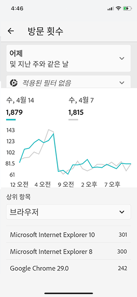

5. 스코어카드에 대한 날짜 범위를 변경하려면:

   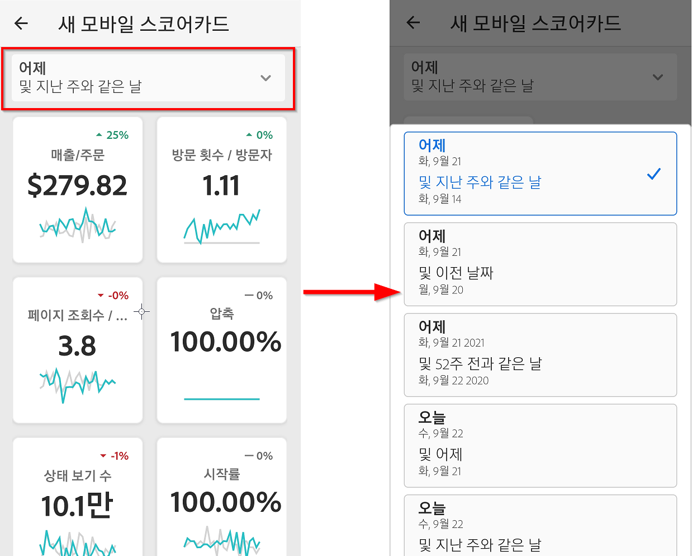

   *참고: 같은 방법으로 위에 표시된 분류 보기 내에서 날짜 범위를 변경할 수도 있습니다.*

   탭한 간격(**일**, **주**, **월** 또는 **년**)에 따라 날짜 범위에 대한 두 개 옵션(현재 시간 범위 또는 직전 시간 범위)이 표시됩니다. 이 두 옵션 중 하나를 탭하여 첫 번째 범위를 선택합니다. **비교 대상** 목록에서 제공된 옵션 중 하나를 탭하여 이 기간의 데이터와 선택한 첫 번째 날짜 범위를 비교합니다. 화면의 오른쪽 상단에 있는 **완료**&#x200B;를 탭합니다. **날짜 범위** 필드와 스코어카드 타일은 선택한 새 범위의 새 비교 데이터로 업데이트됩니다.

6. 이 앱에 대한 피드백을 남기려면:

   1. 앱 화면의 오른쪽 상단에서 사용자 아이콘을 탭합니다.
   2. **내 계정** 화면에서 **피드백** 옵션을 탭합니다.
   3. 피드백 남기기에 대한 옵션을 탭하여 봅니다.
   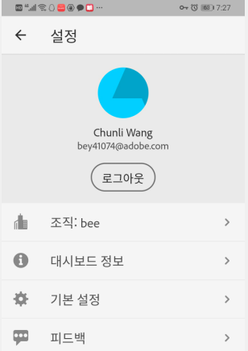
   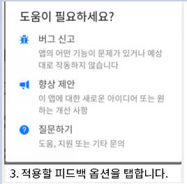

**버그를 보고하려면**:

옵션을 탭하고 버그의 하위 카테고리를 선택합니다. 버그 보고 양식에서 맨 위 필드에 전자 메일 주소를 입력하고 그 아래 필드에 버그에 대한 설명을 입력합니다. 계정 정보에 대한 스크린샷이 메시지에 자동으로 첨부되지만 원할 경우 첨부 이미지에서 **X**&#x200B;를 탭하여 이 스크린샷을 삭제할 수 있습니다. 또한 화면 기록을 촬영하거나 더 많은 스크린샷을 추가하거나 파일을 첨부하는 옵션이 제공됩니다. 보고서를 보내려면 양식 오른쪽 상단에 있는 종이 비행기 아이콘을 탭합니다.

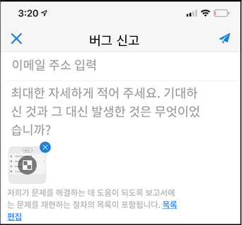

**개선을 제안하려면**:

옵션을 탭하고 제안에 대한 하위 카테고리를 선택합니다. 제안 양식에서 맨 위 필드에 전자 메일 주소를 입력하고 그 아래 필드에 버그에 대한 설명을 입력합니다. 계정 정보에 대한 스크린샷이 메시지에 자동으로 첨부되지만 원할 경우 첨부 이미지에서 **X**&#x200B;를 탭하여 이 스크린샷을 삭제할 수 있습니다. 또한 화면 기록을 촬영하거나 더 많은 스크린샷을 추가하거나 파일을 첨부하는 옵션이 제공됩니다. 제안 사항을 보내려면 양식 오른쪽 상단에 있는 종이 비행기 아이콘을 탭합니다.

**질문하려면:**

옵션을 탭하고 맨 위 필드에 전자 메일 주소를 입력하고 그 아래 필드에 질문을 입력합니다. 스크린샷이 메시지에 자동으로 첨부되지만 원할 경우 첨부 이미지에서 **X**&#x200B;를 탭하여 이 스크린샷을 삭제할 수 있습니다. 또한 화면 기록을 촬영하거나 더 많은 스크린샷을 추가하거나 파일을 첨부하는 옵션이 제공됩니다. 질문을 보내려면 양식 오른쪽 상단에 있는 종이 비행기 아이콘을 탭합니다.
