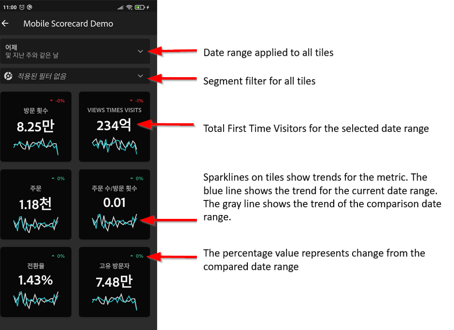

# 베타:Analytics 모바일 앱에 대한 큐레이터 가이드

## 소개

Adobe Analytics 모바일 앱은 Adobe Analytics를 통해 언제 어디서나 인사이트를 제공합니다.   이 앱을 사용하면 Adobe Analytics의 데스크탑 UI에서 만들고 공유하는 직관적인 스코어카드에 모바일 액세스를 할 수 있습니다. 성과 기록표는 보다 자세한 분류 및 트렌드 보고서를 탭할 수 있는 타일식 레이아웃에 표시되는 주요 지표 및 기타 구성 요소 모음입니다. 가장 중요한 데이터에 따라 스코어카드를 조정할 수 있습니다. 모바일 앱은 iOS 및 Android 운영 체제에서 모두 지원됩니다.

## 이 안내서 정보

이 안내서는 Adobe Analytics 데이터 큐레이터가 Analytics 모바일 앱에서 경영진 사용자의 스코어카드를 구성하는 데 도움이 되도록 마련되었습니다. 큐레이터는 조직 관리자나 앱 스코어카드 설정을 담당하는 다른 역할을 담당하는 사람일 수 있으며, 이를 통해 사용자는 자신의 모바일 장치에서 중요한 요약 데이터의 광범위한 렌더링을 빠르고 쉽게 볼 수 있습니다. 경영진 사용자는 Analytics 모바일 앱의 최종 사용자이지만 이 가이드는 데이터 큐레이터가 해당 사용자를 위해 앱을 효과적으로 설정하는 데 도움이 됩니다.

## 용어 설명

다음 표에서는 Analytics 모바일 앱의 대상, 기능 및 운영을 이해하는 용어에 대해 설명합니다.

| 용어 | 정의 |
|--- |--- |
| 소비자 | 모바일 디바이스의 Analytics에서 주요 지표 및 통찰력 보기 |
| 큐레이터 | Analytics에서 통찰력을 찾아 배포하고 소비자가 볼 스코어카드를 구성하는 데이터 리터칭 페르소나 |
| 조정 | 소비자에 대한 관련 지표, 차원 및 기타 구성 요소가 포함된 모바일 스코어카드를 만들거나 편집하는 행위 |
| 득점 카드 | 하나 이상의 타일이 포함된 모바일 앱 보기 |
| 타일 | 스코어카드 보기 내의 지표에 대한 렌더링 |
| 분류 | 스코어카드의 타일을 탭하여 액세스할 수 있는 보조 보기. 이 보기는 타일에 표시되는 지표에서 확장되며 선택적으로 추가 분류 차원에 대해 보고합니다. |
| 날짜 범위 | 모바일 앱 보고를 위한 기본 날짜 범위 |
| 비교 날짜 범위 | 기본 날짜 범위와 비교되는 날짜 범위 |

 
## 경영진 사용자를 위한 성과 기록표 만들기

Mobile Scorecard는 아래와 같이 타일 레이아웃에서 경영진 사용자에 대한 주요 데이터 시각화를 표시합니다.

이 스코어카드의 큐레이터로서 스코어카드 빌더를 사용하여 고객의 스코어카드에 표시되는 타일을 구성할 수 있습니다. 또한 타일을 탭하면 세부 보기 또는 분류를 조정할 수 있는 방법을 구성할 수 있습니다. Scorecard Builder 인터페이스는 다음과 같습니다.

성과 기록표를 만들려면 다음을 수행해야 합니다.

1. 빈 Mobile Scorecard 템플릿에 액세스합니다.
2. 데이터를 사용하여 스코어카드를 구성하고 저장합니다.

### 빈 Mobile Scorecard 템플릿 액세스

다음 방법 중 하나로 빈 Mobile Scorecard 템플릿에 액세스할 수 있습니다.

**새 프로젝트 만들기**

1. Adobe Analytics를 열고 작업 공간 **탭을** 클릭합니다.
2. 새 프로젝트 **만들기** 단추를 클릭하고 빈 **Mobile Scorecard 프로젝트** 템플릿을 선택합니다.
3. Click the **Create** button.

*참고:아래와 같이 빈 Mobile Scorecard 템플릿이 표시되지 않는 경우, 귀하의 회사는 아직 베타에 대해 활성화되지 않았습니다. 고객 서비스 관리자에게 문의하십시오.*

**프로젝트 추가**

프로젝트 **화면의 구성** 요소 **탭에서** 추가 **버튼을** 클릭하고 Mobile Scorecard **를**&#x200B;선택합니다.

**Analytics 도구 사용**

Analytics에서 도구 **메뉴를** 클릭하고 모바일 **앱을 선택합니다**. 이후 화면에서 [스코어카드 만들기] **단추를** 클릭합니다.

### 데이터를 사용하여 스코어카드 구성 및 저장

스코어카드 템플릿을 구현하려면

1. 속성 **** (오른쪽 레일)에서 **데이터를 사용할 프로젝트** 보고서 세트를 지정합니다.

   

2. Scorecard에 새 타일을 추가하려면 왼쪽 패널에서 지표를 드래그하여 지표 여기로 **드래그하여 놓기 영역에** 놓습니다. 유사한 워크플로우를 사용하여 두 타일 사이에 지표를 삽입할 수도 있습니다.

   

   *각 타일에서 관련 차원 목록의 상위 항목 등 지표에 대한 추가 정보를 표시하는 세부 보기에 액세스할 수 있습니다.*

3. 지표에 관련 차원을 추가하려면 왼쪽 패널에서 차원을 드래그하여 타일에 놓습니다. 예를 들어, 타일에 끌어다 놓아 적절한 차원( **이 예에서는** DMA 영역)을 **고유 방문자** 지표에 추가할 수 있습니다.추가한 차원은 타일별 속성의 분류 섹션 아래에 **나타납니다**. 각 타일에 여러 차원을 추가할 수 있습니다.

   

   *참고:Scorecard 캔버스에 차원을 놓아 모든 타일에 차원을 추가할 수도 있습니다.*

   [스코어카드 빌더]에서 타일을 클릭하면 오른쪽 레일에 해당 타일과 연결된 속성 및 특성이 표시됩니다. 이 레일에서 타일에 새 **제목을** 제공하고, 왼쪽 레일에서 드래그하여 놓는 대신 구성 요소를 지정하여 타일을 구성할 수 있습니다.

   또한 타일을 클릭하면 동적 팝업이 앱의 경영진 사용자에게 분류 보기가 표시되는 방식을 표시합니다. 타일에 차원이 적용되지 않은 경우, 분류 차원은 기본 날짜 범위에 따라 **시간** 또는 **일**&#x200B;수가 됩니다.

   

   *타일에 추가된 각 차원이 앱의 세부 보기에 있는 드롭다운 목록에 어떻게 표시되는지 확인하십시오. 그러면 경영진 사용자는 드롭다운 목록에 나열된 옵션 중에서 선택할 수 있습니다.*

4. 세그먼트를 개별 타일에 적용하려면 왼쪽 패널에서 세그먼트를 드래그하여 타일 위에 직접 놓습니다. 성과 기록표의 모든 타일에 세그먼트를 적용하려면 성과 기록표의 맨 위에 타일을 놓습니다.

5. 마찬가지로 전체 스코어카드에 적용되는 구성 요소를 제거하려면 타일 바깥의 아무 곳이나 클릭한 다음 모바일 고객 세그먼트에 대해 아래에서 보듯이 구성 요소를 마우스로 가리키면 나타나는 **x** 를 클릭하여 **제거합니다** .

   

6. 스코어카드 **등록 정보**&#x200B;아래에서 다음을 선택적으로 지정할 수도 있습니다.

   * 기본 **날짜 범위**. 여기에서 지정하는 범위는 경영진 사용자의 앱에 있는 스코어카드 액세스에 적용된 것과 동일합니다.

   * 비교 **날짜 범위**

   * 전체 **스코어카드에** 적용할 모든 세그먼트

7. 스코어카드의 이름을 지정하려면 화면 왼쪽 상단에 있는 네임스페이스를 클릭하고 새 이름을 입력합니다.

   

## 성과 기록표 공유

성과 기록표를 경영진 사용자와 공유하려면

1. [공유] **메뉴를** 클릭하고 [스코어카드 **공유]를 선택합니다**.

2. 공유 **양식에서** 필드를 다음 방법으로 작성합니다.

   * 스코어카드의 이름 제공
   * 스코어카드에 대한 설명 제공
   * 관련 태그 추가
   * 스코어카드의 수신자 지정
   * 임베디드 구성 요소를 **수신자와 공유하는** 옵션을 선택하여 경영진 사용자가 스코어카드의 모든 구성 요소에 액세스할 수 있도록 합니다.

3. **공유**&#x200B;를 클릭합니다.

Scorecard를 공유한 후 수신자가 Analytics 모바일 앱에서 액세스할 수 있습니다. Scorecard Builder에서 Scorecard를 이후 변경하면 공유 스코어카드에서 자동으로 업데이트됩니다. 그러면 경영진 사용자는 자신의 앱에서 Scorecard를 새로 고친 후 변경 사항을 보게 됩니다.

*참고:새 구성 요소를 추가하여 Scorecard를 업데이트하는 경우, 성과 기록표를 다시 공유(및 수신자와&#x200B;**포함된 구성 요소**자동 공유 옵션 확인)하여 경영진 사용자가 이러한 변경 사항에 액세스할 수 있도록 할 수 있습니다.*

## 앱을 사용하여 경영진 설정

경우에 따라 경영진 사용자는 앱에 액세스하고 사용하기 위해 추가적인 지원이 필요할 수 있습니다. 이 섹션에서는 해당 지원을 제공하는 데 도움이 되는 정보를 제공합니다.

### 경영진 액세스 지원

경영진 사용자가 앱에서 스코어카드에 액세스할 수 있도록 지원하려면 다음을 확인하십시오.

* 장치에서 최소 모바일 OS 요구 사항은 iOS 버전 10 이상 또는 Android 버전 4.4(KitKat) 이상입니다
* Adobe Analytics에 유효한 로그인이 있습니다.
* 모바일 스코어카드를 올바로 생성하고 이 스코어카드를 해당 스코어카드와 공유합니다.
* 분석 작업 공간과 스코어카드가 기반으로 하는 보고서 세트에 액세스할 수 있습니다
* 이들은 스코어카드에 포함된 구성 요소에 액세스할 수 있습니다. 참고:스코어카드를 수신자와 공유할 때 **포함된 구성 요소를 수신자와**&#x200B;자동으로 공유할 옵션을 선택할 수 있습니다.

### 경영진 사용자가 앱 사용

베타 단계 동안, 그리고 앱이 공개되기 전에 앱 액세스 권한을 가진 사용자를 제어할 수 있습니다.

1. 경영진 사용자가 앱을 다운로드 및 설치할 수 있도록 지원합니다. 이렇게 하려면 경영진 사용자가 iOS를 사용하는지 또는 Android 장치를 사용하는지에 따라 다음 단계에 따라 액세스 권한을 확장합니다.

   **iOS의 경영진:**

   1. 다음 공개 링크를 클릭합니다(도구 &gt; 모바일 앱의 **Analytics에서도** 사용할 수 **있습니다**).

      [iOS 링크](https://testflight.apple.com/join/WtXMQxlI): `https://testflight.apple.com/join/WtXMQxlI`

      링크를 클릭하면 다음과 같은 테스트 플라이트 화면이 나타납니다.

      

   2. 화면의 **App Store에서** 보기 링크를 눌러 Testflight 앱을 다운로드합니다.

   3. Testflight 앱을 설치한 후 아래와 같이 Testflight 내에서 Adobe Analytics Mobile 앱을 찾아 설치합니다.

      
   **Android의 경영진**

   1. 사용자의 장치에서 다음 스토어 재생 링크를 누릅니다(도구 &gt; 모바일 앱의 **Analytics에서도** 사용할 수 **있습니다**).

      [Android](https://play.google.com/apps/testing/com.adobe.analyticsmobileapp): `https://play.google.com/apps/testing/com.adobe.analyticsmobileapp`

      링크를 탭한 후 다음 화면에서 테스터로 만들기 링크를 누릅니다.

      

   2. 다음 화면에서 Google Play에서 **다운로드** 링크를 누릅니다.

      

   3. 앱을 다운로드하여 설치합니다.
   경영진 사용자는 다운로드 및 설치되면 기존 Adobe Analytics 자격 증명을 사용하여 앱에 로그인할 수 있습니다.adobe는 Adobe 및 Enterprise/Federated ID를 모두 지원합니다.

   

2. Scorecard에 액세스할 수 있도록 지원합니다. 경영진 사용자가 앱에 로그인하면 회사 **선택** 화면이 나타납니다. 이 화면에는 경영진 사용자가 속한 로그인 회사가 나열됩니다. Scorecard에 도달하는 데 도움이 되는 방법은 다음과 같습니다.

   * 공유한 Scorecard에 적용되는 로그인 회사 또는 Experience Cloud 조직의 이름을 누릅니다. 그러면 스코어카드 목록에 해당 로그인 회사 아래의 경영진과 공유된 모든 스코어카드가 표시됩니다.
   * 해당되는 경우 이 목록을 **가장 최근에 수정한**&#x200B;목록으로 정렬할 수 있습니다.
   * 성과 기록표의 이름을 눌러 표시합니다.
   

   참고:경영진 사용자가 로그인하여 공유된 항목이 없다는 메시지가 표시되는 경우:

   * 경영진 사용자가 잘못된 Analytics 인스턴스를 선택했을 수 있습니다.
   * 성과 기록표는 경영진 사용자와 공유되지 않았을 수 있습니다.

      
   경영진 사용자가 올바른 Analytics 인스턴스에 로그인할 수 있으며 Scorecard가 공유되었는지 확인합니다.

3. 공유하는 스코어카드에 타일이 표시되는 방식을 경영진 사용자에게 설명합니다.

   

   타일에 대한 추가 정보:

   * 스파크라인의 세부기간은 날짜 범위의 길이에 따라 달라집니다.
      * 하루 동안 시간별 트렌드가 표시됩니다.
      * 일일 트렌드가 하루 이상 1년 이하로 표시됩니다.
      * 1년 이상 매주 트렌드 표시
   * 퍼센트 값 변경 공식은 지표 합계(현재 날짜 범위) - 지표 합계(비교 날짜 범위)/지표 합계(비교 날짜 범위)입니다.
   * 화면을 아래로 당김하여 스코어카드를 새로 고칠 수 있습니다.

4. 타일에 대한 세부 분류가 어떻게 작동하는지 표시하려면 타일을 누릅니다.

   

5. 스코어카드의 날짜 범위를 변경하려면 다음을 수행합니다.

   

   *참고:위의 분류 보기 내에서 동일한 방식으로 날짜 범위를 변경할 수도 있습니다.*

   탭한 날짜(일,**주**, **월**, **년**&#x200B;간격 **)에 따라**&#x200B;현재 시간 범위 또는 바로 앞의 날짜 범위에 대한 두 가지 옵션이 표시됩니다. 이 두 옵션 중 하나를 눌러 첫 번째 범위를 선택합니다. 비교 **대상** 목록에서 표시된 옵션 중 하나를 눌러 이 기간의 데이터를 선택한 첫 번째 날짜 범위와 비교합니다. 화면 **오른쪽** 상단에 있는 완료를 누릅니다. 날짜 **범위** 필드와 스코어카드 타일은 선택한 새 범위의 새 비교 데이터로 업데이트됩니다.

6. 이 앱에 대한 피드백을 남겨 두려면:

   1. 앱 화면의 오른쪽 상단에 있는 사용자 아이콘을 누릅니다.
   2. 내 **계정** 화면에서 피드백 **옵션을 탭합니다** .
   3. 피드백을 남길 수 있는 옵션을 보려면 을 누릅니다.
   
   

**버그를**&#x200B;보고하려면

옵션을 누르고 버그의 하위 범주를 선택합니다. 버그를 보고하기 위한 양식에서 상단 필드에 이메일 주소와 아래 필드에 버그 설명을 입력합니다. 계정 정보의 스크린샷이 메시지에 자동으로 첨부되지만 첨부 이미지의 X를 눌러 원하는 경우 삭제할 **수** 있습니다. 화면 녹화, 스크린샷 추가 또는 파일 첨부 옵션을 사용할 수도 있습니다. 보고서를 보내려면 양식의 오른쪽 상단에 있는 종이 평면 아이콘을 누릅니다.

**개선을**&#x200B;제안하려면

옵션을 누르고 제안에 대한 하위 카테고리를 선택합니다. 제안 양식에서 맨 위 필드에 이메일 주소와 그 아래 필드에 버그 설명을 입력합니다. 계정 정보의 스크린샷이 메시지에 자동으로 첨부되지만 첨부 이미지의 X를 눌러 원하는 경우 삭제할 **수** 있습니다. 화면 녹화, 스크린샷 추가 또는 파일 첨부 옵션을 사용할 수도 있습니다. 제안을 보내려면 양식의 오른쪽 상단에 있는 종이 평면 아이콘을 누릅니다.

**질문을**&#x200B;하려면

옵션을 누르고 상단 필드에 이메일 주소를 입력하고 아래 필드에 질문을 입력합니다. 스크린 샷은 메시지에 자동으로 첨부되지만, 첨부 이미지의 X를 눌러 원하는 경우 삭제할 **수** 있습니다. 화면 녹화, 스크린샷 추가 또는 파일 첨부 옵션을 사용할 수도 있습니다. 질문을 보내려면 양식의 오른쪽 상단에 있는 용지 평면 아이콘을 누릅니다.
