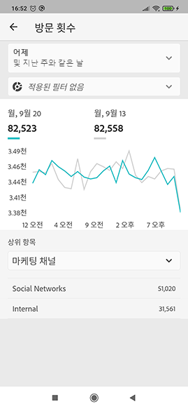

# Adobe Analytics 대시보드에 대한 큐레이터 가이드

다음 정보는 Adobe Analytics 데이터 큐레이터에게 관리자 사용자를 위한 대시보드를 구성하고 표시하는 방법을 알려줍니다. 이 정보를 보여 주는 비디오를 보려면 [Adobe Analytics 대시보드 스코어카드 빌더를 참조하십시오](https://youtu.be/tnnl6hrcP94).

## 소개

Adobe Analytics 대시보드는 Adobe Analytics를 통해 언제 어디서나 통찰력을 제공합니다. 이 앱을 사용하면 사용자가 만들고 Adobe Analytics의 데스크탑 UI에서 공유하는 직관적인 스코어카드에 모바일로 액세스할 수 있습니다. 스코어카드는 더 자세한 분류 및 트렌드 보고서용으로 탭할 수 있는 타일식 레이아웃에 표시되는 주요 지표 및 기타 구성 요소의 컬렉션입니다. 본인에게 가장 중요한 데이터에 따라 스코어카드를 조정할 수 있습니다. Analytics 대시보드는 iOS 및 Android 운영 체제에서 모두 지원됩니다.

## 이 안내서에 대한 자세한 내용

이 안내서는 Adobe Analytics 데이터 큐레이터가 대시보드에서 관리자 사용자에 대한 스코어카드를 구성하는 데 도움이 되도록 하기 위해 마련되었습니다. 큐레이터는 앱 스코어카드 설정을 담당하는 조직의 관리자나 다른 역할을 맡고 있는 사람일 수 있으며, 이를 통해 경영진 사용자가 자신의 모바일 장치에서 중요한 요약 데이터에 대한 광범위한 렌더링을 빠르고 쉽게 볼 수 있습니다. 경영진 사용자는 Analytics 대시보드의 최종 사용자이지만 이 안내서는 데이터 큐레이터가 그러한 사용자를 위해 앱을 효과적으로 설정하는 데 도움을 줍니다.

## 용어집

다음 표에서는 Analytics 대시보드의 대상, 기능 및 작업을 이해하는 데 도움이 되는 용어를 설명합니다.

| 용어 | 정의 |
|--- |--- |
| 소비자 | 모바일 장치의 Analytics를 통해 주요 지표와 통찰력을 보는 경영진 사용자 |
| 큐레이터 | Analytics에서 통찰력을 찾아 배포하고 소비자가 볼 스코어카드를 구성하는 데이터 사용 가능 사용자 |
| 큐레이션 | 소비자에 대한 관련 지표, 차원 및 기타 구성 요소가 포함된 모바일 스코어카드를 만들거나 편집하는 작업 |
| 득점 카드 | 한 개 이상의 타일이 포함된 대시보드 보기 |
| 타일 | 스코어카드 보기 내에 있는 지표에 대한 렌더링 |
| 분류 | 스코어카드에서 타일을 탭하여 액세스할 수 있는 보조 보기. 이 보기는 타일에 표시되는 지표를 확장하고 선택적으로 추가 분류 차원에 대해 보고합니다. |
| 날짜 범위 | 대시보드 보고에 대한 기본 날짜 범위 |
| 비교 날짜 범위 | 기본 날짜 범위와 비교되는 날짜 범위 |

 
## 경영진 사용자를 위한 스코어카드 만들기

스코어카드는 아래에 표시된 대로 타일 레이아웃에 경영진 사용자에 대한 주요 데이터 시각화를 표시합니다.

이 스코어카드의 큐레이터로서 스코어카드 빌더를 사용하여 소비자의 스코어카드에 표시되는 타일을 구성할 수 있습니다. 또한 타일을 탭하여 세부 보기 또는 분류를 조정하는 방법을 구성할 수 있습니다. 스코어카드 빌더 인터페이스가 아래에 표시되어 있습니다.

스코어카드 빌더를 만들려면 다음을 수행해야 합니다.

1. 빈 모바일 스코어카드 템플릿에 액세스합니다.
2. 데이터를 사용하여 스코어카드를 구성하고 저장합니다.

### 빈 모바일 스코어카드 템플릿에 액세스

다음 방법 중 하나로 빈 모바일 스코어카드 템플릿에 액세스할 수 있습니다.

**새 프로젝트 만들기**

1. Adobe Analytics를 열고 **작업 공간** 탭을 클릭합니다.
2. **새 프로젝트 만들기** 단추를 클릭하고 빈 **빈 모바일 스코어카드** 프로젝트 템플릿을 선택합니다.
3. **만들기** 단추를 클릭합니다.

**프로젝트 추가**

**프로젝트** 화면의 **구성 요소** 탭에서 **추가** 단추를 클릭하고 **모바일 스코어카드**&#x200B;를 선택합니다.

**Analytics 도구 사용**

Analytics에서 **도구** 메뉴를 클릭하고 **대시보드**&#x200B;를 선택합니다. 다음에 나오는 화면에서 **스코어카드 만들기** 단추를 클릭합니다.

### 데이터를 사용하여 스코어카드 구성 및 저장

스코어카드 템플릿을 구현하려면:

1. **속성**(오른쪽 레일)에서 데이터를 사용할 **프로젝트 보고서 세트**&#x200B;를 지정합니다.

   

2. 스코어카드에 새 타일을 추가하려면 왼쪽 패널의 지표를 **여기에 지표 끌어다 놓기** 영역으로 끌어다 놓습니다. 비슷한 작업 과정을 사용하여 두 타일 사이에 지표를 삽입할 수도 있습니다.

   

   *각 타일에서 관련 차원 목록에 대한 최상위 항목 등, 지표에 대한 추가 정보를 표시하는 상세 보기에 액세스할 수 있습니다.*

3. 지표에 관련 차원을 추가하려면 왼쪽 패널에서 차원을 끌어서 타일에 놓습니다. 예를 들면 적절한 차원(이 예제의 경우 **DMA 영역**)을 타일에 끌어다 놓아 **고유 방문자 수** 지표에 추가할 수 있습니다. 추가한 차원은 타일별 **속성**&#x200B;의 분류 섹션에 표시됩니다. 각 타일에 여러 차원을 추가할 수 있습니다.

   

   [스코어카드] 캔버스에 차원을 놓아 모든 타일에 차원을 추가할 수도 있습니다.

   스코어카드 빌더에서 타일을 클릭하면 오른쪽 레일에 해당 타일과 연관된 속성 및 특성이 표시됩니다. 이 레일에서 타일에 새 **제목**&#x200B;을 제공하고, 왼쪽 레일에서 끌어다 놓는 대신 구성 요소를 지정하여 타일을 구성할 수 있습니다.

   또한 타일을 클릭하면 앱에서 분류 보기가 경영진 사용자에게 표시되는 방법이 동적 팝업에 나타납니다. 차원이 타일에 적용되지 않은 경우 분류 차원은 기본 날짜 범위에 따라 **시간** 또는 **일**&#x200B;이 됩니다.

   

   타일에 추가된 각 차원은 앱의 세부 보기에 있는 드롭다운 목록에 표시됩니다. 그러면 경영진 사용자는 드롭다운 목록에 나열된 옵션 중에서 선택할 수 있습니다.

4. 세그먼트를 개별 타일에 적용하려면 왼쪽 패널의 세그먼트를 타일 위에 직접 끌어서 놓습니다. 스코어카드의 모든 타일에 세그먼트를 적용하려면 스코어카드의 맨 위에 타일을 놓습니다. 또는 날짜 범위 아래의 필터 메뉴에서 세그먼트를 선택하여 세그먼트를 적용할 수도 있습니다. Adobe [Analytics Workspace에서와 동일한 방식으로 스코어카드에](https://docs.adobe.com/content/help/en/analytics-learn/tutorials/analysis-workspace/using-panels/using-drop-down-filters.html) 대한 필터를 구성하고 적용할 수 있습니다.

   

5. 마찬가지로 전체 스코어카드에 적용된 구성 요소를 제거하려면 타일 바깥쪽에 있는 스코어카드의 아무 곳이나 클릭한 다음 **모바일 고객** 세그먼트에 대해 아래에 표시된 대로 구성 요소를 마우스로 가리키면 표시되는 **x**&#x200B;를 클릭하여 제거합니다.

   

6. 스코어카드 **속성**&#x200B;에서 다음을 선택적으로 지정할 수도 있습니다.

   * **기본 날짜 범위**. 여기서 지정하는 범위는 경영진 사용자가 앱에 있는 스코어카드에 처음 액세스할 때 적용된 것과 동일합니다.

   * **비교 날짜 범위**

   * 전체 스코어카드에 적용할 모든 **세그먼트**

7. 스코어카드에 이름을 지정하려면 화면 왼쪽 상단의 네임스페이스를 클릭하고 새 이름을 입력합니다.

   

## 스코어카드 공유

스코어카드를 경영진 사용자와 공유하려면:

1. **공유** 메뉴를 클릭하고 **스코어카드 공유**&#x200B;를 선택합니다.

2. **공유** 양식에서 다음 방법으로 필드를 작성합니다.

   * 스코어카드의 이름 제공
   * 스코어카드에 대한 설명 제공
   * 관련 태그 추가
   * 스코어카드 수신자 지정
   * 경영진 사용자가 스코어카드의 모든 구성 요소에 액세스할 수 있도록 하려면 **수신자와 임베드된 구성요소 공유** 옵션을 선택합니다.

3. **공유**&#x200B;를 클릭합니다.

스코어카드를 공유하면 수신자가 자신의 Analytics 대시보드에서 액세스할 수 있습니다. 스코어카드 빌드에서 스코어카드를 추가로 변경하면 공유 스코어카드에서 자동으로 업데이트됩니다. 경영진 사용자가 자신의 앱에서 스코어카드를 새로 고치면 변경 사항이 표시됩니다.

If you update the Scorecard by adding new components, you may want to share the scorecard again (and check the **Automatically Share embedded components with recipients** option) in order to make sure that your executive users have access to these changes.

## 앱을 사용하여 경영진 사용자 설정

경우에 따라 경영진 사용자는 앱에 액세스하고 앱을 사용하기 위해 추가 지원이 필요할 수 있습니다. 이 섹션에서는 그러한 지원을 제공하는 데 도움이 되는 정보를 제공합니다.

### 경영진 사용자가 액세스할 수 있게 지원

경영진 사용자가 앱에서 스코어카드에 액세스할 수 있도록 지원하려면 다음을 확인합니다.

* 해당 장치의 최소 모바일 OS 요구 사항은 iOS 버전 10 이상 또는 Android 버전 4.4(KitKat) 이상입니다.
* 경영진 사용자에게 Adobe Analytics에 대한 유효한 로그인 권한이 있습니다.
* 모바일 스코어카드를 올바르게 만들고 이 스코어카드를 해당 스코어카드와 공유했습니다
* Analysis Workspace 및 스코어카드가 기반으로 하는 보고서 세트에 액세스할 수 있습니다.
* 스코어카드에 포함된 구성 요소에 액세스할 수 있습니다. Note that you can select an option when sharing your Scorecards to **Automatically Share embedded components with recipients**.

### 경영진 앱 활용

경영진 사용자를 돕기 위해

1. 앱 다운로드 및 설치 지원 이렇게 하려면 경영진 사용자의 iOS 또는 Android 장치 사용 여부에 따라 경영진 사용자에 대한 액세스 권한을 확장합니다.

   **iOS를 사용하는 경영진 사용자:**

   * 다음 링크(도구 **>** 대시보드 ****&#x200B;아래의 Analytics에서도 사용 가능)를 클릭하고 프롬프트에 따라 앱을 다운로드, 설치 및 엽니다.

      [iOS 링크](https://apple.co/2zXq0aN)
   **Android를 사용하는 경영진 사용자:**

   * 다음 링크(도구 **>** 대시보드 ****&#x200B;아래의 Analytics에서도 사용 가능)를 클릭하고 프롬프트에 따라 앱을 다운로드, 설치 및 엽니다.

      [Android 링크](https://bit.ly/2LM38Oo)
   다운로드하여 설치했으면 경영진 사용자가 자신의 기존 Adobe Analytics 자격 증명을 사용하여 앱에 로그인할 수 있습니다. Adobe는 Adobe 와 Enterprise/Federated ID를 모두 지원합니다.

   

2. 경영진 사용자가 스코어카드에 액세스할 수 있도록 지원합니다. 경영진 사용자가 앱에 로그인하면 **회사 선택** 화면이 표시됩니다. 이 화면에 경영진 사용자가 속한 로그인 회사가 나열됩니다. 경영진 사용자가 스코어카드에 도달하도록 지원하려면:

   * 공유한 스코어카드에 적용되는 로그인 회사 또는 Experience Cloud 조직의 이름을 탭합니다. 스코어카드 목록에는 해당 로그인 회사 아래에 경영진과 공유된 모든 스코어카드가 표시됩니다.
   * 해당되는 경우 **가장 최근에 수정됨**&#x200B;별로 이 목록을 정렬할 수 있습니다.
   * 스코어카드의 이름을 탭하여 봅니다.
   

   관리자 사용자가 로그인하여 공유된 항목이 없다는 메시지가 표시되는 경우:

   * 경영진 사용자가 잘못된 Analytics 인스턴스를 선택했을 수 있음

   * 스코어카드가 경영진 사용자와 공유되지 않았을 수 있음

      

   * 경영진 사용자가 올바른 Analytics 인스턴스에 로그인할 수 있으며 스코어카드가 공유되었는지 확인합니다.

3. 공유하는 스코어카드에 타일이 표시되는 방식을 경영진 사용자에게 설명합니다(아래 첫 번째 스코어카드가 어두운 모드로 설정됨). 경영진 **사용자가** 이 보기 옵션을 선호한다고 생각되면 아래 환경 설정을 참조하십시오.)

   

   

   타일에 대한 추가 정보:

   * 스파크라인의 세부기간은 날짜 범위의 길이에 따라 달라집니다.
      * 하루는 시간별 트렌드를 표시함
      * 하루 이상 1년 이하의 경우 일일 트렌드가 표시됩니다.
      * 1년 이상은 주별 트렌드를 표시함
   * 비율 값 변경 수식은 지표 합계(현재 날짜 범위) – 지표 합계(비교 날짜 범위) / 지표 합계(비교 날짜 범위)입니다.
   * 화면을 아래로 당기면 스코어카드를 새로 고칠 수 있습니다.

4. 타일에 대한 세부 분류가 어떻게 작동하는지 표시하려면 타일을 탭합니다.

   

   * 스파크라인의 아무 지점이나 눌러 해당 포인트와 연관된 데이터를 라인에서 볼 수 있습니다.

   * 타일에 추가된 차원의 데이터를 표시하는 테이블이 포함됩니다. 아래쪽 화살표를 눌러 차원을 선택합니다. 타일에 추가된 차원이 없으면 테이블에 차트 데이터가 표시됩니다.

5. 스코어카드에 대한 날짜 범위를 변경하려면:

   

   * 위에 표시된 분류 보기 내에서 동일한 방식으로 날짜 범위를 변경할 수도 있습니다.

   * 탭한 간격(**일**, **주**, **월** 또는 **년**)에 따라 날짜 범위에 대한 두 개 옵션(현재 시간 범위 또는 직전 시간 범위)이 표시됩니다. 이 두 옵션 중 하나를 탭하여 첫 번째 범위를 선택합니다. **비교 대상** 목록에서 제공된 옵션 중 하나를 탭하여 이 기간의 데이터와 선택한 첫 번째 날짜 범위를 비교합니다. 화면의 오른쪽 상단에 있는 **완료**&#x200B;를 탭합니다. **날짜 범위** 필드와 스코어카드 타일은 선택한 새 범위의 새 비교 데이터로 업데이트됩니다.

6. 이 앱에 대한 피드백을 남기려면:

   1. 앱 화면의 오른쪽 상단에 있는 설정 아이콘을 누릅니다.
   2. On the **Settings** screen, tap the **Feedback** option.
   3. 피드백 남기기에 대한 옵션을 탭하여 봅니다.

      

7. 환경 설정을 변경하려면 위에 표시된 환경 **설정** 옵션을 누릅니다. 환경 설정에서 생체 인식 로그인을 켜거나 아래에 표시된 대로 어두운 모드로 앱을 설정할 수 있습니다.

   

**버그를 보고하려면**:

옵션을 탭하고 버그의 하위 카테고리를 선택합니다. 버그 보고 양식에서 맨 위 필드에 전자 메일 주소를 입력하고 그 아래 필드에 버그에 대한 설명을 입력합니다. 계정 정보에 대한 스크린샷이 메시지에 자동으로 첨부되지만 원할 경우 첨부 이미지에서 **X**&#x200B;를 탭하여 이 스크린샷을 삭제할 수 있습니다. 또한 화면 기록을 촬영하거나 더 많은 스크린샷을 추가하거나 파일을 첨부하는 옵션이 제공됩니다. 보고서를 보내려면 양식 오른쪽 상단에 있는 종이 비행기 아이콘을 탭합니다.

**개선을 제안하려면**:

옵션을 탭하고 제안에 대한 하위 카테고리를 선택합니다. 제안 양식에서 맨 위 필드에 전자 메일 주소를 입력하고 그 아래 필드에 버그에 대한 설명을 입력합니다. 계정 정보에 대한 스크린샷이 메시지에 자동으로 첨부되지만 원할 경우 첨부 이미지에서 **X**&#x200B;를 탭하여 이 스크린샷을 삭제할 수 있습니다. 또한 화면 기록을 촬영하거나 더 많은 스크린샷을 추가하거나 파일을 첨부하는 옵션이 제공됩니다. 제안 사항을 보내려면 양식 오른쪽 상단에 있는 종이 비행기 아이콘을 탭합니다.

**질문하려면:**

옵션을 탭하고 맨 위 필드에 전자 메일 주소를 입력하고 그 아래 필드에 질문을 입력합니다. 스크린샷이 메시지에 자동으로 첨부되지만 원할 경우 첨부 이미지에서 **X**&#x200B;를 탭하여 이 스크린샷을 삭제할 수 있습니다. 또한 화면 기록을 촬영하거나 더 많은 스크린샷을 추가하거나 파일을 첨부하는 옵션이 제공됩니다. 질문을 보내려면 양식 오른쪽 상단에 있는 종이 비행기 아이콘을 탭합니다.
