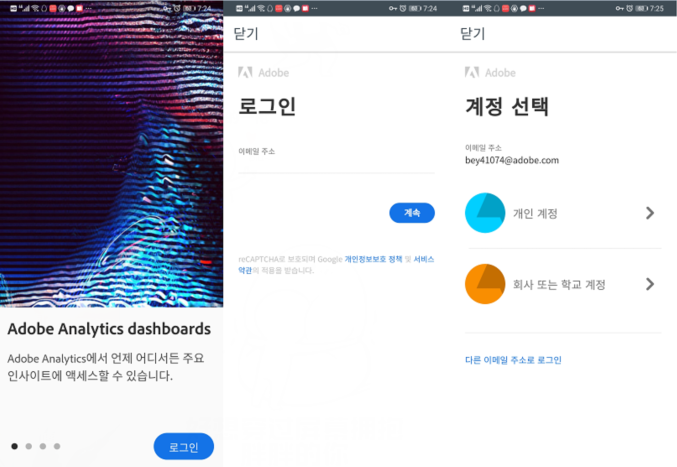
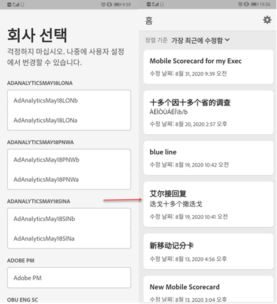
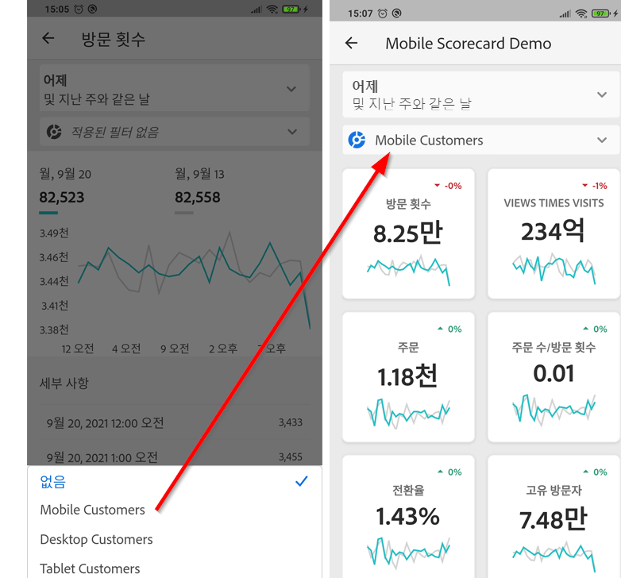
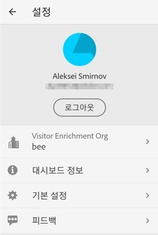
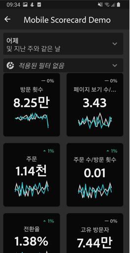

# Adobe Analytics 대시보드: 경영진 사용자 빠른 시작 안내서

다음 정보는 경영진 사용자에게 Adobe Analytics 대시보드를 사용하고 보기 위한 모범 사례에 대한 정보를 제공합니다. 이 정보를 보여 주는 비디오를 보려면 [Adobe Analytics 대시보드 인앱 경험을 참조하십시오](https://youtu.be/QXqQ_PkArbA).

## 소개

Adobe Analytics 대시보드는 Adobe Analytics를 통해 언제 어디서나 통찰력을 제공합니다.  이 앱을 사용하는 사용자는 모바일에서 직관적인 스코어카드에 액세스할 수 있습니다. 스코어카드는 더 자세한 분류 및 트렌드 보고서용으로 탭할 수 있는 타일식 레이아웃에 표시되는 주요 지표 및 기타 구성 요소의 컬렉션입니다. 대시보드는 iOS 및 Android 운영 체제에서 모두 지원됩니다.

## 이 안내서에 대한 자세한 내용

이 안내서는 경영진 사용자가 Analytics 대시보드에서 스코어카드를 읽고 해석할 수 있도록 돕기 위한 것입니다. 이 앱을 사용하면 보유한 모바일 장치에서 중요한 요약 데이터의 광범위한 렌더링을 빠르고 쉽게 볼 수 있습니다.

## 용어집

| 용어 | 정의 |
|--- |--- |
| 소비자 | 모바일 장치의 Analytics를 통해 주요 지표와 통찰력을 보는 경영진 사용자 |
| 큐레이터 | Analytics에서 통찰력을 찾아 배포하고 소비자가 볼 스코어카드를 구성하는 데이터 사용 가능 사용자 |
| 큐레이션 | 소비자에 대한 관련 지표, 차원 및 기타 구성 요소가 포함된 모바일 스코어카드를 만들거나 편집하는 작업 |
| 득점 카드 | 한 개 이상의 타일이 포함된 대시보드 보기 |
| 타일 | 스코어카드 보기 내에 있는 지표에 대한 렌더링 |
| 분류 | 스코어카드에서 타일을 탭하여 액세스할 수 있는 보조 보기. 이 보기는 타일에 표시되는 지표를 확장하고 선택적으로 추가 분류 차원에 대해 보고합니다. |
| 날짜 범위 | 대시보드 보고에 대한 기본 날짜 범위 |
| 비교 날짜 범위 | 기본 날짜 범위와 비교되는 날짜 범위 |

## 장치에 대시보드 설정 지원 받기

대시보드를 효율적으로 사용하려면 스코어카드 큐레이터의 도움을 받아 대시보드를 설정해야 합니다. 이 섹션에서는 큐레이터의 도움을 받아 설정하는 데 유용한 정보를 제공합니다.

### 액세스 권한 얻기

대시보드에서 스코어카드에 액세스하려면 다음을 확인합니다.

* Adobe Analytics에 대한 유효한 로그인 권한이 있습니다.
* 큐레이터가 모바일 스코어카드를 올바르게 작성하고 공유했습니다.

### 대시보드 다운로드 및 설치

앱을 다운로드하여 설치하려면 장치의 운영 체제에 따라 단계를 따릅니다.

**iOS를 사용하는 경영진 사용자:**

다음 링크(도구 **>** 대시보드 ****&#x200B;아래의 Analytics에서도 사용 가능)를 클릭하고 프롬프트에 따라 앱을 다운로드, 설치 및 엽니다.

[iOS 링크](https://apple.co/2zXq0aN)

**Android를 사용하는 경영진 사용자:**

다음 링크(도구 **>** 대시보드 ****&#x200B;아래의 Analytics에서도 사용 가능)를 클릭하고 프롬프트에 따라 앱을 다운로드, 설치 및 엽니다.

[Android 링크](https://bit.ly/2LM38Oo)

경영진 사용자는 다운로드 및 설치 후 기존 Adobe Analytics 자격 증명을 사용하여 앱에 로그인할 수 있습니다.

## 대시보드 사용

대시보드를 사용하려면 다음을 수행하십시오.

1. 앱에 로그인합니다. 대시보드를 실행하면 로그인 화면이 나타납니다. 기존 Adobe Analytics 자격 증명을 사용하여 나타나는 메시지를 따릅니다. Adobe는 Adobe 와 Enterprise/Federated ID를 모두 지원합니다.

   

2. 회사 선택. 대시보드에 로그인하면 **회사 선택** 화면이 나타납니다. 이 화면에는 사용자가 속한 로그인 회사가 나열됩니다. 사용자와 공유된 스코어카드와 연결된 회사 이름을 탭합니다.

3. 그러면 스코어카드 목록에 사용자와 공유된 모든 스코어카드가 표시됩니다. 보려는 스코어카드를 탭합니다.

   

   로그인해서 공유된 내용이 없다는 메시지가 표시되면 큐레이터에게 다음을 확인하십시오.

   * 올바른 Analytics 인스턴스에 로그인할 수 있습니다.
   * 스코어카드가 사용자와 공유되었습니다.
   

4. 스코어카드에 타일이 표시되는 방식을 검사합니다(첫 번째 스코어카드가 어두운 모드로 표시됨). 자세한 **내용은** 아래 환경 설정을 참조하십시오.)

   

   타일에 대한 추가 정보:

   * 스파크라인의 세부기간은 날짜 범위의 길이에 따라 달라집니다.

      * 하루는 시간별 트렌드를 표시함
      * 하루 이상 1년 이하의 경우 일일 트렌드가 표시됩니다.
      * 1년 이상은 주별 트렌드를 표시함
   * 비율 값 변경 수식은 지표 합계(현재 날짜 범위) – 지표 합계(비교 날짜 범위) / 지표 합계(비교 날짜 범위)입니다.

   * 화면을 아래로 당기면 스코어카드를 새로 고칠 수 있습니다.
   다음 [스코어카드]는 일반 모드로 표시됩니다.

   

5. 타일에 대한 상세 분류가 작동하는 방식을 보려면 타일을 누릅니다.

   

6. 스코어카드에 대한 날짜 범위를 변경하려면:

   

   * 위에 표시된 분류 보기 내에서 동일한 방식으로 날짜 범위를 변경할 수도 있습니다.

   * 탭한 간격(**일**, **주**, **월** 또는 **년**)에 따라 날짜 범위에 대한 두 개 옵션(현재 시간 범위 또는 직전 시간 범위)이 표시됩니다. 이 두 옵션 중 하나를 탭하여 첫 번째 범위를 선택합니다. **비교 대상** 목록에서 제공된 옵션 중 하나를 탭하여 이 기간의 데이터와 선택한 첫 번째 날짜 범위를 비교합니다. 화면의 오른쪽 상단에 있는 **완료**&#x200B;를 탭합니다. **날짜 범위** 필드와 스코어카드 타일은 선택한 새 범위의 새 비교 데이터로 업데이트됩니다.

7. 스코어카드에 세그먼트 필터를 적용하려면 필터 드롭다운을 누르고 큐레이터가 구성한 세그먼트를 선택합니다. [앱의 필터는](https://docs.adobe.com/content/help/en/analytics-learn/tutorials/analysis-workspace/using-panels/using-drop-down-filters.html) Analytics 작업 공간에서 작동하는 것과 동일한 방식으로 작동합니다.

   

8. 스코어카드 업데이트를 가져옵니다. 스코어카드에 관심이 있을 수 있는 모든 지표 또는 분류가 포함되어 있지 않은 경우 Analytics 팀에 연락하여 스코어카드가 업데이트되도록 하십시오. 업데이트되었으면 화면에서 카드를 풀다운하여 새로 고친 다음 최근에 추가한 데이터를 로드할 수 있습니다.

9. 이 앱에 대한 피드백을 남기려면:

   1. 앱 화면의 오른쪽 상단에 있는 설정 아이콘을 누릅니다.
   2. On the **Settings** screen, tap the **Feedback** option.
   3. 피드백 남기기에 대한 옵션을 탭하여 봅니다.

      

10. 환경 설정을 변경하려면 위에 표시된 환경 **설정** 옵션을 누릅니다. 환경 설정에서 생체 인식 로그인을 켜거나 아래에 표시된 대로 어두운 모드로 앱을 설정할 수 있습니다.

   

**버그를 보고하려면**:

옵션을 탭하고 버그의 하위 카테고리를 선택합니다. 버그 보고 양식에서 맨 위 필드에 전자 메일 주소를 입력하고 그 아래 필드에 버그에 대한 설명을 입력합니다. 계정 정보에 대한 스크린샷이 메시지에 자동으로 첨부되지만 원할 경우 첨부 이미지에서 **X**&#x200B;를 탭하여 이 스크린샷을 삭제할 수 있습니다. 또한 화면 기록을 촬영하거나 더 많은 스크린샷을 추가하거나 파일을 첨부하는 옵션이 제공됩니다. 보고서를 보내려면 양식 오른쪽 상단에 있는 종이 비행기 아이콘을 탭합니다.

**개선을 제안하려면**:

옵션을 탭하고 제안에 대한 하위 카테고리를 선택합니다. 제안 양식에서 맨 위 필드에 전자 메일 주소를 입력하고 그 아래 필드에 버그에 대한 설명을 입력합니다. 계정 정보에 대한 스크린샷이 메시지에 자동으로 첨부되지만 원할 경우 첨부 이미지에서 **X**&#x200B;를 탭하여 이 스크린샷을 삭제할 수 있습니다. 또한 화면 기록을 촬영하거나 더 많은 스크린샷을 추가하거나 파일을 첨부하는 옵션이 제공됩니다. 제안 사항을 보내려면 양식 오른쪽 상단에 있는 종이 비행기 아이콘을 탭합니다.

**질문하려면:**

옵션을 탭하고 맨 위 필드에 전자 메일 주소를 입력하고 그 아래 필드에 질문을 입력합니다. 스크린샷이 메시지에 자동으로 첨부되지만 원할 경우 첨부 이미지에서 **X**&#x200B;를 탭하여 이 스크린샷을 삭제할 수 있습니다. 또한 화면 기록을 촬영하거나 더 많은 스크린샷을 추가하거나 파일을 첨부하는 옵션이 제공됩니다. 질문을 보내려면 양식 오른쪽 상단에 있는 종이 비행기 아이콘을 탭합니다.
