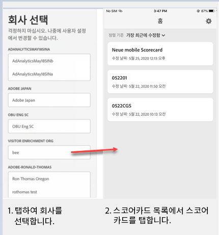
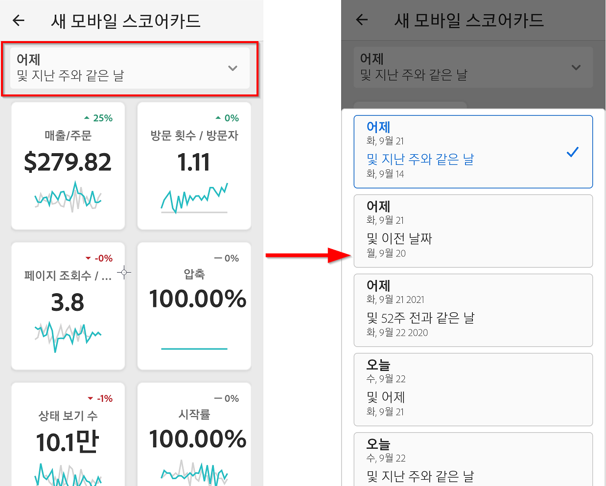

# Adobe Analytics 대시보드:경영진 빠른 시작 가이드

## 소개

Adobe Analytics 대시보드는 Adobe Analytics를 통해 언제 어디서나 통찰력을 제공합니다.  이 앱을 사용하는 사용자는 모바일에서 직관적인 스코어카드에 액세스할 수 있습니다. 스코어카드는 더 자세한 분류 및 트렌드 보고서용으로 탭할 수 있는 타일식 레이아웃에 표시되는 주요 지표 및 기타 구성 요소의 컬렉션입니다. 대시보드는 iOS 및 Android 운영 체제에서 모두 지원됩니다.

## 이 안내서 정보

이 안내서는 경영진 사용자가 Analytics 대시보드에서 스코어카드를 읽고 해석하도록 돕기 위해 마련되었습니다. 이 앱을 사용하면 보유한 모바일 장치에서 중요한 요약 데이터의 광범위한 렌더링을 빠르고 쉽게 볼 수 있습니다.

## 용어집

| 용어 | 정의 |
|--- |--- |
| 소비자 | 모바일 장치의 Analytics를 통해 주요 지표와 통찰력을 보는 경영진 사용자 |
| 큐레이터 | Analytics에서 통찰력을 찾아 배포하고 소비자가 볼 스코어카드를 구성하는 데이터 사용 가능 사용자 |
| 큐레이션 | 소비자에 대한 관련 지표, 차원 및 기타 구성 요소가 포함된 모바일 스코어카드를 만들거나 편집하는 작업 |
| 득점 카드 | 하나 이상의 타일이 포함된 대시보드 보기 |
| 타일 | 스코어카드 보기 내에 있는 지표에 대한 렌더링 |
| 분류 | 스코어카드에서 타일을 탭하여 액세스할 수 있는 보조 보기. 이 보기는 타일에 표시되는 지표를 확장하고 선택적으로 추가 분류 차원에 대해 보고합니다. |
| 날짜 범위 | 대시보드 보고를 위한 기본 날짜 범위 |
| 비교 날짜 범위 | 기본 날짜 범위와 비교되는 날짜 범위 |

## 디바이스에서 대시보드 설정

대시보드를 효과적으로 사용하려면 Scorecard 큐레이터가 대시보드를 설정하는 데 도움이 되어야 합니다. 이 섹션에서는 큐레이터의 도움을 받아 설정하는 데 유용한 정보를 제공합니다.

### 액세스 권한 얻기

대시보드의 스코어카드에 액세스하려면 다음을 확인하십시오.

* Adobe Analytics에 대한 유효한 로그인 권한이 있습니다.
* 큐레이터가 모바일 스코어카드를 올바르게 작성하고 공유했습니다.

### 대시보드 다운로드 및 설치

앱을 다운로드하여 설치하려면 장치의 운영 체제에 따라 단계를 따릅니다.

**iOS 장치의 경우:**

1. Click the following public link (It is also available in Analytics under **Tools** > **dashboards**):

   [iOS 링크](https://testflight.apple.com/join/WtXMQxlI): `https://testflight.apple.com/join/WtXMQxlI`

   이 링크를 클릭하면 다음과 같은 Testflight 화면이 나타납니다.

   

2. 화면에서 **App Store에서 보기** 링크를 탭하여 Testflight 앱을 다운로드합니다.

3. Testflight 앱을 설치한 후 아래와 같이 Testflight 내에서 Adobe Analytics 대시보드를 찾아 설치합니다.

   

**Android 장치의 경우:**

1. Tap the following Play Store link on the user&#39;s device (It is also available in Analytics under **Tools** > **dashboards**):

   [Android](https://play.google.com/apps/testing/com.adobe.analyticsmobileapp): `https://play.google.com/apps/testing/com.adobe.analyticsmobileapp`

   링크를 탭한 후에 다음 화면에서 테스트 되기 링크를 탭합니다.

   

2. 다음 화면에서 **Google Play에서 다운로드** 링크를 탭합니다.

   

## 대시보드 사용

대시보드를 사용하려면

1. 앱에 로그인합니다. 대시보드 시작 시 로그인 화면이 나타납니다. 기존 Adobe Analytics 자격 증명을 사용하여 나타나는 메시지를 따릅니다. Adobe는 Adobe 와 Enterprise/Federated ID를 모두 지원합니다.

   

2. 회사 선택. After you sign into dashboards, the **Choose a company** screen appears. 이 화면에는 사용자가 속한 로그인 회사가 나열됩니다. 사용자와 공유된 스코어카드와 연결된 회사 이름을 탭합니다.

3. 그러면 스코어카드 목록에 사용자와 공유된 모든 스코어카드가 표시됩니다. 보려는 스코어카드를 탭합니다.

   

   *참고: 로그인했을 때 아무 것도 공유되지 않았다는 메시지가 표시되면 큐레이터와 다음 사항을 확인합니다.*

   * *올바른 Analytics 인스턴스에 로그인할 수 있습니다.*
   * *스코어카드가 사용자와 공유되었습니다.*

      

4. 타일이 스코어카드에 어떻게 표시되는지 검사합니다.

   

   타일에 대한 추가 정보:

   * 스파크라인의 세부기간은 날짜 범위의 길이에 따라 달라집니다.
   * 하루는 시간별 트렌드를 표시함
   * 이틀 이상 및 1년 미만은 일별 트렌드를 표시함
   * 1년 이상은 주별 트렌드를 표시함
   * 비율 값 변경 수식은 지표 합계(현재 날짜 범위) – 지표 합계(비교 날짜 범위) / 지표 합계(비교 날짜 범위)입니다.
   * 화면을 아래로 당기면 스코어카드를 새로 고칠 수 있습니다.

5. 타일에 대한 세부 분류가 어떻게 작동하는지 표시하려면 타일을 탭합니다.

   

6. 스코어카드에 대한 날짜 범위를 변경하려면:

   

   *참고: 같은 방법으로 위에 표시된 분류 보기 내에서 날짜 범위를 변경할 수도 있습니다.*

   탭한 간격(**일**, **주**, **월** 또는 **년**)에 따라 날짜 범위에 대한 두 개 옵션(현재 시간 범위 또는 직전 시간 범위)이 표시됩니다. 이 두 옵션 중 하나를 탭하여 첫 번째 범위를 선택합니다. **비교 대상** 목록에서 제공된 옵션 중 하나를 탭하여 이 기간의 데이터와 선택한 첫 번째 날짜 범위를 비교합니다. 화면의 오른쪽 상단에 있는 **완료**&#x200B;를 탭합니다. **날짜 범위** 필드와 스코어카드 타일은 선택한 새 범위의 새 비교 데이터로 업데이트됩니다.

7. 스코어카드 업데이트를 가져옵니다. 스코어카드에 관심이 있을 수 있는 모든 지표 또는 분류가 포함되어 있지 않은 경우 Analytics 팀에 연락하여 스코어카드가 업데이트되도록 하십시오. 업데이트되었으면 화면에서 카드를 풀다운하여 새로 고친 다음 최근에 추가한 데이터를 로드할 수 있습니다.

8. 피드백 남기기. 피드백을 남기려면:

   1. 대시보드 화면의 오른쪽 상단에 있는 사용자 아이콘을 누릅니다.
   2. **내 계정** 화면에서 **피드백** 옵션을 탭합니다.
   3. 피드백 남기기에 대한 옵션을 탭하여 봅니다.
   
   

**버그를 보고하려면**:

옵션을 탭하고 버그의 하위 카테고리를 선택합니다. 버그 보고 양식에서 맨 위 필드에 전자 메일 주소를 입력하고 그 아래 필드에 버그에 대한 설명을 입력합니다. 계정 정보에 대한 스크린샷이 메시지에 자동으로 첨부되지만 원할 경우 첨부 이미지에서 **X**&#x200B;를 탭하여 이 스크린샷을 삭제할 수 있습니다. 또한 화면 기록을 촬영하거나 더 많은 스크린샷을 추가하거나 파일을 첨부하는 옵션이 제공됩니다. 보고서를 보내려면 양식 오른쪽 상단에 있는 종이 비행기 아이콘을 탭합니다.

**개선을 제안하려면**:

옵션을 탭하고 제안에 대한 하위 카테고리를 선택합니다. 제안 양식에서 맨 위 필드에 전자 메일 주소를 입력하고 그 아래 필드에 버그에 대한 설명을 입력합니다. 계정 정보에 대한 스크린샷이 메시지에 자동으로 첨부되지만 원할 경우 첨부 이미지에서 **X**&#x200B;를 탭하여 이 스크린샷을 삭제할 수 있습니다. 또한 화면 기록을 촬영하거나 더 많은 스크린샷을 추가하거나 파일을 첨부하는 옵션이 제공됩니다. 제안 사항을 보내려면 양식 오른쪽 상단에 있는 종이 비행기 아이콘을 탭합니다.

**질문하려면:**

옵션을 탭하고 맨 위 필드에 전자 메일 주소를 입력하고 그 아래 필드에 질문을 입력합니다. 스크린샷이 메시지에 자동으로 첨부되지만 원할 경우 첨부 이미지에서 **X**&#x200B;를 탭하여 이 스크린샷을 삭제할 수 있습니다. 또한 화면 기록을 촬영하거나 더 많은 스크린샷을 추가하거나 파일을 첨부하는 옵션이 제공됩니다. 질문을 보내려면 양식 오른쪽 상단에 있는 종이 비행기 아이콘을 탭합니다.
