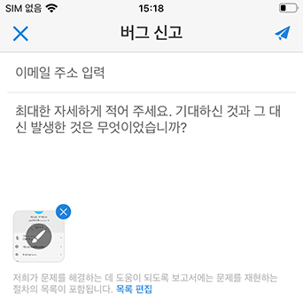

# Analytics 모바일 앱:경영진 사용자 빠른 시작 안내서

## 소개

Adobe Analytics 모바일 앱은 Adobe Analytics를 통해 언제 어디서나 인사이트를 제공합니다.  이 앱을 사용하면 사용자가 모바일에서 직관적인 스코어카드에 액세스할 수 있습니다. 성과 기록표는 보다 자세한 분류 및 트렌드 보고서를 탭할 수 있는 타일식 레이아웃에 표시되는 주요 지표 및 기타 구성 요소 모음입니다. 모바일 앱은 iOS 및 Android 운영 체제에서 모두 지원됩니다.

## 이 안내서 정보

이 안내서는 경영진 사용자가 Analytics 모바일 앱에서 스코어카드를 읽고 해석하도록 돕기 위해 마련되었습니다. 이 앱을 사용하면 모바일 디바이스에서 중요한 요약 데이터의 광범위한 렌더링을 빠르고 손쉽게 볼 수 있습니다.

## 용어 설명

| 용어 | 정의 |
|--- |--- |
| 소비자 | 모바일 디바이스의 Analytics에서 주요 지표 및 통찰력 보기 |
| 큐레이터 | Analytics에서 통찰력을 찾아 배포하고 소비자가 볼 스코어카드를 구성하는 데이터 리터칭 페르소나 |
| 조정 | 소비자에 대한 관련 지표, 차원 및 기타 구성 요소가 포함된 모바일 스코어카드를 만들거나 편집하는 행위 |
| 득점 카드 | 하나 이상의 타일이 포함된 모바일 앱 보기 |
| 타일 | 스코어카드 보기 내의 지표에 대한 렌더링 |
| 분류 | 스코어카드의 타일을 탭하여 액세스할 수 있는 보조 보기. 이 보기는 타일에 표시되는 지표에서 확장되며 선택적으로 추가 분류 차원에 대해 보고합니다. |
| 날짜 범위 | 모바일 앱 보고를 위한 기본 날짜 범위 |
| 비교 날짜 범위 | 기본 날짜 범위와 비교되는 날짜 범위 |

## 디바이스에서 앱 설정

앱을 효과적으로 사용하려면 Scorecard 큐레이터가 이를 설정하는 데 도움이 필요합니다. 이 섹션에서는 큐레이터의 도움을 받아 설정하는 데 도움이 되는 정보를 제공합니다.

### 액세스

앱의 스코어카드에 액세스하려면 다음을 확인하십시오.

* Adobe Analytics에 유효한 로그인이 있습니다.
* 큐레이터가 모바일 성과 기록표를 올바르게 만들어 사용자와 공유했습니다.

### 앱 다운로드 및 설치

앱을 다운로드하고 설치하려면 장치의 운영 체제에 따라 단계를 수행하십시오.

**iOS 장치의 경우:**

1. 다음 공개 링크를 클릭합니다(도구 &gt; 모바일 앱의 **Analytics에서도** 사용할 수 **있습니다**).

   [iOS 링크](https://testflight.apple.com/join/WtXMQxlI): `https://testflight.apple.com/join/WtXMQxlI`

   링크를 클릭하면 다음과 같은 테스트 플라이트 화면이 나타납니다.

   

2. 화면의 **App Store에서** 보기 링크를 눌러 Testflight 앱을 다운로드합니다.

3. Testflight 앱을 설치한 후 아래와 같이 Testflight 내에서 Adobe Analytics Mobile 앱을 찾아 설치합니다.

   

**Android 장치의 경우:**

1. 사용자의 장치에서 다음 스토어 재생 링크를 누릅니다(도구 &gt; 모바일 앱의 **Analytics에서도** 사용할 수 **있습니다**).

   [Android](https://play.google.com/apps/testing/com.adobe.analyticsmobileapp): `https://play.google.com/apps/testing/com.adobe.analyticsmobileapp`

   링크를 탭한 후 다음 화면에서 테스터로 만들기 링크를 누릅니다.

   

2. 다음 화면에서 Google Play에서 **다운로드** 링크를 누릅니다.

   

## 앱 사용

앱을 사용하려면:

1. 앱 로그인 앱을 실행하면 로그인 화면이 나타납니다. 기존 Adobe Analytics 자격 증명을 사용하여 나타나는 메시지에 따릅니다. Adobe는 Adobe 및 Enterprise/Federated ID를 모두 지원합니다.

   

2. 회사 선택. 앱에 로그인하면 회사 **선택** 화면이 나타납니다. 이 화면에는 사용자가 속한 로그인 회사가 나열됩니다. 사용자와 공유된 성과 연결된 회사 이름을 누릅니다.

3. 그러면 스코어카드 목록에 사용자와 공유된 모든 스코어카드가 표시됩니다. 보려는 스코어카드를 누릅니다.

   

   *참고:로그인해서 아무 것도 공유되지 않았다는 메시지가 표시되면 큐레이터에게 다음 사항을 확인하십시오.*

   * *올바른 Analytics 인스턴스에 로그인할 수 있습니다*
   * *성과 기록표가 사용자와 공유되었습니다.*

      

4. 스코어카드에 타일이 표시되는 방식을 검사합니다.

   

   타일에 대한 추가 정보:

   * 스파크라인의 세부기간은 날짜 범위의 길이에 따라 달라집니다.
   * 하루 동안 시간별 트렌드가 표시됩니다.
   * 일일 트렌드가 하루 이상 1년 이하로 표시됩니다.
   * 1년 이상 매주 트렌드 표시
   * 퍼센트 값 변경 공식은 지표 합계(현재 날짜 범위) - 지표 합계(비교 날짜 범위)/지표 합계(비교 날짜 범위)입니다.
   * 화면을 아래로 당김하여 스코어카드를 새로 고칠 수 있습니다.

5. 타일에 대한 세부 분류가 어떻게 작동하는지 표시하려면 타일을 누릅니다.

   

6. 스코어카드의 날짜 범위를 변경하려면 다음을 수행합니다.

   

   *참고:위의 분류 보기 내에서 동일한 방식으로 날짜 범위를 변경할 수도 있습니다.*

   탭한 날짜(일,**주**, **월**, **년**&#x200B;간격 **)에 따라**&#x200B;현재 시간 범위 또는 바로 앞의 날짜 범위에 대한 두 가지 옵션이 표시됩니다. 이 두 옵션 중 하나를 눌러 첫 번째 범위를 선택합니다. 비교 **대상** 목록에서 표시된 옵션 중 하나를 눌러 이 기간의 데이터를 선택한 첫 번째 날짜 범위와 비교합니다. 화면 **오른쪽** 상단에 있는 완료를 누릅니다. 날짜 **범위** 필드와 스코어카드 타일은 선택한 새 범위의 새 비교 데이터로 업데이트됩니다.

7. 성과 기록표 업데이트 다운로드 Scorecard에 관심 있는 모든 지표나 분류가 포함되어 있지 않은 경우 Analytics 팀에 연락하여 Scorecard를 업데이트하십시오. 업데이트한 후에는 화면에 있는 카드를 풀다운하여 새로 고치고 최근에 추가된 데이터를 로드할 수 있습니다.

8. 피드백을 남길 수 있습니다. 피드백을 남기려면

   1. 앱 화면의 오른쪽 상단에 있는 사용자 아이콘을 누릅니다.
   2. 내 **계정** 화면에서 피드백 **옵션을 탭합니다** .
   3. 피드백을 남길 수 있는 옵션을 보려면 을 누릅니다.
   
   

**버그를**&#x200B;보고하려면

옵션을 누르고 버그의 하위 범주를 선택합니다. 버그를 보고하기 위한 양식에서 상단 필드에 이메일 주소와 아래 필드에 버그 설명을 입력합니다. 계정 정보의 스크린샷이 메시지에 자동으로 첨부되지만 첨부 이미지의 X를 눌러 원하는 경우 삭제할 **수** 있습니다. 화면 녹화, 스크린샷 추가 또는 파일 첨부 옵션을 사용할 수도 있습니다. 보고서를 보내려면 양식의 오른쪽 상단에 있는 종이 평면 아이콘을 누릅니다.

**개선을**&#x200B;제안하려면

옵션을 누르고 제안에 대한 하위 카테고리를 선택합니다. 제안 양식에서 맨 위 필드에 이메일 주소와 그 아래 필드에 버그 설명을 입력합니다. 계정 정보의 스크린샷이 메시지에 자동으로 첨부되지만 첨부 이미지의 X를 눌러 원하는 경우 삭제할 **수** 있습니다. 화면 녹화, 스크린샷 추가 또는 파일 첨부 옵션을 사용할 수도 있습니다. 제안을 보내려면 양식의 오른쪽 상단에 있는 종이 평면 아이콘을 누릅니다.

**질문을**&#x200B;하려면

옵션을 누르고 상단 필드에 이메일 주소를 입력하고 아래 필드에 질문을 입력합니다. 스크린 샷은 메시지에 자동으로 첨부되지만, 첨부 이미지의 X를 눌러 원하는 경우 삭제할 **수** 있습니다. 화면 녹화, 스크린샷 추가 또는 파일 첨부 옵션을 사용할 수도 있습니다. 질문을 보내려면 양식의 오른쪽 상단에 있는 용지 평면 아이콘을 누릅니다.
