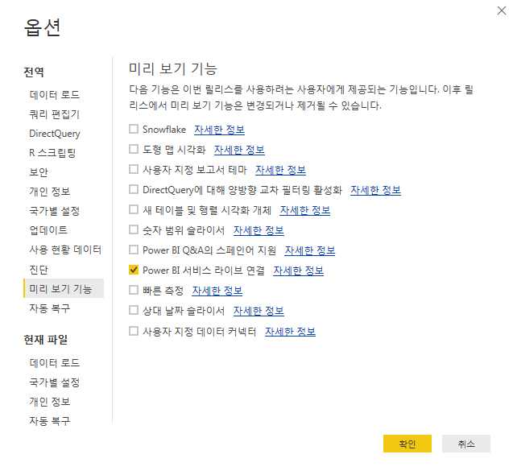

# 게시된 자산을 Power BI Desktop에 가져오기

Report Builder에서 게시한 자산을 Power BI Desktop에 가져오는 방법을 설명합니다.

## 전제 조건 {#section_BDFDAE1E300B429FB6EBCB21AD1383A0}

* 최신 Power BI Desktop 버전이 설치되어 있어야 합니다(2017년 4월 릴리스).
* 이 프로세스에서는 이미 Report Builder에서 형식을 지정한 표나 요청을 Power BI 서비스에 게시했다고 가정합니다.

## 프로세스 {#section_CB03E6E1B066457EA0F6FC08FFF5EFDD}

Microsoft는 Power BI Desktop의 2017년 4월 업데이트에서 Power BI 서비스의 데이터 세트에 연결하는 기능을 발표했습니다. 이 기능을 사용하면 이미 클라우드에 게시한 기존의 데이터 세트에서 새 보고서를 생성할 수 있고, 팀에서 공동 작업을 더 잘 수행하고 중복되는 노력을 줄일 수 있습니다.

1. Power BI Desktop에서 **[!UICONTROL 파일]** > **[!UICONTROL 옵션 및 설정]** > **[!UICONTROL 옵션]** > **[!UICONTROL 기능 미리 보기]**&#x200B;로 이동합니다.
1. **[!UICONTROL Power BI 서비스 라이브 연결]**&#x200B;을 활성화하고 **[!UICONTROL 확인]**&#x200B;을 클릭합니다. 

1. Power BI Desktop을 시작합니다.
1. 데스크톱을 시작한 후 **[!UICONTROL 홈]** > **[!UICONTROL 데이터 가져오기]** > **[!UICONTROL 더 보기]**&#x200B;로 이동합니다.
1. **[!UICONTROL Power BI 서비스]**&#x200B;를 검색하여 선택합니다.
1. **[!UICONTROL Microsoft Power BI 서비스]** > **[!UICONTROL 내 작업 공간]** 아래에서 이전에 Report Builder에서 게시한 데이터 세트를 선택합니다.

자세한 내용은 이 [Microsoft 블로그 게시물](https://powerbi.microsoft.com/ko-kr/blog/connecting-to-datasets-in-the-power-bi-service-from-desktop/)을 참조하십시오.
