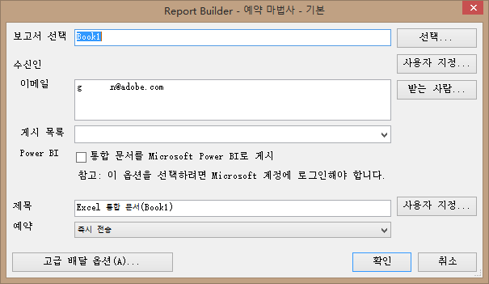
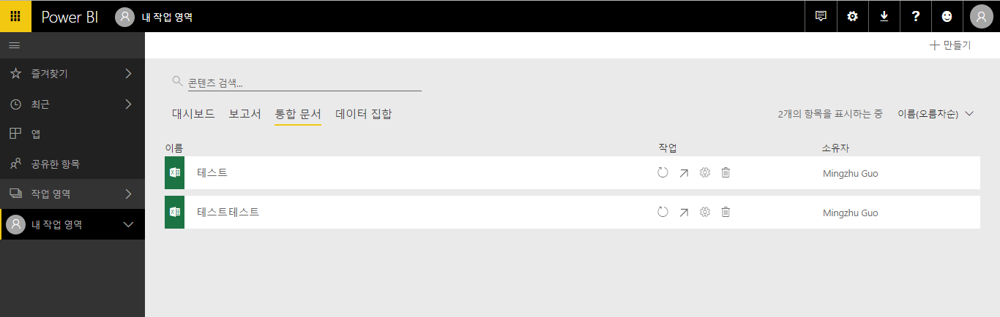
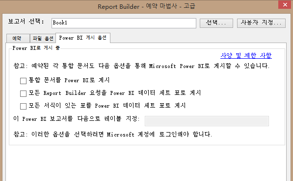
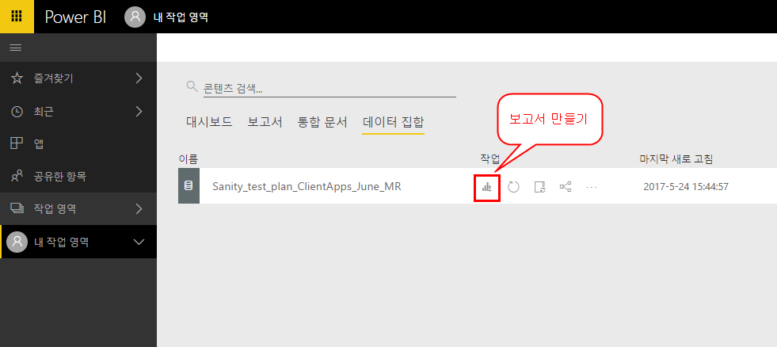
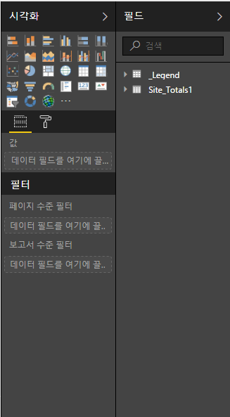
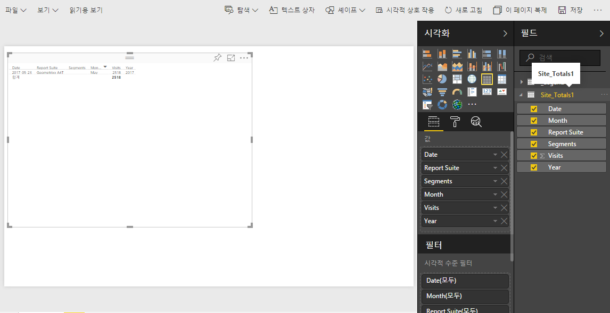
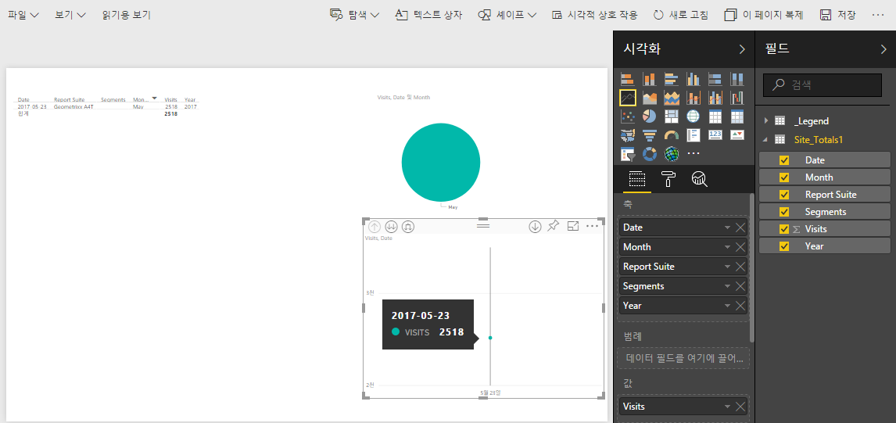
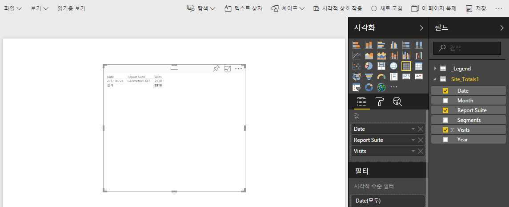
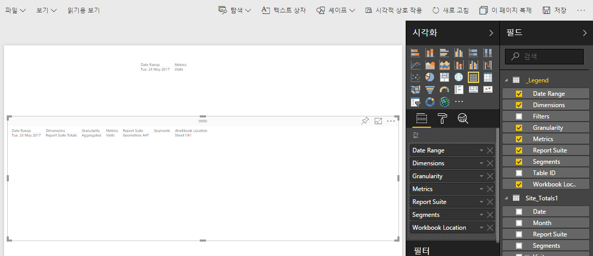

# Power BI에 게시 - 개요

Microsoft Power BI는 데이터를 분석하고 통찰력을 공유할 수 있는 비즈니스 분석 대시보드 세트입니다. Power BI와의 Adobe Analytics 통합을 통해 Microsoft Power BI 내에서 Report Builder Analytics 데이터를 시각화하고 조직에서 쉽게 공유할 수 있습니다.

분석가의 경우 이전에는 이메일(또는 ftp)을 통해 배포하도록 Report Builder 통합 문서를 예약했습니다. 이제는 비즈니스 사용자 이해 당사자에게 플랫폼 및 장치에서 액세스할 수 있는 웹 기반 환경의 정확한 최신 데이터에 대한 액세스 권한(Power BI 계정 내에서)을 제공할 수 있습니다.

Report Builder의 보고서 생성 기능을 Power BI의 시각화 기능과 결합하면 조직의 모든 구성원이 정보에 더 쉽게 액세스할 수 있습니다. 또한 Power BI를 사용하여 Adobe Analytics를 다른 데이터 소스(예: 매장, CRM)와 통합하여 특별한 고객 통찰력, 연결 및 기회를 발견할 수도 있습니다.

Adobe Report Builder와의 통합을 통해 다음을 수행할 수 있습니다.

* [예약된 Report Builder 통합 문서를 Power BI에 게시](../../../analyze/report-builder/whats-new-arb.md#section_21CA66229EC240D49594A9A7D3FBA687)
* [통합 문서에서 형식이 지정된 표를 모두 Power BI 데이터 세트 표로 게시](../../../analyze/report-builder/whats-new-arb.md#section_7C54A54E75184DD6BAEF4ACCE241239A)
* [모든 Report Builder 요청을 Power BI 데이터 세트 표로 게시](../../../analyze/report-builder/whats-new-arb.md#section_0C26057C7DBB4068A643FDD688F6E463)

## 시스템 요구 사항 {#section_0B71092D853446F38FA36447DAC0D32B}

* Adobe Report Builder 5.5 [installed](../../../analyze/report-builder/setup/t-install-arb.md#task_0CA66703882F469EB6DBD9298975D6C3)
* Power BI에 로그인할 수 있도록 해주는 Active Microsoft 계정

## Publish workbook to Power BI {#section_21CA66229EC240D49594A9A7D3FBA687}

예약된 통합 문서는 Adobe Analytics의 데이터로 채워지고 정기적으로 전송되는 형식이 지정된 Excel 스프레드시트입니다.

**리포트 빌더에서 통합 문서 게시**

1. Report Builder에서, 통합 문서를 생성하고 저장합니다.
1. On the Report Builder Toolbar, click **[!UICONTROL Schedule]** &gt; **[!UICONTROL New]**.

1. 기본 예약 마법사에서, **[!UICONTROL Microsoft Power BI에 통합 문서 게시 옆에 있는 상자를 선택합니다]**.

   

1. 이메일을 지정하고 즉시 전송하거나 예약 빈도를 지정합니다(시간별, 일별 등).
1. **[!UICONTROL 확인]을 클릭하여 게시합니다.**
1. 이제 Microsoft 계정에 로그인하라는 메시지가 표시됩니다. 자격 증명을 제공합니다.
1. Report Builder 통합 문서가 예약되어 Power BI에 게시됩니다.

   예약된 각 인스턴트의 Report Builder 예약 프로세스에서 업데이트된 Analytics 데이터를 사용하여 통합 문서가 새로 고침되면, 통합 문서가 Microsoft Power BI에 게시됩니다.

**Power BI에서 리포트 빌더 통합 문서 데이터 보기**

1. Power BI의 [!UICONTROL 통합 문서] 메뉴에서 통합 문서를 두 번 클릭합니다.

   

1. 이제 통합 문서 대시보드 데이터를 볼 수 있습니다.  

1. 그런 다음 Power BI 대시보드에 포함되도록 이 통합 문서의 한 영역을 고정할 수 있습니다.

## Publish all formatted tables in the workbook as Power BI dataset tables {#section_7C54A54E75184DD6BAEF4ACCE241239A}

>[!NOTE]
>
>통합 문서에 매크로가 들어 있는 경우 «통합 문서를 Power BI 데이터 세트로 통합 문서에 모두 게시» 표를 사용할 수 없게 됩니다.

전체 통합 문서를 가져오는 대신 통합 문서 내의 모든 형식이 지정된 표의 컨텐츠만 가져올 수 있습니다.

**사용 사례**: 여러 Report Builder 요청에서 데이터를 가져오고 공식이 많은 요약 표를 만드는 Excel 통합 문서가 있을 경우, 요약 표만 Power BI에 가져오고 이를 우한 시각화를 생성할 수 있습니다.

**리포트 빌더에서 형식 지정 표 게시**

1. Report Builder에서, 뒤에 데이터 행이 오는 머리글 행을 포함하는 데이터 표를 생성합니다.
1. 표를 선택하고 [!UICONTROL **홈]메뉴에서**[!UICONTROL 표로 형식 지정]을 선택합니다. 표는 기본적으로 이름이 지정되지만(표 1, 표 2 등), [!UICONTROL 디자인 ]메뉴에서 이름을 변경할 수 있습니다.

1. On the Report Builder Toolbar, click **[!UICONTROL Schedule]** &gt; **[!UICONTROL New]**.

1. 기본 예약 마법사에서 **[!UICONTROL 고급 예약 옵션을 클릭합니다]**.
1. [!UICONTROL 예약 마법사 - 고급 탭의]**[!UICONTROL 게시 옵션]** 탭에서 모든 형식의 표 **[!UICONTROL 게시 옆에 있는 확인란을 선택하여 Power BI 데이터 세트 표로]**&#x200B;만듭니다.

   

1. (선택 사항) Power BI에서 게시된 자산의 이름을 사용자 지정할 수 있습니다. 이렇게 하는 것은 통합 문서 이름으로서 버전을 매기되 (예: myworkbook_v1.1.xlsx), 게시된 Power BI 자산의 이름에 버전 번호를 표시하지 않으려 하는 경우 유용할 수 있습니다. 버전 번호가 변화하는 경우, 게시된 자산은 변화하지 않는다는 추가적인 장점이 있습니다. (여기에서 [사양](../../../analyze/report-builder/c-publish-power-bi/specifications-limits.md#concept_1B6522B4D7A9482680198F125D94EEFD)을 보십시오.)

**Power BI에서 표 데이터 보기**

1. In Power BI, go to the **[!UICONTROL Workspaces]** &gt; **[!UICONTROL Datasets]** menu.

   

1. 게시한 데이터 세트를 선택하고 그 옆에 있는 [!UICONTROL 보고서 만들기] 아이콘을 클릭합니다. 표가 필드로 나타납니다.

   

1. 표와 해당 표와 연결된 열을 선택합니다.

   

1. [!UICONTROL 시각화] 메뉴에서 Power BI에서 표를 시각화하는 방법을 선택할 수 있습니다. 예를 들어 데이터를 선 그래프로 표시하도록 선택할 수 있습니다.

   

1. 여기에서 이 데이터 세트 표로부터 시각화를 생성할 수 있습니다.

## Publish all Report Builder requests as Power BI Dataset tables {#section_0C26057C7DBB4068A643FDD688F6E463}

모든 요청을 데이터 세트 표로 만들고 표의 맨 위에 시각화를 만들 수 있습니다.

>[!IMPORTANT]
>
>통합 문서에 요청이 100 개 이상 들어 있는 경우 처음 100 개의 요청만 Power BI에 게시됩니다. 또한, Power BI에 게시된 각 요청에 대해, 데이터의 처음 10,000개 행만 게시됩니다. 따라서 이 요청이 예약을 통해 성공적으로 제공되면, Power BI에 대한 게시 범위가 제한됩니다.

1. Report Builder에서 Report Builder 요청으로 통합 문서를 열거나 만듭니다.
1. On the Report Builder Toolbar, click **[!UICONTROL Schedule]** &gt; **[!UICONTROL New]**.

1. 기본 예약 마법사에서 **[!UICONTROL 고급 예약 옵션을 클릭합니다]**.
1. [!UICONTROL 예약 마법사 - 고급]탭에서**[!UICONTROL 게시 옵션]** 탭에서 모든 리포트 빌더 요청 **[!UICONTROL 게시 옆에 있는 확인란을 선택합니다.]**

1. **[!UICONTROL 확인을 클릭합니다]**.

**Power BI에서 요청 데이터 보기**

각각의 예약된 Report Builder 요청은 데이터 세트에서 표로 게시됩니다. 각 요청 표의 이름은 요청에서 기본 차원 다음에 지정되고 여기에는 [!UICONTROL 보고서 세트]와 [!UICONTROL 세그먼트] 열이 있습니다.

1. In Power BI, go to the **[!UICONTROL Workspaces]** &gt; **[!UICONTROL Datasets]** menu.

1. 게시한 요청을 선택하고 그 옆에 있는 [!UICONTROL 보고서 만들기] 아이콘을 클릭합니다.

   요청은 [!UICONTROL 필드] 메뉴에서 표로 나타납니다.

   

   >[!NOTE]
   >
   >워크시트 (피벗 레이아웃, 사용자 지정 레이아웃, 일부 열 보이지 않음) 에 리포트 빌더 요청을 구성했더라도 리포트 빌더는 항상 동일한 2 차원 단일 헤더 행 형식으로 요청을 게시합니다. 날짜, 차원, 지표, 보고서 세트, 세그먼트.

1. 또한 **[!UICONTROL 범례라는 추가적인 표가 있습니다]**. 요청을 Report Builder 컨텍스트에서 떨어뜨리면, 각 요청이 나타내는 사항을 기억하기 어려울 수 있습니다. 범례 표의 목적은 표 ID 아래에 각 요청의 이름을 사용자에게 보여주는 것입니다. 다른 범례 열을 추가하여 요청의 전체 모습을 알 수도 있습니다.

   

