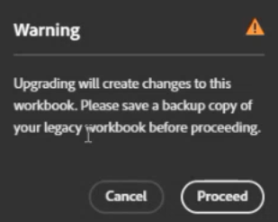

# 기존 Report Builder 통합 문서를 데이터 블록으로 변환

새로운 Report Builder 기술로의 전환의 일환으로 현재 레거시 통합 문서를 Javascript 기반 통합 문서로 빠르게 변환할 수 있습니다.

>[!IMPORTANT]
>
>각 통합 문서를 복제하고 변환하기 전에 한 버전의 이름을 변경합니다. 이렇게 하면 원본 통합 문서의 사본이 그대로 유지됩니다. 필요한 경우

>[!BEGINSHADEBOX]

데모 비디오를 보려면  [통합 문서 변환](https://video.tv.adobe.com/v/3434957?quality=12&learn=on){target="_blank"}을 참조하세요.

>[!ENDSHADEBOX]

1. [다음 지침에 따라](/help/analyze/report-builder/report-builder-setup.md)하여 새 Report Builder을 설정하십시오.

1. Excel을 열고 오른쪽 상단에 있는 Adobe Report Builder 아이콘을 클릭합니다.

1. **[!UICONTROL 로그인]**&#x200B;을 클릭하고 Report Builder에 로그인합니다.

1. Report Builder 추가 기능이 이 통합 문서에 [기존 Report Builder](/help/analyze/legacy-report-builder/home.md)개의 요청이 포함되어 있는지 검색합니다.

   

1. 하나 이상의 레거시 요청이 있는 경우 **[!UICONTROL 업그레이드]**&#x200B;를 클릭하여 통합 문서를 업그레이드하십시오.

   >[!NOTE]
   >
   >각 요청을 개별적으로 업그레이드해야 합니다. 대량 업그레이드는 지원되지 않습니다.

1. 업그레이드할 경우 통합 문서 변경 사항에 대해 경고하는 경고가 표시됩니다. 계속하기 전에 이전 통합 문서의 백업을 만들어야 합니다.

   

1. 업그레이드를 계속하려면 **[!UICONTROL 계속 진행]**&#x200B;을 클릭하세요.

   업그레이드가 성공하면 다음 완료 알림이 표시됩니다.

   

1. (선택 사항) **[!UICONTROL 업그레이드 보고서 다운로드]**&#x200B;를 클릭합니다. 이 보고서에는 업그레이드된 각 데이터 블록의 상태가 포함됩니다.

이제 [데이터 블록을 관리](/help/analyze/report-builder/manage-reportbuilder.md)할 수 있습니다.

## 새 Report Builder에서 지원되지 않는 기존 Report Builder 기능 {#unsupported}

레거시 Report Builder의 기능을 새 Report Builder 추가 기능과 비교할 때 일부 레거시 기능은 더 이상 사용할 수 없습니다.

- 실시간 요청

- 경로/폴아웃 보고

- 예약된 보고서에 대한 FTP 옵션

- 방문자 지표. 보고 결과가 정확히 일치하지 않더라도 다음 지표는 모두 &quot;고유 방문자 수&quot;로 변환됩니다. `visitorshourly`, `visitorsdaily`, `visitorsweekly`, `visitorsmonthly`, `visitorsquarterly` 및 `visitorsyearly`. 이는 `mobilevisitorshourly`, `mobilevisitorsdaily`, `mobilevisitorsweekly`, `mobilevisitorsmonthly`, `mobilevisitorsquarterly` 및 `mobilevisitorsyearly`에도 적용됩니다.

## 전환된 통합 문서 예약 {#schedule}

예약 문서에서 [변환된 통합 문서 예약](/help/analyze/report-builder/schedule-reportbuilder.md)을 참조하십시오.