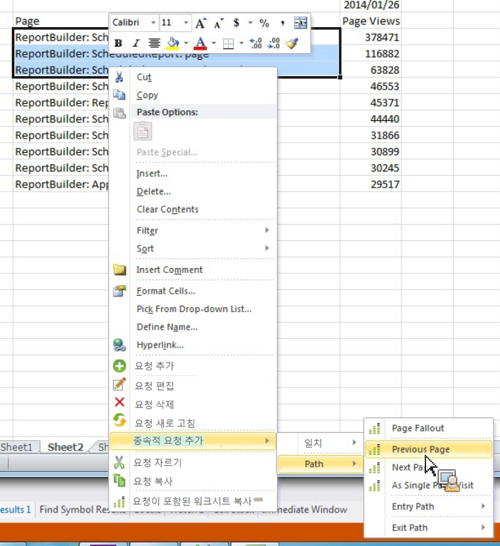

# 종속 요청을 추가하여 경로 보고서 필터링

미리 정의한 필터로 경로 보고서를 만드는 방법을 설명합니다.

마케팅 보고 및 분석은 보고서, 시작 및 [!UICONTROL Next] 보고서, [!UICONTROL Previous Site Section] [!UICONTROL Exit Site Section] [!UICONTROL Single Site Section] 보고서와 같은 사전 정의된 필터가 있는 상위 경로 보고서인 몇 가지 독립 실행형 보고서를 제공합니다.

Report Builder does not offer these as standalone reports, but you can create them through the **[!UICONTROL Add dependent request]** > **[!UICONTROL Path]** context menus. 다음 보고서를 사용할 수 있습니다.

* 경로 > 페이지 폴아웃
* 경로 > 시작 경로
* 경로 > 종료 경로
* 경로 > 다음 페이지
* 경로 > 시작 페이지 > 다음 페이지
* 경로 > 이전 페이지
* 경로 > 종료 경로 > 이전 페이지
* 경로 > 시작 경로 > 시작 페이지로
* 경로 > 종료 경로 > 종료 페이지로

1. 기존 요청에서 여러 행을 선택한 다음 마우스 오른쪽 단추를 **[!UICONTROL Add Dependent Request]** > **[!UICONTROL Path]**&#x200B;클릭합니다.

   (Note that you have to select at least 3 rows if you want to see the **[!UICONTROL Page Fallout]** menu item.)

   

1. Select the predefined filter, for example **[!UICONTROL Previous Page]**.

   이전 페이지 지표가 이미 선택된 상태로 요청 마법사가 나타납니다. 1. 요청 마법사에서 요청을 계속 세분하고 요청을 생성합니다.
