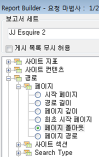
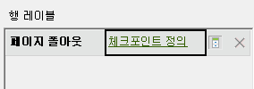

# 요청 마법사를 사용하여 폴아웃 보고서 필터링

폴아웃 보고서에 필터를 적용하는 단계에 대해 설명합니다.

이 예에서는 페이지 폴아웃 보고서를 보여줍니다.

1. In Adobe Report Builder, click **[!UICONTROL Create]** to open the Request Wizard.
1. 적절한 보고서 세트를 선택합니다.
1. In the tree view on the left, select **[!UICONTROL Paths]** &gt; **[!UICONTROL Page]** &gt; **[!UICONTROL Page Fallout]**.

   

1. Configure the appropriate [date ranges](../../../../analyze/report-builder/data-requests/configuring-report-dates/custom-calendar.md).
1. Click **[!UICONTROL Next]**.
1. In Step 2 of the Wizard, under **[!UICONTROL Row Labels]**, click the **[!UICONTROL Define Checkpoints]** link. 폴아웃 보고서에서는 패턴이 미리 정의되어 있는 경로 보고서와 달리 항상 경로 요소를 정의해야 합니다. 

   

1. **[!UICONTROL 필터]** 옵션을 선택합니다.

1. In the **[!UICONTROL Define Site Section Fallout Checkpoints]** dialog, define checkpoints from a range of cells or from a list. 그런 후 **[!UICONTROL 확인을 클릭합니다]**.
1. 셀 범위에서 선택할지 또는 목록에서 선택할지를 결정합니다.
1. If you select from a list, click **[!UICONTROL Add]** to select checkpoints to add to the fallout path. 3 및 8 체크포인트 사이에서 정의할 수 있습니다. (Search for available elements by clicking **[!UICONTROL More]**.)

   For more information on refining the filter, see [Filter Dimensions](../../../../analyze/report-builder/layout/c-filter-dimensions/filter-dimensions.md#concept_9C0518E2CF604AADA97DDBB1B4ECAAF8). 1. Move **[!UICONTROL Available Elements]** from the left column to the right by selecting them and clicking the orange arrow.
1. **[!UICONTROL 확인을]** 세 번 클릭한 다음 **[!UICONTROL 마침을 클릭합니다]**.

   보고서가 새로 고쳐집니다.