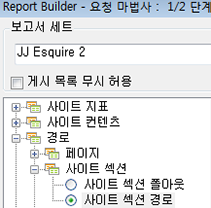
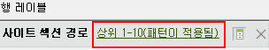
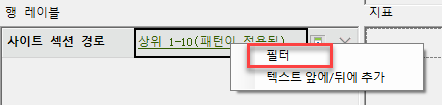
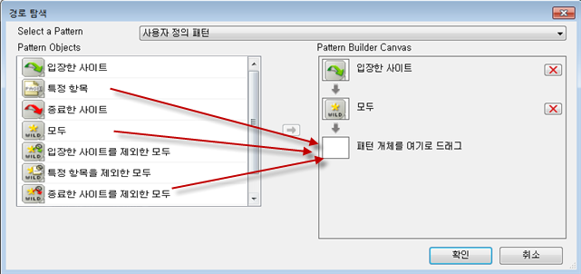
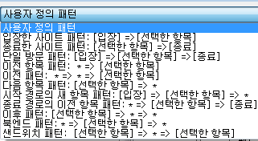
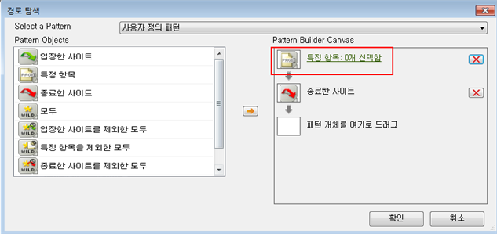
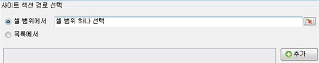
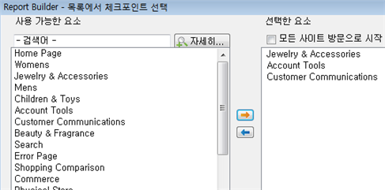

# 요청 마법사를 사용하여 경로 보고서 필터링

경로 지정 보고서에 필터를 적용하는 단계에 대해 설명합니다.

이 예제에서는 사이트 섹션 경로를 사용합니다.

1. In Adobe Report Builder, click **[!UICONTROL Create]** to open the Request Wizard.
1. 적절한 보고서 세트를 선택합니다.
1. In the tree view on the left, select **[!UICONTROL Paths]** &gt; **[!UICONTROL Site Sections]** &gt; **[!UICONTROL Site Section Paths]**.

   

1. 해당 날짜를 지정합니다.
1. Click **[!UICONTROL Next]**.
1. In Step 2 of the Wizard, under **[!UICONTROL Row Labels]**, click the **[!UICONTROL Top 1-10 (pattern applied)]** link. 경로 보고서에는 기본적으로 패턴이 적용되어 있습니다.

   

1. **[!UICONTROL 필터]** 옵션을 선택합니다.

   

1. In the **[!UICONTROL Define 'Site Section Paths' Path Pattern]** dialog, you can specify
   1. 첫 번째 보고서의 시작 등급 
   1. 이 보고서에 표시하려는 항목 수 
1. **[!UICONTROL 편집을]** 클릭하여 경로 패턴을 정의합니다.
1. If you want a custom pattern, drag and drop any **[!UICONTROL Pattern Objects]** from the list on the left into the **[!UICONTROL Pattern Build Canvas]** on the right.

   

1. You can also select a predefined pattern from the **[!UICONTROL Select a Pattern]** drop-down list and modify it. 사용 가능한 패턴은 다음과 같습니다. 

   

   일부 패턴인 시작 경로의 다음 항목 패턴, 종료 경로의 이전 항목 패턴, 다음 항목 패턴은 Report Builder에만 국한됩니다.
1. 미리 정의한 패턴을 편집하려면
   1. 패턴을 선택합니다. For example, select the **[!UICONTROL Exited Site Pattern]**: 

   1. 종료하기 전에 사용자가 이동하는 사이트 섹션 경로를 정의해야 합니다. **[!UICONTROL 특정 항목: 0개 선택함을 클릭합니다]**. 셀 범위에서 선택하거나(기존 요청을 편집하는 경우) 섹션 목록에서 선택하여 이 경로를 정의할 수 있습니다.
   1. To select from a range of cells from a previous request, select **[!UICONTROL From range of cells]** and click the cell selector icon. 그런 후 보고서에서 셀을 선택합니다. 

   1. To select from a list of site sections, select **[!UICONTROL From list]** and click **[!UICONTROL Add]**.
   1. **[!UICONTROL 사용 가능한 요소]** 열에서 **[!UICONTROL 선택한 요소]** 열로 요소를 이동하고 주황색 화살표를 클릭하여 요소를 이동합니다. **[!UICONTROL 확인을 클릭합니다]**. 

   1. To save the pattern you just established, click **[!UICONTROL Save]**.
   1. **[!UICONTROL 확인을]** 세 번 클릭한 다음 **[!UICONTROL 마침을]**&#x200B;클릭합니다. 필터링한 패턴 요청이 생성됩니다.
