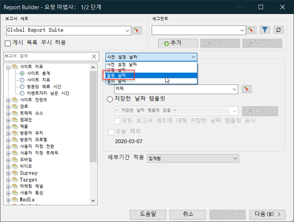
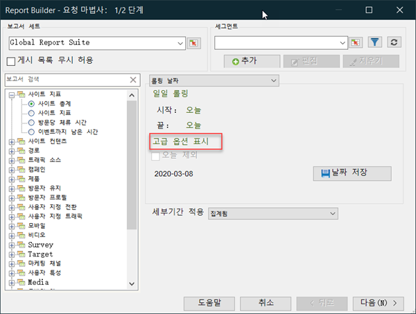
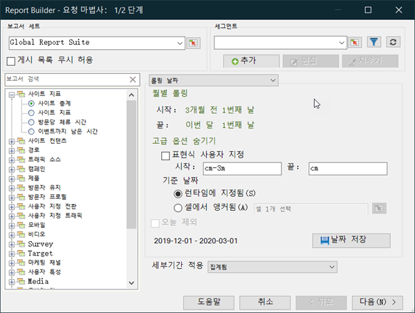
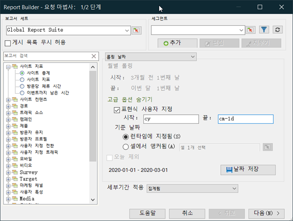

# 사용자 지정된 날짜 표현식 - 개요

사용자 지정 표현식을 만들어 복합적인 날짜 범위를 지정할 수 있습니다.

주 및 일 수를 올바로 지정하려면 표현식을 작성할 때 달력을 참조하는 것이 좋습니다. Excel에는 날짜 간의 일, 업무일, 월 및 년 수를 계산할 수 있도록 해주는 몇 가지 내장 함수들이 있습니다. 공식에 이 함수들을 사용하여 주 수 및 분기 수와 같은 다른 간격들을 계산할 수 있습니다.

**사용자 지정 표현식을 활성화하는 방법**

이것은 **[!UICONTROL 롤링 날짜]**&#x200B;를 사용하는 예입니다.

1. [!UICONTROL 요청 마법사에서:1단계], **[!UICONTROL 사전 설정 날짜]**&#x200B;를 사용하는 대신 **[!UICONTROL 롤링 날짜]**&#x200B;를 선택합니다.

   

1. 주별, 월별, 분기별 또는 연도별로 전환합니다. 아래 옵션이 어떻게 변경되었는지 확인하십시오.
1. 추가 사용자 정의 옵션을 보려면 **[!UICONTROL 고급 옵션 표시]**&#x200B;를 클릭합니다.

   

1. 예를 들어 3개월 전 첫 날부터 이번 달 첫 번째 날로 위의 날짜를 월별로 변경하면 고급 옵션 부분에 있는 날짜가 다음을 반영하도록 자체적으로 업데이트됩니다.

   

1. **[!UICONTROL 표현식 사용자 지정]**&#x200B;을 활성화합니다. **[!UICONTROL 롤링 날짜]** 아래의 옵션을 선택하면 사용자 지정 날짜 표현식에 대한 구문을 쉽게 볼 수 있습니다.

   

   고급 옵션을 사용하여 사용자 지정 날짜 표현식을 혼합하고 일치시킬 수 있습니다. 예를 들어 연도의 첫 번째 데이터와 마지막 전체 월의 마지막 끝까지 데이터를 보려면 다음을 입력할 수 있습니다.`From: cy` `To: cm-1d` 마법사에서 해당 날짜는 1/1/2020-1/31/2020으로 표시됩니다.
