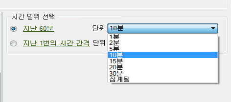

# 실시간 요청 구성

실시간 요청 날짜를 구성하는 방법을 설명하는 단계.

1. 마케팅 분석의 [관리 도구](https://marketing.adobe.com/resources/help/en_US/reference/?f=real_time_admin)에서 실시간 보고가 활성화되어 있는지 확인합니다.
1. On the [!UICONTROL Request Wizard: Step 1], click **[!UICONTROL Real-Time Report]** &gt; **[!UICONTROL `<report type>`]**

   예를 들어 트래픽 보고서를 선택합니다. 실시간 보고서 유형을 선택하면 [!UICONTROL 시간 범위 선택] 옵션이 표시됩니다.

1. 분 또는 시간 단위로 위를 선택합니다.

   

   실시간 보고는 지난 20시간 동안에만 사용할 수 있습니다. 세부기간의 경우 1분에서 30분까지 선택하는 옵션이 있습니다.
1. Click **[!UICONTROL Next]** and continue [configuring the request layout](../../../../analyze/report-builder/layout/layout.md#concept_D66E1C2217E24E1F837AC064C61919DB).
