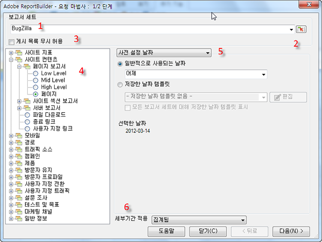

# 데이터 요청 - 요청 마법사 1 단계

요청 마법사 1단계 양식에서는 보고서 세트, 보고서 유형, 세그먼트를 선택하고 날짜를 구성합니다.

1. **[!UICONTROL 보고서 세트]**: 로그인 자격 증명을 기반으로 사용할 수 있는 보고서 세트 목록. See [Select Report Suites](../../../analyze/report-builder/data-requests/selecting-report-suites/t-select-report-suites.md#task_59444416F6F042D1998217AE91580913).

1. **범위 선택기**: Excel의 셀에서 보고서 세트 ID를 선택할 수 있습니다. see [보고서 세트 선택](../../../analyze/report-builder/data-requests/selecting-report-suites/t-select-report-suites.md#task_59444416F6F042D1998217AE91580913).

1. **세그먼트**: 는 데이터의 사용자 지정 하위 세트이거나 작성한 규칙으로 필터링된 데이터입니다. 세그먼트는 히트 수, 방문 횟수 및 방문자 수를 기반으로 합니다. 세그먼트에 대한 자세한 내용은 [Analytics 세그멘테이션 안내서](https://marketing.adobe.com/resources/help/en_US/analytics/segment/)를 참조하십시오.

   예를 들어 [!UICONTROL 페이지 보고서]를 실행한 다음 최초 방문 세그먼트를 적용할 수 있습니다.

1. **게시 목록 무시 허용**: 보고서를 예약할 때 배포에 사용할 게시 목록을 선택할 수 있습니다. Publishing lists are set up in **[!UICONTROL Analytics]** &gt; **[!UICONTROL Admin tools]**. 이 요청에 대한 보고서 세트는 게시 목록에서 각 수신자에게 지정된 보고서 세트 ID로 대체됩니다. see [게시 목록 무시 허용](../../../analyze/report-builder/data-requests/allow-publishing-list-overrides.md#concept_BCB19A20DC4B4B8D984F9670EE018D8C).

1. **보고서 유형**: 데이터 요청에서 실행할 기본 보고서를 지정합니다. 요청당 하나의 보고서를 실행하며 이 보고서는 일 대 다 차원 및 일 대 다 지표를 가질 수 있습니다. 보고서 유형에 대한 지표 및 차원은 [!UICONTROL 요청 마법사: 2단계] 인터페이스에 표시됩니다. see [보고서 유형을 선택합니다](../../../analyze/report-builder/data-requests/c-report-types/select-report-types.md#concept_C711B27E6FB64C18AC564EE142FC7EFC).

1. **날짜 범위**: 요청이 적용되는 시간 범위를 정의합니다. 사전 설정, 고정 및 롤링과 같이 몇 가지 유형의 요청 기간을 사용할 수 있습니다. 기간의 최대 개수는 366개입니다. 셀에서 지정된 날짜 범위를 선택할 수도 있고, 날짜 범위를 나중에 사용할 수 있도록 템플릿으로 저장할 수도 있습니다. See [Configuring Report Dates](../../../analyze/report-builder/data-requests/configuring-report-dates/custom-calendar.md)

1. **세부기간 적용**: 보고서에 포함되어 있는 시간 기반 세부 사항의 수준을 지정합니다. see [세부기간](../../../analyze/report-builder/data-requests/configuring-report-dates/granularity.md#concept_A13CBA2962E24FF882456135431B7ADB).

>[!MORE_LIKE_THIS]
>
>* [데이터 요청 만들기](/help/analyze/report-builder/data-requests/t-create-a-data-request.md)