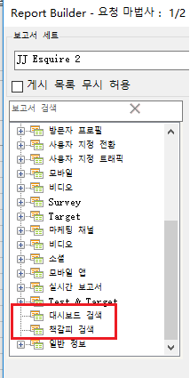

# 책갈피가 지정된 보고서 및 대시보드 Reportlet 가져오기

책갈피가 지정된 모든 보고서와 대시보드 보고서는 이제 요청 마법사 1단계에서 차원으로 표시되며, Report Builder 요청으로 가져올 수 있습니다.

책갈피가 지정된 보고서를 선택하면 요청 마법사는 책갈피가 지정된 보고서를 정의하는 모든 차원 및 지표를 채웁니다. 날짜 범위, 세부기간 및 선택한 세그먼트 또한 선택한 책갈피를 기준으로 업데이트됩니다.

요청 마법사 1단계에는 다음과 같이 대시보드 및 해당 Reportlet이 표시됩니다.

When you click **[!UICONTROL Retrieve your Dashboards]** or **[!UICONTROL Retrieve your Bookmarks]**, your existing dashboard and/or bookmark data is retrieved and pasted in the worksheet.

>[!NOTE]
>
>리포트 빌더에서 사용 가능한 대시보드 및 책갈피 목록은 사용자로 제한되지만 마법사의 1 단계에서 선택한 보고서 세트에 적용되는 사용자에게도 적용됩니다. 그에 반해 마케팅 Reports &amp; Analytics에서는 대시보드 및 책갈피에서 사용하는 보고서 세트에 상관없이 사용자가 액세스할 수 있는 모든 책갈피 및 대시보드에 대한 액세스 권한이 주어집니다.

>[!NOTE]
>
>데이터만 가져올 수 있으므로 책갈피에 차트가 들어 있거나 대시보드 reportlet 이 차트로 구성된 경우 차트를 채우는 데 사용된 데이터만 가져옵니다.

대시보드 Reportlet(또는 책갈피)를 가져와 요청을 만들었으므로 요청은 Reportlet(또는 책갈피)의 기본 차원에 연결됩니다. 따라서 요청을 편집하는 경우 트리 보기는 더 이상 대시보드 Reportlet 트리 보기 노드(또는 책갈피 노드)를 선택하지 않으며 대신 기본 차원을 선택합니다.

가져온 북마클릿은 보고서 세트, 선택한 세그먼트, 차원 및 선택한 지표를 Reports &amp; Analytics 책갈피에 공개된 것과 동일한 매개 변수로 적절히 설정합니다.

>[!IMPORTANT]
>
>이 날짜 범위가 보고 및 분석 책갈피에서 롤링 날짜 범위였더라도 날짜 범위는 동일하지만 정적 날짜 범위로 설정됩니다.

