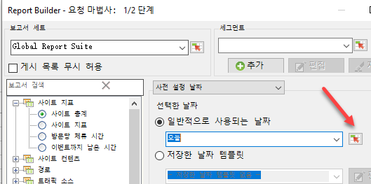
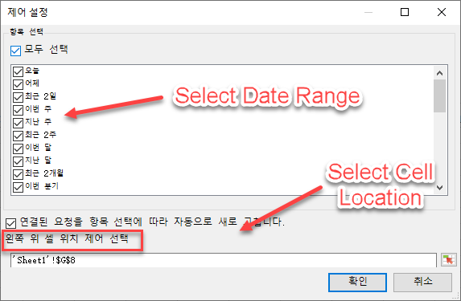
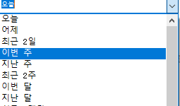
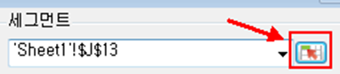
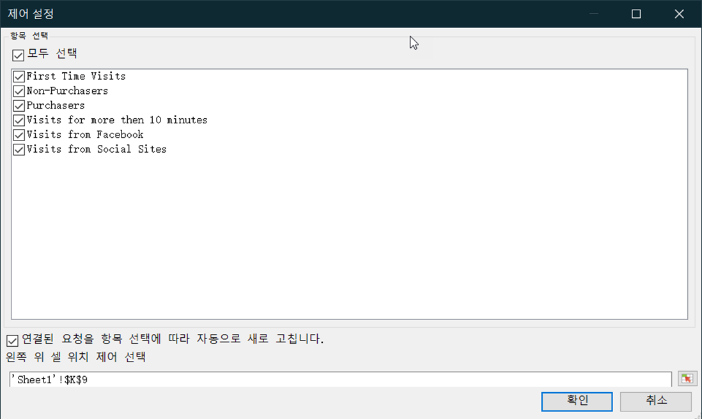
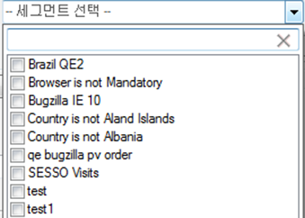

# 양방향 컨트롤

양방향 컨트롤을 사용하여 워크시트에서 직접 하나 이상의 요청에 대한 세그먼트 및 날짜 범위를 편집할 수 있습니다. 이를 통해 Report Builder 요청을 업데이트할 때 보다 유연하게 작업할 수 있습니다.

양방향 컨트롤은 분석가가 통합 문서를 만들고 이러한 통합 문서를 마케팅 조직과 공유하는 일반적인 워크플로우가 있을 때 생성됩니다. 양방향 컨트롤을 사용하면 마케터는 Report Builder 작동 방식을 깊이 있게 알지 못하더라도 요청을 수정하고 새로 고칠 수 있습니다. (요청을 새로 고치려면 통합 문서 받는 사람이 Report Builder 사용자여야 합니다.) 이러한 제어는 예약된 통합 문서 내부에서 작동합니다. 현재 다음 두 가지 유형의 양방향 컨트롤을 사용할 수 있습니다.

* 순환 날짜 범위
* 세그먼트

>[!IMPORTANT]
>
>인터랙티브한 컨트롤을 사용하려면 리포트 빌더 v 5.0 이 설치되어 있어야 합니다. &gt;
>* Windows에서 Microsoft Excel을 실행하고 있지만 Report Builder 버전이 더 낮거나, Report Builder가 설치되어 있지 않으면 양방향 컨트롤에서 해당 값을 변경할 수 있지만 연결된 요청이 새로 고쳐지지 않고 요청의 연결된 매개 변수도 업데이트되지 않습니다.
>* Mac에서 Excel을 실행하고 있는 경우 제어의 값을 변경하면 다음 메시지가 표시됩니다. “매크로 ‘Adobe.Report Builder.Bridge.FormControlClick.Event’를 찾을 수 없습니다."
>

>[!IMPORTANT]
>
>컨트롤의 이름을 함부로 변경하지 마십시오. (이 이름을 보려면 제어에 초점을 둡니다. 그러면 왼쪽 위의 Excel 표 바로 위에 제어 이름이 나타납니다.)

## Implement interactive date range control {#section_39B228F2D2C44985863D31424C953280}

1. 예를 들어 요청 마법사의 1단계에서 **[!UICONTROL [페이지]]보고서를 선택합니다.**
1. **[!UICONTROL 일반적으로 사용되는 날짜]** 드롭다운 옆에 있는 **컨트롤 설정[!UICONTROL 아이콘을 클릭합니다.]**

   

1. 컨트롤 설정 대화 상자에서 양방향 컨트롤에 표시할 모든 날짜 범위 항목을 선택합니다. 또한 컨트롤의 왼쪽 위 셀 위치를 지정합니다.

   

1. "연결된 요청을 항목 선택에 따라 자동으로 새로 고칩니다.” 옵션을 확인합니다.

   * 이 옵션이 선택되어 있으면 이 컨트롤을 사용하는 모든 요청이 새로 고쳐집니다.
   * 이 옵션이 선택되어 있지 않으면 연결된 요청 매개 변수가 업데이트되지만 요청은 새로 고쳐지지 않습니다.

1. **[!UICONTROL 확인을 클릭합니다]**. 지정한 셀 위치에 제어가 나타납니다.

   

1. 이제 날짜 범위를 변경할 수 있습니다. 그러면 요청은 해당 날짜 범위로 새로 고쳐집니다.
1. 요청을 복사하고 마우스 오른쪽 단추를 클릭하여 두 개의 요청 붙여넣기 옵션 중 하나를 사용할 수 있습니다.

   * **[!UICONTROL 요청 붙여넣기]** &gt; **[!UICONTROL 절대 입력 셀]**&#x200B;사용 이것은 복사한 요청이 원본 요청과 동일한 양방향 날짜 범위 제어를 가리키게 됨을 의미합니다.

   * **[!UICONTROL 요청 붙여넣기]**&gt; **[!UICONTROL 상대 입력 셀]**&#x200B;사용 이것은 복사한 요청이 자체 컨트롤을 가리키게 됨을 의미합니다.

      >[!NOTE]
      >
      >기본 Microsoft Excel 잘라내기/복사/붙여넣기 컨트롤 기능을 사용할 수 있습니다. Report Builder는 새로 추가한 컨트롤을 자동으로 인식합니다.

## Implement interactive segment control {#section_5003D3F724644280BF1BCD6E1B0CB784}

양방향 세그먼트 컨트롤 구현은 날짜 범위 컨트롤 구현과 비슷합니다.

1. 요청 마법사의 1단계에서 **[!UICONTROL 세그먼트]드롭다운 목록 옆에 있는 세그먼트 컨트롤 설정 아이콘을 선택합니다.**

   

1. 세그먼트 컨트롤 설정 대화 상자에서 드롭다운에 포함할 세그먼트를 선택합니다. 또한 컨트롤의 왼쪽 위 셀 위치를 지정합니다.

   

1. 이제 새 양방향 컨트롤이 통합 문서에 나타납니다.

   

